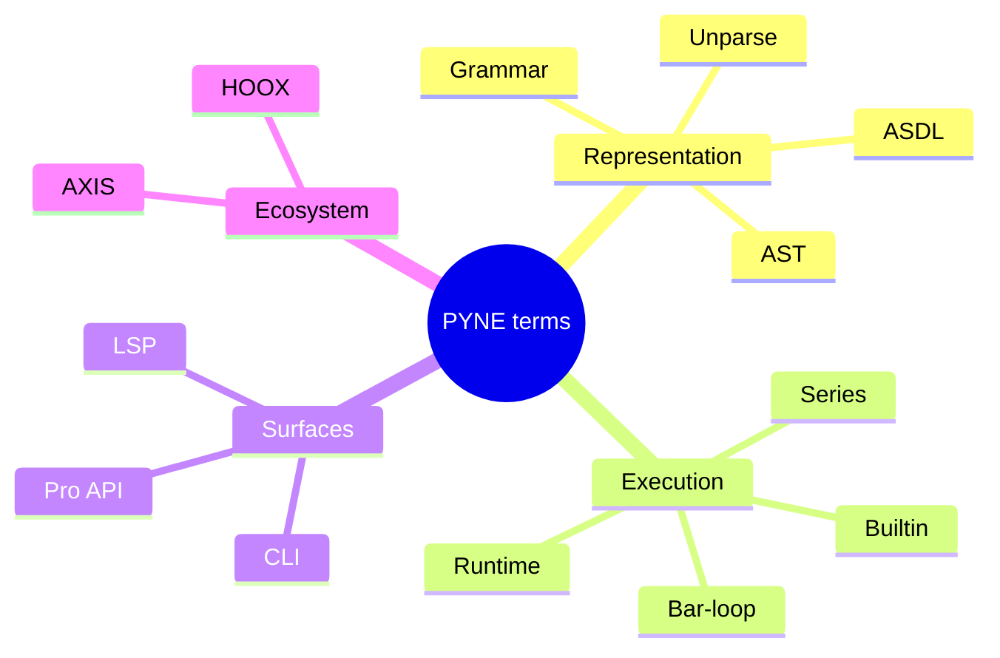

# Copyright (C) 2024-2026 jango_blockchained
#
# This file is part of pynescript.
#
# pynescript is free software: you can redistribute it and/or modify
# it under the terms of the GNU Affero General Public License as published by
# the Free Software Foundation, either version 3 of the License, or
# (at your option) any later version.
#
# pynescript is distributed in the hope that it will be useful,
# but WITHOUT ANY WARRANTY; without even the implied warranty of
# MERCHANTABILITY or FITNESS FOR A PARTICULAR PURPOSE.  See the
# GNU Affero General Public License for more details.
#
# You should have received a copy of the GNU Affero General Public License
# along with pynescript.  If not, see <https://www.gnu.org/licenses/>.
#
# SPDX-License-Identifier: AGPL-3.0-or-later

---
title: "Glossary"
description: "Definitions of PYNE end-user terms: AST, ASDL, bar-loop, series, Runtime, LSP, Pro API, extras, and related concepts."
---

# Glossary

## Abstract

Shared vocabulary for the End User track. Terms are defined as **used in this repo**, not as MarketingView marketing copy. Cross-links point at deeper systems manuals where useful.

## Conceptual model

Terms fall into four buckets:

1. **Language representation** — grammar, AST, unparser  
2. **Execution** — series, bar-loop, builtins, strategy events  
3. **Surfaces** — CLI, library, LSP, Pro API  
4. **Ecosystem** — AXIS, HOOX, PyneTS, pyne-worker, pyne-agent-worker



## Interface surface

This page is pure reference — no commands required.

## Internals (repo paths)

| Term cluster | Primary paths |
| --- | --- |
| Parse / AST | `src/pynescript/ast/helper.py`, `builder.py`, `grammar/` |
| Evaluate | `src/pynescript/ast/evaluator/`, `src/pynescript/runtime/` (`backend/runtime.py` is a compat shim) |
| Lint | `src/pynescript/ast/linter.py` |
| LSP | `src/pynescript/langserver/` |
| HTTP | `backend/app.py` |

## Invariants & edge cases

- **Pine Script™ / TradingView®** are trademarks of TradingView, Inc. PYNE is independent (see product [index](/pyne/docs)).
- “Parity” is empirical (tests/corpus), not a legal claim of equivalence.

## Terms

### ASDL

**Abstract Syntax Description Language.** Schema language used to generate Python AST node classes (`Pinescript.asdl` → generated node module). Gives a single algebraic description of script structure.

### Annotation

Special comments such as `//@version=6` (preferred) attached to script or declaration nodes during parse (`_add_annotations` in `helper.py`).

### AST

**Abstract Syntax Tree.** In-memory tree of ASDL-generated nodes produced by `parse`. Root is typically a `Script` (`mode="exec"`) or `Expression` (`mode="eval"`).

### AXIS

Optional **charting PWA “AXIS”** product (`frontend/`, docs at `/axis/docs`). Consumes evaluate results (series/plots); not required for evaluation.

### Bar / bar-loop

A discrete OHLCV time step. A **bar-loop** evaluator re-executes script logic once per bar with updated series history (`pynescript.runtime.Runtime.run`).

### Builtin

Host-provided namespace function or value (`ta.rsi`, `strategy.entry`, `math.sqrt`, …). Implemented under `ast/evaluator/builtins/` and catalogued for LSP metadata.

### CLI

The preferred **`pyne`** Click command group (alias `pynescript`: `check`, `format`, `lint`, `compile`, `prewarm`, `run`, `data`, `info`). `pyne run` is compile-only synthetic smoke — not `Runtime.run`.

### Compile mode

`mode="compile"` on Runtime / `/run`: attempts a **Numba (or similar) compiled subset** of bar logic for speed. Not full language coverage.

### Data provider

Historical OHLCV source (`mock`, `yahoo`, `alphavantage`, `ccxt`) via `pynescript.util.data`.

### Data feed

Realtime stream abstraction (`datafeed`, e.g. CCXT Pro) for live candles/trades.

### Dump

`dump(node)` — pretty textual representation of an AST for debugging and tests (not executable Pine).

### Evaluate / evaluator

Execution of AST nodes to values. Ranges from `literal_eval` (expression-safe) to full statement/builtin evaluators and package **`pynescript.runtime.Runtime`** (Pro API / workers share the same host).

### Extra (package extra)

Optional dependency set in `pyproject.toml`: `lsp`, `dev-lsp`, `compile`, `data`, `datafeed`, `pro`.

### HOOX

Edge **trade execution mesh** (separate monorepo / docs under `/docs`). Can consume strategy events from evaluate pipelines; optional.

### Interpret mode

Default Runtime mode: AST walking per bar without the compiled subset path.

### `libraries=`

Optional `Runtime.run` / `POST /run` list of `{namespace, name, version, source}` dicts registered before `import ns/Name/ver` resolves. Compile-ineligible. HTTP cap is 32. Not available on `pyne run`.

### `literal_eval`

Helper that parses an expression (or accepts an AST) and evaluates literals plus supported builtins/series context — analogous in spirit to Python’s `ast.literal_eval` but Pine-aware and broader.

### Lint / `LintWarning`

Static diagnostics with `code`, `message`, `line`, `severity` (`error`|`warning`). Entry: `lint_script`.

### LSP

**Language Server Protocol.** `pyne-lsp` process (alias `pynescript-lsp`) implementing diagnostics, completion, hover, navigation, formatting.

### NodeVisitor / NodeTransformer

Patterns for traversing or rewriting ASTs (`visitor.py`, `transformer.py`).

### OHLCV

Open, high, low, close, volume — bar fields passed to Runtime / `/run` (plus `time`).

### PyneTS

TypeScript / Bun library (`@hoox-sh/pynets`). Public names match Python: `parse`, `unparse`, `Runtime.run`. **Not** a Worker and **not** [pyne-worker](/pyne/docs/pyne-worker). See [PyneTS](/pyne/docs/pynets).

### pyne-agent-worker

Sister Cloudflare Worker that turns natural language into Pine source (`POST /v1/chat`). Standalone by default; optional validate via pyne-worker. See [pyne-agent-worker](/pyne/docs/agent).

### pyne-worker

Python Cloudflare Worker (sister repo) embedding pynescript for edge `POST /run`. See [pyne-worker](/pyne/docs/pyne-worker). HOOX mesh notes: [isolate profile](/docs/devops/workers/pyne-worker).

### Plot / series / plot_meta

Evaluate outputs: plotted values, named multi-series maps, and metadata for AXIS UIs (AXIS).

### Pro API

Flask application in `backend/` exposing `/run`, preview, backtest, and auth endpoints.

### PYNE

Product name for this evaluation stack (docs under `/pyne/docs`). PyPI distribution is **`hoox-pyne`**; the import package is **`pynescript`**.

### Round-trip

`parse` → `unparse` (optionally → `parse` again). Used to normalize formatting and test fidelity.

### Runtime

`pynescript.runtime.Runtime` — multi-bar execution engine (`src/pynescript/runtime/host.py`). `backend.runtime` re-exports the same class for the Pro API. Library default `mode` is **interpret**; `POST /run` defaults to **auto**. See [modes](/pyne/docs/enduser/reference/modes).

### Series

Time-indexed value stream with history access (`close[1]`). Implementation includes `PineSeries` and evaluator series objects.

### Strategy event

Structured record of entries/exits/orders emitted during strategy evaluation for downstream systems (HOOX, analytics).

### `timeout_seconds`

Optional `Runtime.run` wall-clock budget (interpret path). Also a `POST /run` / `/run/batch` body field (0.3.11+). Exceeded runs return partial plots with `timed_out`. Omit / `null` / `≤ 0` → no timeout.

### Optimize (hyperparameter search)

`pynescript.optimize.run_study` / `pyne optimize` / `POST /optimize` (0.3.12+). Loops interpret `Runtime` with `input.*` overrides for a `strategy()` script. Not a Pine builtin and not `/backtest/quick`.

### `timeframe.change`

`timeframe.change(tf)` is true on the first bar of a new UTC fixed-width period (0.3.12+). Not exchange-calendar / DST aware. See [known divergences](https://github.com/hoox-sh/pyne/blob/main/docs/known_divergences.md).

### Unparse

`unparse(node)` — regenerate Pine source text from an AST.

### `//@version`

Version pragma annotation; linter expects v5+ for modern scripts.

### Warmup

Bars required before a TA function has enough history; early outputs may be `na`.

## Worked examples

Using terms together:

```text
Source --parse--> AST --unparse--> normalized source
AST + OHLCV --Runtime bar-loop--> series + strategy events
AST --lint_script--> LintWarnings
AST --LSP--> editor diagnostics/completion
series --AXIS--> chart
events --HOOX--> exchange orders
```

## Failure modes

Misusing terms often causes support confusion:

| Confused pair | Distinction |
| --- | --- |
| dump vs unparse | dump is debug AST text; unparse is Pine source |
| literal_eval vs Runtime | single-shot expressions vs multi-bar scripts |
| pyne vs pyne-lsp | desk CLI vs language server (aliases: pynescript*) |
| AXIS vs PYNE | AXIS vs evaluate engine |
| data provider vs data feed | historical fetch vs realtime stream |

## See also

- [End User hub](/pyne/docs/enduser)
- [FAQ](/pyne/docs/enduser/reference/faq)
- [PYNE product map](/pyne/docs)
- [AXIS docs](/axis/docs)
- [HOOX docs](/docs)
