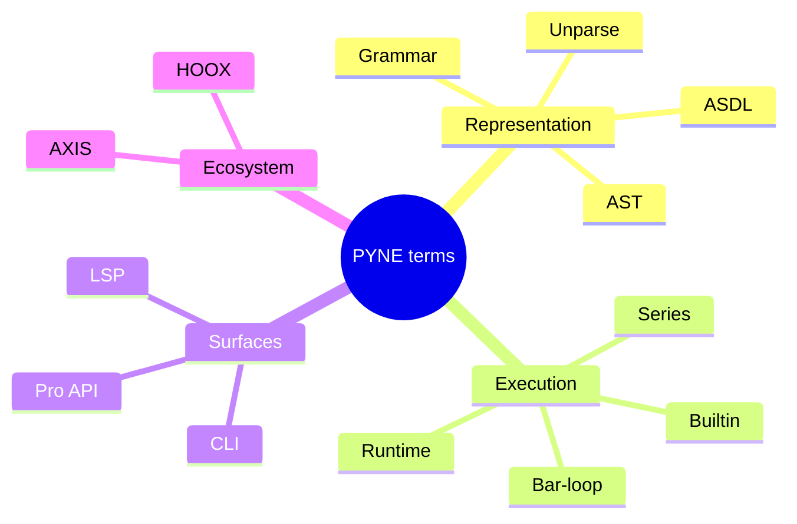

# Glossary

## Abstract

Shared vocabulary for the End User track. Terms are defined as **used in this repo**, not as MarketingView marketing copy. Cross-links point at deeper systems manuals where useful.

## Conceptual model

Terms fall into four buckets:

1. **Language representation** — grammar, AST, unparser  
2. **Execution** — series, bar-loop, builtins, strategy events  
3. **Surfaces** — CLI, library, LSP, Pro API  
4. **Ecosystem** — AXIS, HOOX, pine-worker, pyne-worker  



## Interface surface

This page is pure reference — no commands required.

## Internals (repo paths)

| Term cluster | Primary paths |
| --- | --- |
| Parse / AST | `src/pynescript/ast/helper.py`, `builder.py`, `grammar/` |
| Evaluate | `src/pynescript/ast/evaluator/`, `backend/runtime.py` |
| Lint | `src/pynescript/ast/linter.py` |
| LSP | `src/pynescript/langserver/` |
| HTTP | `backend/app.py` |

## Invariants & edge cases

- **Pine Script™ / TradingView®** are trademarks of TradingView, Inc. PYNE is independent (see product [index](/pyne/docs)).
- “Parity” is empirical (tests/corpus), not a legal claim of equivalence.

## Terms

### ASDL

**Abstract Syntax Description Language.** Schema language used to generate Python AST node classes (`Pinescript.asdl` → generated node module). Gives a single algebraic description of script structure.

### Annotation

Special comments such as `//@version=5` attached to script or declaration nodes during parse (`_add_annotations` in `helper.py`).

### AST

**Abstract Syntax Tree.** In-memory tree of ASDL-generated nodes produced by `parse`. Root is typically a `Script` (`mode="exec"`) or `Expression` (`mode="eval"`).

### AXIS

Optional **charting PWA “AXIS”** product (`frontend/`, docs at `/axis/docs`). Consumes evaluate results (series/plots); not required for evaluation.

### Bar / bar-loop

A discrete OHLCV time step. A **bar-loop** evaluator re-executes script logic once per bar with updated series history (`Runtime.run`).

### Builtin

Host-provided namespace function or value (`ta.rsi`, `strategy.entry`, `math.sqrt`, …). Implemented under `ast/evaluator/builtins/` and catalogued for LSP metadata.

### CLI

The `pynescript` Click command group (`parse-and-dump`, `parse-and-unparse`, `lint`, `data`, `download-builtin-scripts`).

### Compile mode

`mode="compile"` on Runtime / `/run`: attempts a **Numba (or similar) compiled subset** of bar logic for speed. Not full language coverage.

### Data provider

Historical OHLCV source (`mock`, `yahoo`, `alphavantage`, `ccxt`) via `pynescript.util.data`.

### Data feed

Realtime stream abstraction (`datafeed`, e.g. CCXT Pro) for live candles/trades.

### Dump

`dump(node)` — pretty textual representation of an AST for debugging and tests (not executable Pine).

### Evaluate / evaluator

Execution of AST nodes to values. Ranges from `literal_eval` (expression-safe) to full statement/builtin evaluators and HTTP `Runtime`.

### Extra (package extra)

Optional dependency set in `pyproject.toml`: `lsp`, `dev-lsp`, `data`, `datafeed`.

### HOOX

Edge **trade execution mesh** (separate monorepo / docs under `/docs`). Can consume strategy events from evaluate pipelines; optional.

### Interpret mode

Default Runtime mode: AST walking per bar without the compiled subset path.

### `literal_eval`

Helper that parses an expression (or accepts an AST) and evaluates literals plus supported builtins/series context — analogous in spirit to Python’s `ast.literal_eval` but Pine-aware and broader.

### Lint / `LintWarning`

Static diagnostics with `code`, `message`, `line`, `severity` (`error`|`warning`). Entry: `lint_script`.

### LSP

**Language Server Protocol.** `pynescript-lsp` process implementing diagnostics, completion, hover, navigation, formatting.

### NodeVisitor / NodeTransformer

Patterns for traversing or rewriting ASTs (`visitor.py`, `transformer.py`).

### OHLCV

Open, high, low, close, volume — bar fields passed to Runtime / `/run` (plus `time`).

### pine-worker

TypeScript port / worker tool colocated under `pine-worker/` for parity experiments and edge TS evaluate paths.

### pyne-worker

Python Cloudflare Worker (sister repo) embedding pynescript for edge `/run`.

### Plot / series / plot_meta

Evaluate outputs: plotted values, named multi-series maps, and metadata for AXIS UIs (AXIS).

### Pro API

Flask application in `backend/` exposing `/run`, preview, backtest, and auth endpoints.

### PYNE

Product name for this evaluation stack (docs under `/pyne/docs`); package name on PyPI remains **`pynescript`**.

### Round-trip

`parse` → `unparse` (optionally → `parse` again). Used to normalize formatting and test fidelity.

### Runtime

`backend.runtime.Runtime` — multi-bar execution engine used by Pro API.

### Series

Time-indexed value stream with history access (`close[1]`). Implementation includes `PineSeries` and evaluator series objects.

### Strategy event

Structured record of entries/exits/orders emitted during strategy evaluation for downstream systems (HOOX, analytics).

### Unparse

`unparse(node)` — regenerate Pine source text from an AST.

### `//@version`

Version pragma annotation; linter expects v5+ for modern scripts.

### Warmup

Bars required before a TA function has enough history; early outputs may be `na`.

## Worked examples

Using terms together:

```text
Source --parse--> AST --unparse--> normalized source
AST + OHLCV --Runtime bar-loop--> series + strategy events
AST --lint_script--> LintWarnings
AST --LSP--> editor diagnostics/completion
series --AXIS--> chart
events --HOOX--> exchange orders
```

## Failure modes

Misusing terms often causes support confusion:

| Confused pair | Distinction |
| --- | --- |
| dump vs unparse | dump is debug AST text; unparse is Pine source |
| literal_eval vs Runtime | single-shot expressions vs multi-bar scripts |
| pynescript vs pynescript-lsp | desk CLI vs language server |
| AXIS vs PYNE | AXIS vs evaluate engine |
| data provider vs data feed | historical fetch vs realtime stream |

## See also

- [End User hub](/pyne/docs/enduser)
- [FAQ](/pyne/docs/enduser/reference/faq)
- [PYNE product map](/pyne/docs)
- [AXIS docs](/axis/docs)
- [HOOX docs](/docs)
