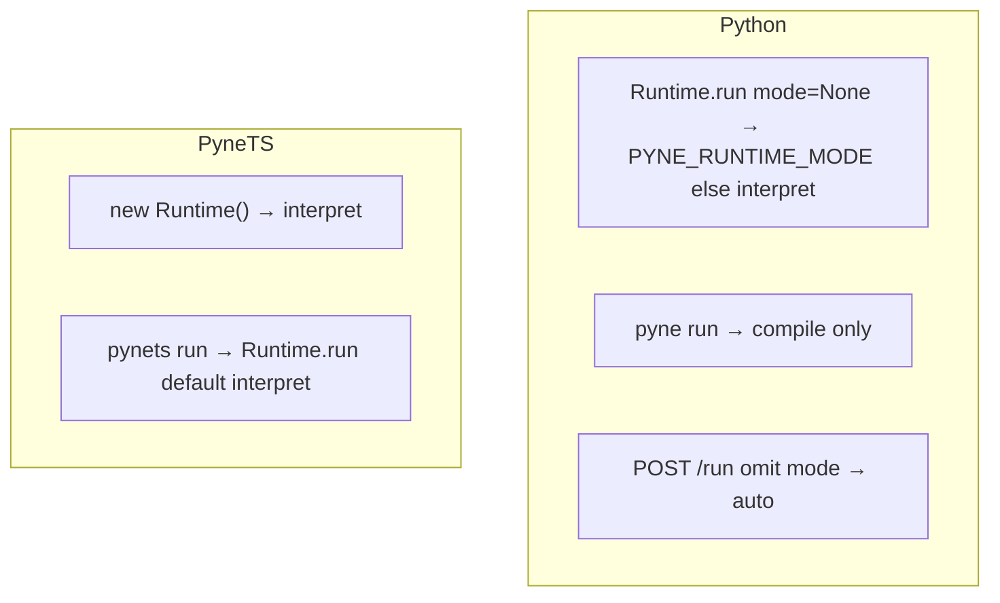

# Copyright (C) 2024-2026 jango_blockchained
#
# This file is part of pynescript.
#
# pynescript is free software: you can redistribute it and/or modify
# it under the terms of the GNU Affero General Public License as published by
# the Free Software Foundation, either version 3 of the License, or
# (at your option) any later version.
#
# pynescript is distributed in the hope that it will be useful,
# but WITHOUT ANY WARRANTY; without even the implied warranty of
# MERCHANTABILITY or FITNESS FOR A PARTICULAR PURPOSE.  See the
# GNU Affero General Public License for more details.
#
# You should have received a copy of the GNU Affero General Public License
# along with pynescript.  If not, see <https://www.gnu.org/licenses/>.
#
# SPDX-License-Identifier: AGPL-3.0-or-later

---
title: "Runtime modes"
description: "interpret / compile / auto defaults differ by surface. Python CLI run is compile-only. PyneTS run calls Runtime.run."
---

# Runtime modes

## Abstract

`mode` selects how the bar loop executes: **`interpret`** (AST walk), **`compile`** (transpiled loop), or **`auto`** (try compile, fall back to interpret). The **default is not the same on every surface**. This is the most common footgun when moving a script from the library to the Pro API or between Python and PyneTS.

There is **no** `Runtime.evaluate`.

## Conceptual model



## Interface surface

### What each mode means

| Mode | Python | PyneTS |
| --- | --- | --- |
| `interpret` | AST walker. Full host: `input.*`, `request.*`, libraries, profiler, alerts | AST walker. Same public envelope |
| `compile` | Numba nopython **or** object-mode Python loop | **JS emit** (object-mode analog). Not Numba |
| `auto` | Try compile; on ineligibility / compile error / compiled runtime error → interpret | Same control flow |

### Defaults by surface

| Surface | Default `mode` | Calls `Runtime.run`? |
| --- | --- | --- |
| `pynescript.runtime.Runtime.run(..., mode=None)` | `PYNE_RUNTIME_MODE` else **`interpret`** | yes |
| Pro API `POST /run` body omits `mode` | schema **`auto`** | yes (host wrap) |
| `?mode=` query (legacy) | overrides body | yes |
| CLI `pyne run` | **compile only** — not `Runtime.run` | **no** |
| `new Runtime()` / `pynets run` | **`interpret`** | yes |
| AXIS engine `server` | whatever you pass; UI default often `auto` | HTTP `/run` |
| AXIS engine `pyodide` | object-mode in Wasm (no Numba) | in-browser Python |

### `Runtime.run` (Python, exact)

```python
Runtime(symbol="AAPL").run(
    source_code,
    ohlcv_data,
    data_feed=None,
    data_provider=None,
    mode=None,            # env PYNE_RUNTIME_MODE else "interpret"
    inputs=None,
    profiler=False,
    timeout_seconds=None,
    libraries=None,
    realtime_last_bar=False,
    realtime_ticks=1,
    realtime_bars=0,
    realtime_from_bar=None,
)
```

`inputs` / `profiler` / `libraries` / `timeout_seconds` / `realtime_*` force or keep the **interpret** host (or force interpret after compile miss).

### `Runtime.run` (PyneTS)

```ts
new Runtime(symbol, { inputs, broker, timeframe, libraries, mode })
  .run(source, ohlcv, extra?)
```

Default constructor `mode` is `"interpret"`. Per-call `extra.mode` overrides.

## Internals

| Surface | Implementation |
| --- | --- |
| Python library | `src/pynescript/runtime/host.py` |
| Python CLI `run` | `src/pynescript/__main__.py` → `compile_script` + synthetic bars |
| Pro API | `backend/app.py` `RUN_SCHEMA` default `auto` |
| PyneTS | `src/runtime/interpret.ts` + `src/runtime/compile/` |
| PyneTS CLI | `src/cli.ts` → `new Runtime("AAPL", { broker, mode }).run` |

## Invariants & edge cases

1. **Do not document `pyne run` as `mode=auto`.** It is compile-only smoke (`--bars` default 50).
2. **Do not document `pynets run` as compile-only.** It is `Runtime.run` (default interpret).
3. `result.mode` is what **executed**. After `auto`, also read `auto_backend` and `compile_fallback_reason`.
4. Foreign `request.security` is `na` on every host. Compile does not invent bars to become "more complete".
5. AXIS Pyodide `compile` / `auto` cannot be Numba (Wasm).

## Worked examples

Force interpret everywhere you care about `input.*` + libraries + alerts:

```python
Runtime(symbol="AAPL").run(src, bars, mode="interpret", inputs={"len": 14})
```

```ts
new Runtime("AAPL", { mode: "interpret", inputs: { len: 14 } }).run(src, bars);
```

```bash
# Python desk smoke (compile only)
pyne run script.pine --bars 50

# PyneTS desk smoke (Runtime.run)
pynets run script.pine --bars 50 --mode interpret
```

## Failure modes

| Symptom | Cause | Fix |
| --- | --- | --- |
| Pro API "misses" an input | `auto` compiled a path that drops overrides | Pass `mode: "interpret"` |
| `pyne run` ≠ notebook `Runtime.run` | Different host | Use the library or Pro API |
| PyneTS compile ≠ Python compile | JS emit vs Numba | Compare interpret to interpret first |
| `mode` omitted, two hosts disagree | Different defaults | Set `mode` explicitly |

## See also

- [Evaluate scripts](/pyne/docs/enduser/guides/evaluate-scripts)
- [Python compiler](/pyne/docs/runtime/compiler/overview)
- [PyneTS compile](/pyne/docs/pynets/compile)
- [Configuration](/pyne/docs/enduser/getting-started/configuration)
- [Evaluate contract](/pyne/docs/api/contract)
