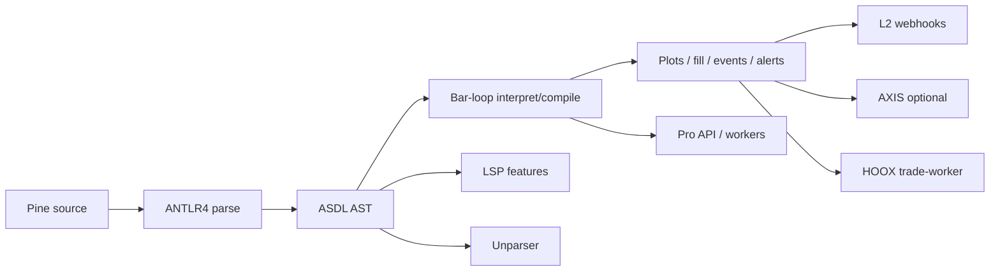

# Copyright (C) 2024-2026 jango_blockchained
#
# This file is part of pynescript.
#
# pynescript is free software: you can redistribute it and/or modify
# it under the terms of the GNU Affero General Public License as published by
# the Free Software Foundation, either version 3 of the License, or
# (at your option) any later version.
#
# pynescript is distributed in the hope that it will be useful,
# but WITHOUT ANY WARRANTY; without even the implied warranty of
# MERCHANTABILITY or FITNESS FOR A PARTICULAR PURPOSE.  See the
# GNU Affero General Public License for more details.
#
# You should have received a copy of the GNU Affero General Public License
# along with pynescript.  If not, see <https://www.gnu.org/licenses/>.
#
# SPDX-License-Identifier: AGPL-3.0-or-later

---
title: "PYNE Documentation"
description: "Open-source Pine Script™ evaluation — grammar, AST, interpret/compile runtime, alerts + webhooks, LSP, Pro API. pip install hoox-pyne · github.com/hoox-sh/pyne"
---

# PYNE Documentation

**PYNE** is the open evaluation stack for TradingView® Pine Script™: a formal ANTLR4 grammar, an ASDL algebraic AST, a deterministic bar-loop evaluator (interpret / compile / `mode=auto`), a Language Server Protocol surface, a Flask Pro API, and edge workers that share one evaluate contract — including **alerts** and optional **L2 webhooks**.

For **natural-language authoring** (PYNE Agent), see the sister project **[pyne-agent-worker](/pyne/docs/agent)** — standalone Cloudflare® Workers AI™ agent with optional AXIS plugin; does not require pyne-worker.

_Pine Script™ and TradingView® are trademarks of TradingView, Inc. This project is independent and not affiliated with or endorsed by TradingView, Inc. Cloudflare® is a trademark of Cloudflare, Inc._

## Abstract

Where closed hosts couple the language to a proprietary charting host, PYNE treats the language as an inspectable pipeline:

```
Source (.pyne / .pine)
  → ANTLR4 lexer/parser (resource grammar)
  → ASDL AST (builder)
  → bar-loop (interpret | compile | auto)
  → plots / fill / events / drawings / alerts
  → optional L2 webhooks (Pro API + edge)
```

**Live on PyPI** as **[`hoox-pyne`](https://pypi.org/project/hoox-pyne/)** (`import pynescript`). Source: [github.com/hoox-sh/pyne](https://github.com/hoox-sh/pyne).

```bash
pip install "hoox-pyne[lsp]"
pyne --version
# → 0.3.6
# aliases: pynescript / pynescript-lsp
```

The same pipeline powers the desk CLI, the LSP binary, the Pro API, browser Pyodide (via AXIS), and Cloudflare® workers. Round-trip fidelity (`parse → unparse`) and interpret↔compile [plot parity](/pyne/docs/runtime/compiler/parity) are first-class invariants — see [compatibility](/pyne/docs/reference/compatibility) and [implementation status](/pyne/docs/reference/implementation-status). Local open-corpus set01–04 (2026-08-09): **parse 99.96%**, **Runtime interpret 100% excl. intentional demos** (set01 **249/249**). The repository does not ship third-party script corpora.

## Product map

| Surface | Role | Start here |
| --- | --- | --- |
| **Library + CLI** | Parse, lint, unparse, evaluate (`mode=auto`) on your machine | [End User hub](/pyne/docs/enduser) |
| **Language core** | Grammar, AST, visitors, type system | [Core](/pyne/docs/core) |
| **Runtime** | Series caps, builtins, strategy, alerts, compiler parity | [Runtime](/pyne/docs/runtime) |
| **LSP** | Diagnostics, completion, hover, format (`.pyne` / `.pine`) | [LSP](/pyne/docs/lsp) |
| **Pro API** | HTTP `/run` (alerts + L2 webhooks), preview, backtest | [API](/pyne/docs/api) |
| **Ops** | CI, Docker, Nuitka, secrets, GCP | [DevOps](/pyne/docs/devops) |
| **AXIS** (separate product) | Charting PWA AXIS | [AXIS docs](/axis/docs) |
| **HOOX** | Edge trade mesh | [HOOX docs](/docs) |

## Conceptual model



**Invariant:** evaluation never requires a proprietary chart host. AXIS is an optional chart; HOOX is an optional *execution mesh*.

## Tracks

### End User

Install the package (`pip install hoox-pyne`), run the CLI, embed the library API, wire an editor (`.pyne` / `.pine`), or call the Pro API as a consumer — including alerts export and webhooks.

→ [End User hub](/pyne/docs/enduser)

### Core / Runtime / LSP / API

Contributor and systems manuals: how the front-end, semantics, editor protocol, and HTTP bridge are built. Runtime covers series caps, incremental TA, drawing GC, `fill()` export, foreign `request.security` → `na`, and [parity](/pyne/docs/runtime/compiler/parity).

### DevOps

CI matrices, Fernet metadata encryption, Nuitka LSP binaries, containers, Cloud Build.

→ [DevOps hub](/pyne/docs/devops)

### Reference

Compatibility guarantees, missing surface, numerical validation, TypeScript `pine-worker` parity tool, [roadmap](/pyne/docs/reference/roadmap).

## Sister surfaces

- **pyne-worker** (separate repo) — Python Cloudflare® Worker for production `/run` (alerts + webhooks dual-host).
- **pine-worker** (this monorepo, `pine-worker/`) — TypeScript port + converter; see [pine-worker](/pyne/docs/pine-worker).
- **AXIS** — installable PWA; documented at [hoox.sh/axis/docs](/axis/docs).

## Offline & agent exports

Auto-generated like HOOX manuals (`bun run docs:exports`):

| Kind | Path |
| --- | --- |
| Full-corpus LLM pack | [`llm.txt`](/pyne/docs/llm.txt) |
| LLM site map ([llmstxt.org](https://llmstxt.org/)) | [`llms.txt`](/pyne/docs/llms.txt) |
| Track PDFs (A4) | [`/exports/pyne-*-manual.pdf`](/exports/manifest.json) |

## See also

- [Installation](/pyne/docs/enduser/getting-started/installation)
- [Quick start](/pyne/docs/enduser/getting-started/quick-start)
- [Alerts & webhooks](/pyne/docs/runtime/alerts)
- [Grammar pipeline](/pyne/docs/core/grammar-antlr4)
- [Evaluate contract](/pyne/docs/api/contract)
- [Roadmap](/pyne/docs/reference/roadmap)
