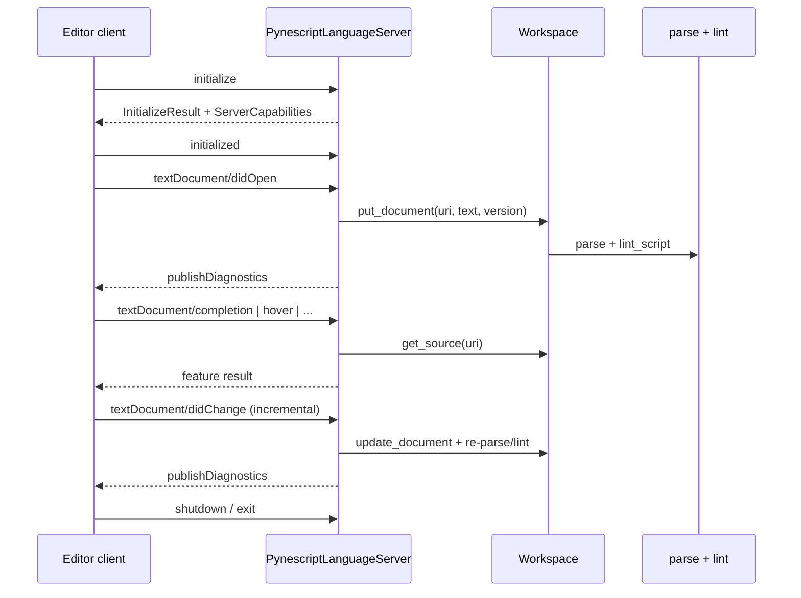

# Copyright (C) 2024-2026 jango_blockchained
#
# This file is part of pynescript.
#
# pynescript is free software: you can redistribute it and/or modify
# it under the terms of the GNU Affero General Public License as published by
# the Free Software Foundation, either version 3 of the License, or
# (at your option) any later version.
#
# pynescript is distributed in the hope that it will be useful,
# but WITHOUT ANY WARRANTY; without even the implied warranty of
# MERCHANTABILITY or FITNESS FOR A PARTICULAR PURPOSE.  See the
# GNU Affero General Public License for more details.
#
# You should have received a copy of the GNU Affero General Public License
# along with pynescript.  If not, see <https://www.gnu.org/licenses/>.
#
# SPDX-License-Identifier: AGPL-3.0-or-later

---
title: "LSP Architecture"
description: "PynescriptLanguageServer lifecycle, Workspace document model, capability declaration, and STDIO transport."
---

# LSP Architecture

## Abstract

The language server is a single-process pygls application. It owns a `Workspace` of open `TextDocumentState` records, re-parses on every mutation, and dispatches LSP methods to pure-ish feature handlers that take `(params, source)` rather than holding server globals. Capabilities are declared once at `initialize`; transport defaults to STDIO for editor integration.

## Conceptual model



## Interface surface

### Process entry

```bash
# Editable install
pip install -e ".[lsp]"
python -m pynescript.langserver   # same as pynescript-lsp
make run-lsp
```

Entry: `src/pynescript/langserver/__main__.py` constructs `PynescriptLanguageServer()` and calls `server.start_io()` (STDIO JSON-RPC).

`pyproject.toml` registers:

```text
pynescript-lsp = "pynescript.langserver.__main__:main"
```

### Server class

`PynescriptLanguageServer` (`server.py`):

- Subclasses `pygls.lsp.server.LanguageServer` with `name="Pynescript"`, `version="0.1.0"`.
- Instantiates `self.pine_workspace = Workspace()`.
- Registers handlers in `setup_method_handlers()` via `@self.feature(...)`.

### Document sync

| Event | Behavior |
| --- | --- |
| `didOpen` | `put_document` → parse/lint → push diagnostics |
| `didChange` | Incremental or full-text apply → re-parse/lint → push diagnostics |
| `didClose` | Remove document; publish empty diagnostic list |
| `didSave` | Re-publish diagnostics for current buffer |

Sync options (`config.get_server_capabilities`):

- `TextDocumentSyncKind.Incremental`
- `open_close=True`
- `save` with `include_text=True`
- `will_save` / `will_save_wait_until` off

### Capability set (declared)

From `config.py`:

- Diagnostic provider (`identifier="pynescript-diagnostics"`, `workspace_diagnostics=False` in options; workspace pull handler still exists)
- Completion: trigger `"."`, `resolve_provider=True`
- Hover, definition, references
- Document + workspace symbols
- Full + range formatting
- Inlay hints (`resolve_provider=False`)
- Semantic tokens full (legend of standard token types/modifiers; range=false)
- Signature help and code action *options are advertised*; dedicated handlers are not fully wired as first-class feature modules yet — treat as capability stubs for clients that probe the table

File filters (`get_filter_options`): `*.pine`, `*.pinev5`, `*.pinev6` under language id `pinescript`.

## Internals

### Workspace

`Workspace` (`workspace.py`) maps `uri → TextDocumentState`:

```text
TextDocumentState
  uri, source, version
  ast | None
  diagnostics: list[LintWarning]
  parse_error, parse_error_line
```

`_parse_and_lint`:

1. `parse(source, filename=uri)` — on success, `lint_script(source, filename=uri)`.
2. On exception: clear AST, store `parse_error` string, extract line via regex `line[:\s]+(\d+)`.

Incremental edits: `_apply_text_edit` splits on `\n`, replaces the LSP range, rejoins. Whole-document change events replace `source` wholesale.

Diagnostics conversion (`_lint_warnings_to_diagnostics`):

- Map severity strings → `DiagnosticSeverity`.
- Source tag `"PineScript"`, code from lint rule.
- Append synthetic **E001** error for parse failures at the extracted line.

### Feature dispatch pattern

Handlers are functions, not server methods, e.g.:

```python
@self.feature(lsp.TEXT_DOCUMENT_COMPLETION)
def text_completion(params):
    source = self.pine_workspace.get_source(params.text_document.uri)
    return completion_feature.handle_completion(params, source)
```

Definition / references / symbols also pass `uri` for `Location` construction. Inlay hints and semantic tokens re-parse from `source` inside the feature module.

### Pull diagnostics

- `textDocument/diagnostic` → `RelatedFullDocumentDiagnosticReport` with `result_id=f"{uri}-{version}"`.
- `workspace/diagnostic` → one full report per open document from `get_all_diagnostics()`.

### Workspace symbols

`workspace/symbol` walks each open document’s AST via `_collect_workspace_symbols`: `FunctionDef` → Function, `TypeDef` → Class, `Assign` to `Name` → Variable. Filter is case-insensitive substring on `params.query`.

## Invariants and edge cases

1. **Parse failure is non-fatal for the process.** AST-dependent features return `None` or `[]`; diagnostics still surface E001.
2. **Source of truth is the open buffer**, not disk. Save only re-publishes; it does not re-read files.
3. **Incremental sync assumes the client sends coherent ranges.** Out-of-bounds ranges leave source unchanged (`_apply_text_edit` early-return).
4. **Version** is stored and used in pull-diagnostic `result_id`; the server does not reject out-of-order versions itself.
5. **Nuitka onefile** embeds providers data and may rely on encrypted metadata — see [builtin metadata](/pyne/docs/lsp/builtin-metadata). Architecture of handlers is identical to the pure-Python path.

## Worked example — minimal initialize

Client → server (conceptual):

```json
{
  "method": "initialize",
  "params": {
    "capabilities": {},
    "clientInfo": { "name": "example", "version": "1" }
  }
}
```

Server returns `InitializeResult` with `serverInfo.name = "Pynescript Language Server"` and the full `ServerCapabilities` table from `get_server_capabilities()`.

## Failure modes

| Symptom | Likely cause |
| --- | --- |
| No diagnostics on open | Client did not send `didOpen` or language id is not `pinescript` |
| Completions empty | Metadata file missing/undecryptable; see [builtin metadata](/pyne/docs/lsp/builtin-metadata) |
| Format no-ops | Parse error (handler returns `[]`) or unparsed text equals source |
| Extension can't spawn server | `pynescript-lsp` not on `PATH`; check [VS Code extension](/pyne/docs/lsp/vscode-extension) |

## See also

- [Diagnostics](/pyne/docs/lsp/features/diagnostics)
- [Builtin metadata](/pyne/docs/lsp/builtin-metadata)
- [VS Code extension](/pyne/docs/lsp/vscode-extension)
- [Nuitka build](/pyne/docs/devops/nuitka-build)
