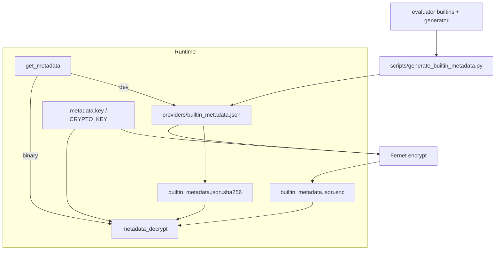

# Copyright (C) 2024-2026 jango_blockchained
#
# This file is part of pynescript.
#
# pynescript is free software: you can redistribute it and/or modify
# it under the terms of the GNU Affero General Public License as published by
# the Free Software Foundation, either version 3 of the License, or
# (at your option) any later version.
#
# pynescript is distributed in the hope that it will be useful,
# but WITHOUT ANY WARRANTY; without even the implied warranty of
# MERCHANTABILITY or FITNESS FOR A PARTICULAR PURPOSE.  See the
# GNU Affero General Public License for more details.
#
# You should have received a copy of the GNU Affero General Public License
# along with pynescript.  If not, see <https://www.gnu.org/licenses/>.
#
# SPDX-License-Identifier: AGPL-3.0-or-later

---
title: "Builtin Metadata"
description: "JSON catalog for LSP completion and hover; generation pipeline; Fernet encryption, CRYPTO_KEY / METADATA_KEY, and decrypt path."
---

# Builtin Metadata

## Abstract

Builtin metadata is the **LSP documentation corpus**: a map from fully qualified names (`ta.sma`, `strategy.entry`, …) to labels, signatures, briefs, snippets, and categories. It is generated from code (not hand-edited as source of truth), loaded by the language server for completion/hover/inlay, and optionally **Fernet-encrypted** for Nuitka onefile distribution so casual string extraction does not dump the full catalog.

This is obscurity for distribution hygiene, not a cryptographic access-control boundary.

## Conceptual model



## Interface surface (metadata record)

Typical entry in `builtin_metadata.json`:

```json
{
  "ta.sma": {
    "label": "ta.sma",
    "kind": "function",
    "detail": "ta.sma(series, int) → series float",
    "brief": "…",
    "documentation": "…",
    "snippet": "ta.sma(${1:param1}, ${2:param2})",
    "category": "ta.technical_analysis"
  }
}
```

Categories drive completion headers (`ta.technical_analysis` → “Technical Analysis (ta.*)”, `builtin` → “Built-in Variables”, etc.).

### Loader API

`providers/builtin_metadata.py`:

| Function | Behavior |
| --- | --- |
| `get_metadata()` | Singleton cache; prefer `.enc` decrypt, else plaintext JSON, else `{}` |
| `get_builtin(name)` | Single entry or `None` |
| `get_builtins_by_category` / `get_all_categories` | Category queries |
| `fuzzy_filter` | Scored substring match for completion |

### Consumers

- Completion list / module / resolve
- Hover cards
- Inlay return-type extraction from `detail` after `→`

## Internals

| Path | Role |
| --- | --- |
| `scripts/generate_builtin_metadata.py` | Introspect builtins → JSON |
| `src/pynescript/langserver/providers/builtin_metadata.json` | Dev plaintext |
| `…/builtin_metadata.json.enc` | Encrypted blob for release |
| `…/builtin_metadata.json.sha256` | First 16 hex chars of SHA-256 of **plaintext** |
| `…/metadata_decrypt.py` | Fernet load + integrity check |
| `scripts/build/compile.py` | `encrypt_metadata()`, Nuitka include of providers dir |
| `scripts/build/ci_build.py` | `stage_metadata()` for CI |
| `scripts/build/.metadata.key` | **Gitignored** Fernet key material |

### Generation

After adding evaluator builtins:

```bash
python scripts/generate_builtin_metadata.py
```

Do not hand-edit the JSON as the long-term source of truth; regenerate from code.

### Encryption (build)

`scripts/build/compile.py` → `encrypt_metadata()`:

1. Require `cryptography` and plaintext JSON.
2. Generate Fernet key → write `scripts/build/.metadata.key` (mode `0o600`).
3. Encrypt → `builtin_metadata.json.enc`.
4. Write truncated SHA-256 of plaintext to `.sha256`.

Local `encrypt_metadata` currently **always generates a new key** when invoked. For **byte-stable** encrypted artifacts across CI runs, supply a stable secret:

| Context | Mechanism |
| --- | --- |
| GitHub Actions | `secrets.METADATA_KEY` → env (documented as `CRYPTO_KEY` in workflows / AGENTS) |
| Cloud Build | substitution `${_METADATA_KEY}` → `CRYPTO_KEY` |
| Runtime decrypt | File `.metadata.key` next to providers **or** env `PYNESCRIPT_METADATA_KEY` |

Without a stable key, each CI encrypt produces a different `.enc` blob — not a functional bug, but noisy diffs and cache misses.

### Decrypt path

`metadata_decrypt.py`:

1. Resolve key: PyInstaller/Nuitka data dir `.metadata.key`, else providers dir, else `PYNESCRIPT_METADATA_KEY`.
2. Fernet-decrypt `.enc`.
3. If `.sha256` present, compare `sha256(plaintext).hexdigest()[:16]`.
4. `json.loads` → dict.

`get_metadata_cached()` prefers **plaintext** when both exist (developer-friendly).

`get_metadata()` in `builtin_metadata.py`: if `.enc` exists, try decrypt cache; on failure empty dict; elif plaintext, load it.

## Invariants and edge cases

1. **Regenerate after builtin changes** or completion/hover/inlay drift.
2. **Empty dict on failure** fails soft (no completions) rather than crashing the server.
3. **Integrity mismatch** raises in decrypt — compiled binary should not silently serve corrupt docs.
4. **Key not in git** — never commit `.metadata.key`.
5. **Fernet is symmetric** — anyone with the binary + key material can recover plaintext; design goal is casual reverse-engineering friction and future paid-metadata swap hooks.

## Worked example — local dev

```bash
python scripts/generate_builtin_metadata.py
# edit-free check
python -c "from pynescript.langserver.providers.builtin_metadata import get_builtin; print(get_builtin('ta.sma'))"
```

## Worked example — encrypted binary path

```bash
# build (encrypts + Nuitka) — see DevOps
python scripts/build/compile.py
export PYNESCRIPT_METADATA_KEY="$(cat scripts/build/.metadata.key)"
# or embed .metadata.key in the onefile data dir during compile
```

## Failure modes

| Symptom | Cause |
| --- | --- |
| Completions empty in release binary | Missing key / wrong `PYNESCRIPT_METADATA_KEY` |
| `Metadata integrity check failed` | `.enc` and `.sha256` out of sync |
| CI churn on `.enc` | New random key each build without `CRYPTO_KEY` / `METADATA_KEY` |
| Stale docs for new `ta.*` | Forgot to re-run generator |

## See also

- [Metadata crypto (DevOps)](/pyne/docs/devops/metadata-crypto)
- [Nuitka build](/pyne/docs/devops/nuitka-build)
- [Completion](/pyne/docs/lsp/features/completion)
- [Hover](/pyne/docs/lsp/features/hover)
