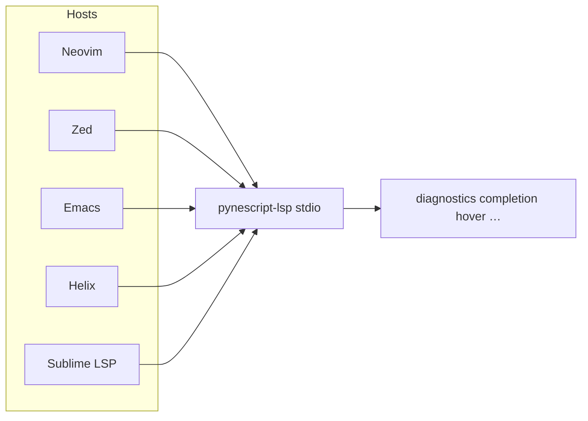

# Copyright (C) 2024-2026 jango_blockchained
#
# This file is part of pynescript.
#
# pynescript is free software: you can redistribute it and/or modify
# it under the terms of the GNU Affero General Public License as published by
# the Free Software Foundation, either version 3 of the License, or
# (at your option) any later version.
#
# pynescript is distributed in the hope that it will be useful,
# but WITHOUT ANY WARRANTY; without even the implied warranty of
# MERCHANTABILITY or FITNESS FOR A PARTICULAR PURPOSE.  See the
# GNU Affero General Public License for more details.
#
# You should have received a copy of the GNU Affero General Public License
# along with pynescript.  If not, see <https://www.gnu.org/licenses/>.
#
# SPDX-License-Identifier: AGPL-3.0-or-later

---
title: "Editor Clients"
description: "Wire pynescript-lsp into Neovim, Zed, Emacs, Helix, Sublime, and generic LSP hosts."
---

# Editor Clients

## Abstract

Any editor that speaks LSP over STDIO can host PYNE intelligence. First-class snippets live in `clients/` (Neovim Lua, Zed JSON, Emacs Lisp) plus documented Helix/Sublime fragments. The VS Code path is a dedicated extension ([vscode-extension](/pyne/docs/lsp/vscode-extension)); this page covers the rest.

**Prerequisite:** `pynescript-lsp` on `PATH` (Python 3.10+):

```bash
pip install "pynescript[lsp]"
# development
pip install -e ".[lsp]"
```

## Conceptual model



## Interface surface — repo files

| File | Editor |
| --- | --- |
| `clients/neovim.lua` | Neovim (`nvim-lspconfig` or manual) |
| `clients/zed.json` | Zed `settings.json` fragment |
| `clients/emacs.el` | Emacs `lsp-mode` + `pinescript-mode` |
| `clients/README.md` | Human-oriented install notes |
| `vscode-extension/` | VS Code / Cursor-compatible |

## Neovim

Return table from `clients/neovim.lua`:

```lua
return {
  cmd = { 'pynescript-lsp' },
  filetypes = { 'pinescript' },
  root_dir = function(fname)
    return vim.fs.root(fname, { '.git', '*.pine', '*.pinev5', '*.pinev6', 'pyproject.toml' })
      or vim.fn.getcwd()
  end,
  settings = {
    pinescript = {
      formatting = { enabled = true },
      diagnostics = { enabled = true },
      completion = { snippets = true },
    },
  },
}
```

Suggested maps when attaching: `gd` definition, `gr` references, `K` hover, format via `vim.lsp.buf.format`.

Register filetype if needed:

```vim
au BufRead,BufNewFile *.pine,*.pinev5,*.pinev6 setfiletype pinescript
```

## Zed

Merge `clients/zed.json` into `~/.config/zed/settings.json`:

```json
{
  "languages": {
    "Pine Script": {
      "language_servers": ["pynescript"]
    }
  },
  "language_servers": {
    "pynescript": {
      "command": "pynescript-lsp",
      "arguments": ["--stdio"],
      "languages": ["Pine Script"]
    }
  }
}
```

{/* TODO: verify Zed language name registration for Pine Script files */}

## Emacs

`clients/emacs.el` registers an `lsp-mode` client:

```elisp
(lsp-register-client
 (make-lsp-client
  :new-connection (lsp-stdio-connection '("pynescript-lsp" "--stdio"))
  :major-modes '(pinescript-mode)
  :server-id 'pynescript))
```

Defines a minimal `pinescript-mode` with font-lock keywords and `auto-mode-alist` for `\\.pine\\'` / `\\.pinev[0-9]+\\'`. Optional keys: `C-c C-c` format, `M-.` definition, `M-?` references.

## Helix

`~/.config/helix/languages.toml`:

```toml
[[language]]
name = "pinescript"
scope = "source.pinescript"
file-types = ["pine", "pinev5", "pinev6"]
roots = ["pyproject.toml"]
command = "pynescript-lsp"
args = ["--stdio"]
```

## Sublime Text

With Package Control **LSP**:

```json
{
  "clients": {
    "pynescript": {
      "command": ["pynescript-lsp", "--stdio"],
      "selector": "source.pinescript",
      "initializationOptions": {}
    }
  }
}
```

## Generic / Cursor

```bash
pynescript-lsp
# or explicitly:
pynescript-lsp --stdio
```

Point the host’s “external language server” command at that binary. Cursor users can also load the VS Code extension in compatible mode when packaged as VSIX.

## Internals

Server entry always uses STDIO (`start_io` in `__main__.py`). Capability negotiation is identical across hosts — differences are client UI only (how inlay hints render, whether pull diagnostics are used, etc.).

Tests: `tests/test_lsp_features.py` (handlers with fake params), `tests/test_langserver.py` (e2e with pytest-asyncio) — not editor-specific.

## Invariants and edge cases

1. **Language id** should be `pinescript` for VS Code parity; some editors invent their own names — map filetypes carefully.
2. **Root directory** heuristics vary; wrong root rarely breaks single-file Pine editing (workspace is URI-keyed open buffers).
3. **Settings keys** under `pinescript` in Neovim are conventional; the Python server does not currently enforce a rich `workspace/configuration` schema for all of them.
4. Nuitka onefile can replace the module entry for air-gapped machines — same command name if installed on PATH.

## Failure modes

| Symptom | Cause |
| --- | --- |
| Server exits immediately | Missing pygls / incomplete install `.[lsp]` |
| Filetype never attaches | Extension not mapped to `pinescript` |
| Features missing in Helix | Older Helix without inlay / semantic support — grammar still useful |

## See also

- [VS Code extension](/pyne/docs/lsp/vscode-extension)
- [Architecture](/pyne/docs/lsp/architecture)
- [End-user editors guide](/pyne/docs/enduser/guides/editors)
