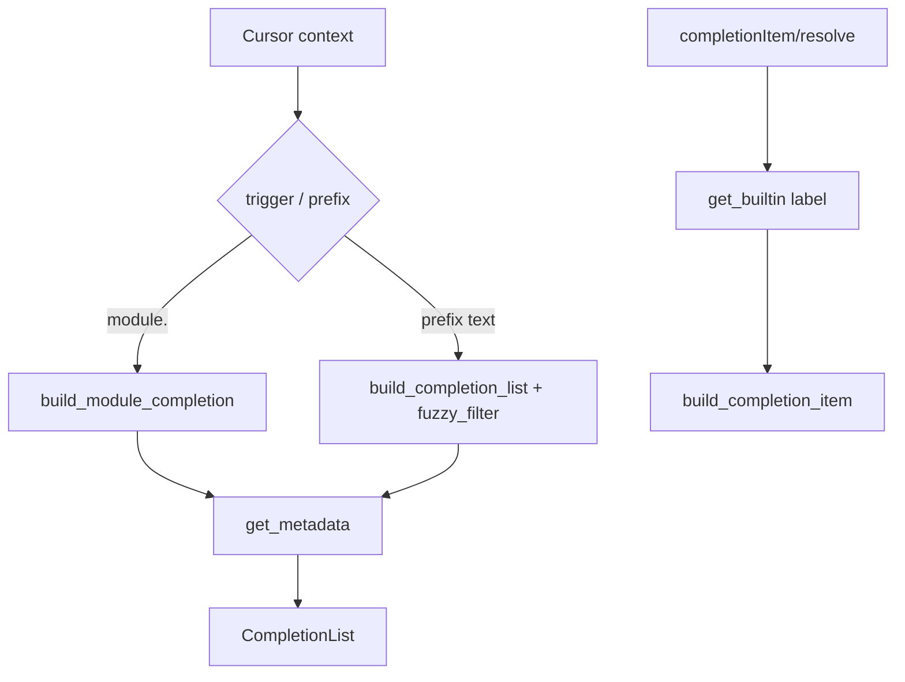

# Copyright (C) 2024-2026 jango_blockchained
#
# This file is part of pynescript.
#
# pynescript is free software: you can redistribute it and/or modify
# it under the terms of the GNU Affero General Public License as published by
# the Free Software Foundation, either version 3 of the License, or
# (at your option) any later version.
#
# pynescript is distributed in the hope that it will be useful,
# but WITHOUT ANY WARRANTY; without even the implied warranty of
# MERCHANTABILITY or FITNESS FOR A PARTICULAR PURPOSE.  See the
# GNU Affero General Public License for more details.
#
# You should have received a copy of the GNU Affero General Public License
# along with pynescript.  If not, see <https://www.gnu.org/licenses/>.
#
# SPDX-License-Identifier: AGPL-3.0-or-later

---
title: "Completion"
description: "textDocument/completion and completionItem/resolve from builtin metadata, module-dot triggers, and fuzzy filter."
---

# Completion

## Abstract

Completion is metadata-driven, not evaluator-driven. The server loads a catalog of builtins (plaintext JSON in development, Fernet-encrypted in compiled binaries), filters by prefix or module, and returns `CompletionItem` rows with optional snippet `insertText`. Resolve re-hydrates documentation for a single item.

## Conceptual model

## Interface surface

| Method | Capability |
| --- | --- |
| `textDocument/completion` | `trigger_characters=["."]`, returns `CompletionList` |
| `completionItem/resolve` | `resolve_provider=True` |

Handler: `features/completion.py` → `handle_completion` / `handle_completion_resolve`.

### Trigger logic

1. Compute `text_before_cursor` on the current line.
2. `get_trigger_char` — if the previous character is `.` (or `(`, `,`, space), treat as trigger.
3. If the last token contains `.` (e.g. `ta.` or `ta.sm`), call `build_module_completion(module)`.
4. Else `build_completion_list(prefix=prefix)` over the full catalog.

Word boundaries for Pine identifiers: `[a-zA-Z_][a-zA-Z0-9_.]*` (`protocol/utils.py`).

### Item fields

Built by `providers/completion_items.py`:

| Field | Source |
| --- | --- |
| `label` | metadata `label` (e.g. `ta.sma`) |
| `kind` | `CompletionItemKind.Function` |
| `detail` | signature / detail string |
| `documentation` | Markdown from metadata |
| `insert_text` | Snippet if `${...}` present, else plain label |
| `insert_text_format` | Snippet or PlainText |
| `filter_text` | dotted parts + brief |
| `sort_text` | modules first (`\x01…`), root second (`\x02…`) |

Category headers may appear as Folder-kind items with empty insert text and labels like `--- Technical Analysis (ta.*) (N) ---`.

## Internals

| Path | Role |
| --- | --- |
| `features/completion.py` | Request context + dispatch |
| `providers/completion_items.py` | List / item / module builders |
| `providers/builtin_metadata.py` | Load cache, `fuzzy_filter`, `get_builtin` |
| `protocol/utils.py` | Word + trigger helpers |

### Fuzzy filter scores

`fuzzy_filter(query, items, limit=50)`:

| Match | Score |
| --- | --- |
| Exact label | 1000 |
| Prefix | 500 |
| Substring in label | 100 |
| Category | 50 |
| Brief | 25 |

Results sorted by score descending, capped at `limit`.

### Resolve

`handle_completion_resolve` looks up `params.label` in metadata; if found, rebuilds a full `CompletionItem`. Unknown labels return unchanged.

## Invariants and edge cases

1. **No user-symbol completion yet** — only catalog builtins (not local `myFunc` unless it appears in metadata).
2. Empty metadata dict yields an empty list (failed decrypt / missing files).
3. Module completion uses `startswith(module + ".")` — nested namespaces beyond one dot still work if labels are fully qualified.
4. Snippets are generated at metadata build time (`scripts/generate_builtin_metadata.py`); incompleteness of placeholders is a generator concern, not the LSP handler.

## Worked example

User types `ta.` → module completion for all `ta.*` labels.

User types `sma` without a module → fuzzy filter may return `ta.sma` among others (substring score).

Resolve on `ta.sma` reloads full documentation markup for the detail pane.

## Failure modes

| Symptom | Cause |
| --- | --- |
| Zero items always | Metadata not loaded — check [builtin metadata](/pyne/docs/lsp/builtin-metadata) |
| Dot trigger ignored | Client did not set completion trigger characters from server capabilities |
| Snippets inserted raw | Client disabled snippet support; extension setting `pynescript.completion.snippets` |

## See also

- [Hover](/pyne/docs/lsp/features/hover) — shares metadata
- [Builtin metadata](/pyne/docs/lsp/builtin-metadata)
- [Inlay hints](/pyne/docs/lsp/features/inlay-hints) — uses return types from `detail`
