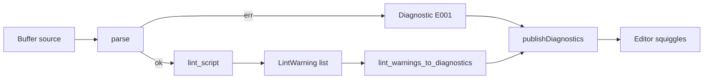

# Copyright (C) 2024-2026 jango_blockchained
#
# This file is part of pynescript.
#
# pynescript is free software: you can redistribute it and/or modify
# it under the terms of the GNU Affero General Public License as published by
# the Free Software Foundation, either version 3 of the License, or
# (at your option) any later version.
#
# pynescript is distributed in the hope that it will be useful,
# but WITHOUT ANY WARRANTY; without even the implied warranty of
# MERCHANTABILITY or FITNESS FOR A PARTICULAR PURPOSE.  See the
# GNU Affero General Public License for more details.
#
# You should have received a copy of the GNU Affero General Public License
# along with pynescript.  If not, see <https://www.gnu.org/licenses/>.
#
# SPDX-License-Identifier: AGPL-3.0-or-later

---
title: "Diagnostics"
description: "Push and pull diagnostics: parse errors, lint rules, severity mapping, and code-action stubs."
---

# Diagnostics

## Abstract

Diagnostics are the primary static feedback channel. The workspace re-parses and re-lints on every open/change/save, converts `LintWarning` objects (and parse failures) into `lsp.Diagnostic`, then **pushes** them with `textDocument/publishDiagnostics`. Clients that support LSP 3.16+ pull diagnostics can also request `textDocument/diagnostic` or `workspace/diagnostic`.

## Conceptual model



## Interface surface

### Push (always on)

Triggered from `server.py` on `didOpen`, `didChange`, `didSave`. Close clears diagnostics (`items=[]`).

### Pull

| Method | Response |
| --- | --- |
| `textDocument/diagnostic` | `RelatedFullDocumentDiagnosticReport` with `kind=full`, `result_id="{uri}-{version}"` |
| `workspace/diagnostic` | One `WorkspaceFullDocumentDiagnosticReport` per open URI |

Capability: `diagnostic_provider` with `identifier="pynescript-diagnostics"`, `inter_file_dependencies=False`.

### Diagnostic shape

| Field | Value |
| --- | --- |
| `range` | 0-based line; column from warning or 0; end spans remainder of line (capped) |
| `severity` | error / warning / information / hint |
| `message` | Human-readable lint or parse message |
| `source` | `"PineScript"` |
| `code` | Lint code (e.g. `W001`) or `E001` for parse errors |

The richer conversion in `features/diagnostics.py` also supports:

- `code_description` hrefs for codes starting with `E` / `W` (docs URLs)
- `tags`: `W001` → Unnecessary, `W002` → Deprecated

Workspace conversion in `workspace.py` is the path used on push; the feature module API is available for shared logic and quick-fix helpers.

## Internals

| Path | Role |
| --- | --- |
| `src/pynescript/langserver/workspace.py` | `_parse_and_lint`, `_lint_warnings_to_diagnostics` |
| `src/pynescript/langserver/features/diagnostics.py` | Conversion helpers, tags, `create_quick_fix` |
| `src/pynescript/ast/linter.py` | Rule engine producing `LintWarning` |

### Severity map

```text
error        → DiagnosticSeverity.Error
warning      → Warning
info|information → Information
hint         → Hint
(default)    → Warning
```

### Parse errors

On exception from `parse`:

- `ast = None`, `diagnostics = []` (lint skipped)
- Message stored as `parse_error`
- Synthetic diagnostic code **E001**, severity Error, line from regex on the exception text

### Quick fixes (feature module)

`create_quick_fix` (not yet fully wired through `workspace/executeCommand` / codeAction handlers in `server.py`):

- **W001** → insert `//@version=5\n` at document start
- **C002** (long line) → suggest format document command

Capability advertises QuickFix / Refactor / SourceOrganizeImports kinds for future wiring.

## Invariants and edge cases

1. **Lint does not run when parse fails** — only E001 is shown.
2. Warnings without a line number are dropped (`None` conversion).
3. End column heuristic uses full line length (or +10) and clamps to 2000 characters — not a precise token span.
4. `inter_file_dependencies=False`: no cross-file analysis; each URI is independent.
5. Push and pull should agree for a given buffer version; both read the same `TextDocumentState`.

## Worked example

Source:

```pinescript
indicator("x")
plot(close)
```

If the linter emits a missing-version warning (code `W001`), the client receives a Warning diagnostic on the relevant line with `source: "PineScript"` and may offer the version-header quick fix when code actions are connected.

On a hard parse failure at line 3, expect:

```json
{
  "severity": 1,
  "code": "E001",
  "source": "PineScript",
  "message": "<exception text>"
}
```

## Failure modes

| Symptom | Cause |
| --- | --- |
| Stale squiggles after edit | Client using full-document sync incorrectly, or version mismatch |
| Empty diagnostics on broken file | Unexpected: parse errors should still emit E001 — check client filter on `source` |
| No workspace pull results | Only **open** documents are tracked; closed files are absent |

## See also

- [Linter (core)](/pyne/docs/core/linter)
- [Error model](/pyne/docs/core/error-model)
- [Architecture](/pyne/docs/lsp/architecture)
