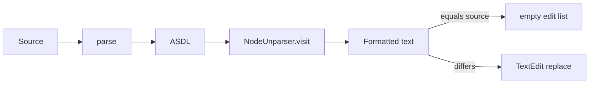

# Formatting

## Abstract

Formatting is **canonical unparse**, not a style linter. The handler parses the buffer, runs `NodeUnparser`, and if the result differs from the source, replaces the document (or the requested line range) with a single `TextEdit`. There is no prettier-like option matrix; `FormattingOptions` from the client are currently unused.

## Conceptual model



## Interface surface

| Method | Handler |
| --- | --- |
| `textDocument/formatting` | `handle_formatting` |
| `textDocument/rangeFormatting` | `handle_range_formatting` |

Capabilities: both providers `True` in `config.py`.

### Full document

1. Parse with filename `"<format>"`.
2. `formatted = NodeUnparser().visit(tree)`.
3. If identical to source → `[]`.
4. Else one `TextEdit` spanning `(0,0)` → last line/col with `new_text=formatted`.

### Range

1. Unparse the **entire** document.
2. Slice **formatted** lines and **source** lines by the client range’s start/end line indices.
3. If the in-range slices match → `[]`.
4. Else replace `params.range` with the formatted line slice.

This is line-aligned, not AST-node-aligned: partial mid-line ranges may produce surprising splices when unparse changes line structure.

## Internals

| Path | Role |
| --- | --- |
| `features/formatting.py` | LSP handlers |
| `src/pynescript/ast/helper.py` | `parse` |
| `src/pynescript/ast/unparser.py` | `NodeUnparser` |

VS Code command `pynescript.formatDocument` delegates to `editor.action.formatDocument`, which hits this provider when the language client is active.

## Invariants and edge cases

1. **Parse failure → `[]`** (no partial format; silent no-op from the client’s perspective).
2. **Idempotence goal:** format twice should stabilize if unparse is canonical; any non-idempotent unparse is a core bug, not an LSP bug.
3. **Comments / trivia:** fidelity is whatever the unparser preserves — not a full CST pretty-printer.
4. **Range formatting** still requires a full successful parse of the whole file.
5. Tab size / insert spaces from `FormattingOptions` are ignored today.

## Worked example

Before:

```pinescript
//@version=5
indicator("x")
plot(  close  )
```

After full format (illustrative — exact whitespace follows `NodeUnparser`):

```pinescript
//@version=5
indicator("x")
plot(close)
```

If source already matches unparse output, the server returns an empty edit list and the editor leaves the buffer alone.

## Failure modes

| Symptom | Cause |
| --- | --- |
| Format does nothing on broken syntax | Expected: exception → `[]` |
| Range format rewrites wrong lines | Unparse shifted line count; prefer full-document format |
| Client “format on save” loops | Unparse not idempotent — fix unparser, not client |

## See also

- [Unparser](/pyne/docs/core/unparser)
- [Architecture](/pyne/docs/lsp/architecture)
- [VS Code extension](/pyne/docs/lsp/vscode-extension)
