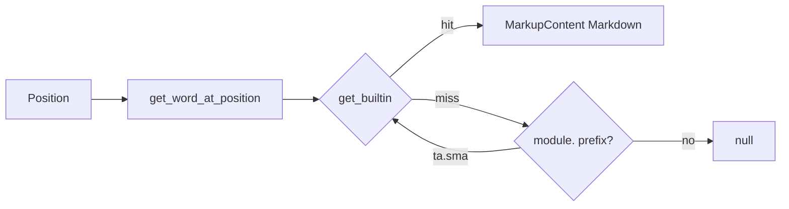

# Hover

## Abstract

Hover answers “what is this identifier?” for **builtins**. The handler extracts the word under the cursor (including dotted forms), looks up metadata, and returns a Markdown card: signature fence, brief, optional long documentation, curated examples, and related symbols. User-defined symbols without metadata return `null`.

## Conceptual model



## Interface surface

- Method: `textDocument/hover`
- Capability: `hover_provider=True`
- Handler: `features/hover.py` → `handle_hover`

### Lookup order

1. Exact word at cursor via `get_word_at_position` (identifiers may include `.`).
2. If no metadata hit, inspect text before the word: if it ends with `module.`, try `module.word`.
3. Build hover with range covering `[start, end)` of the word on the line.

### Card structure

```markdown
```pinescript
{detail}
```

{brief}

---
{first documentation paragraph, ≤500 chars}

**Example:** …
**See also:** `ta.ema`, …
```

Examples and related maps are **hardcoded** for a small high-value set (`ta.sma`, `ta.ema`, `ta.rsi`, `ta.macd`, strategy entry/exit, etc.). Others show signature + brief only.

External TradingView doc links are intentionally omitted (`_build_docs_link` returns empty) to keep hover self-contained.

## Internals

| Path | Role |
| --- | --- |
| `features/hover.py` | Word resolution + Markdown assembly |
| `providers/builtin_metadata.py` | `get_builtin` |
| `protocol/utils.py` | Word extraction |

## Invariants and edge cases

1. **No source → null.** Missing buffer aborts early.
2. **Line OOB → null.** Cursor past last line is ignored.
3. **Empty word → null.** Whitespace / punctuation yields no hover.
4. **User symbols** (local variables, UDTs) are not inferred for hover; use [definition](/pyne/docs/lsp/features/navigation) / outline instead.
5. Documentation truncation is first-paragraph / 500-char only — full docs live in metadata and completion resolve.

## Worked example

Cursor on `sma` in `plot(ta.sma(close, 14))`:

- Word may be `ta.sma` if the dotted identifier is one match, or `sma` with module recovery from `ta.`.
- Response `contents.kind = markdown` with fence of the metadata `detail` line.

## Failure modes

| Symptom | Cause |
| --- | --- |
| Hover never appears | Metadata empty or word not in catalog |
| Wrong symbol | Identifier regex swallowed neighboring text — rare with `_.` pattern |
| Stale docs after adding builtin | Regenerate metadata — [builtin metadata](/pyne/docs/lsp/builtin-metadata) |

## See also

- [Completion](/pyne/docs/lsp/features/completion)
- [Builtin metadata](/pyne/docs/lsp/builtin-metadata)
- [Navigation](/pyne/docs/lsp/features/navigation)
