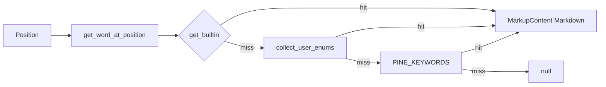

# Copyright (C) 2024-2026 jango_blockchained
#
# This file is part of pynescript.
#
# pynescript is free software: you can redistribute it and/or modify
# it under the terms of the GNU Affero General Public License as published by
# the Free Software Foundation, either version 3 of the License, or
# (at your option) any later version.
#
# pynescript is distributed in the hope that it will be useful,
# but WITHOUT ANY WARRANTY; without even the implied warranty of
# MERCHANTABILITY or FITNESS FOR A PARTICULAR PURPOSE.  See the
# GNU Affero General Public License for more details.
#
# You should have received a copy of the GNU Affero General Public License
# along with pynescript.  If not, see <https://www.gnu.org/licenses/>.
#
# SPDX-License-Identifier: AGPL-3.0-or-later

---
title: "Hover"
description: "textDocument/hover — Markdown documentation cards for Pine builtins from metadata."
---

# Hover

## Abstract

Hover answers “what is this identifier?” for **builtins**, then **user enums**, then **keywords**. The handler extracts the word under the cursor (including dotted forms), looks up metadata / enum members / `PINE_KEYWORDS`, and returns a Markdown card. Local functions and variables still return `null` (use [definition](/pyne/docs/lsp/features/navigation)).

## Conceptual model



## Interface surface

- Method: `textDocument/hover`
- Capability: `hover_provider=True`
- Handler: `features/hover.py` → `handle_hover`

### Lookup order

1. Exact word at cursor via `get_word_at_position` (identifiers may include `.`).
2. Builtin lookup: full word, then leaf after `.`, then `module.word` if the preceding token ends with `.`.
3. Else user-enum type or `Enum.member` from the cached AST.
4. Else keyword brief from `PINE_KEYWORDS`.
5. Build hover with range covering `[start, end)` of the word on the line.

### Card structure

```markdown
```pinescript
{detail}
```

{brief}

---
{first documentation paragraph, ≤500 chars}

**Example:** …
**See also:** `ta.ema`, …
```

Examples and related maps are **hardcoded** for a small high-value set (`ta.sma`, `ta.ema`, `ta.rsi`, `ta.macd`, strategy entry/exit, etc.). Others show signature + brief only.

External TradingView doc links are intentionally omitted (`_build_docs_link` returns empty) to keep hover self-contained.

## Internals

| Path | Role |
| --- | --- |
| `features/hover.py` | Word resolution + Markdown assembly |
| `providers/builtin_metadata.py` | `get_builtin` |
| `protocol/utils.py` | Word extraction |

## Invariants and edge cases

1. **No source → null.** Missing buffer aborts early.
2. **Line OOB → null.** Cursor past last line is ignored.
3. **Empty word → null.** Whitespace / punctuation yields no hover.
4. **User functions / locals / UDTs** are not inferred for hover (enums are). Use [definition](/pyne/docs/lsp/features/navigation) / outline instead.
5. Documentation truncation is first-paragraph / 500-char only — full docs live in metadata and completion resolve.

## Worked example

Cursor on `sma` in `plot(ta.sma(close, 14))`:

- Word may be `ta.sma` if the dotted identifier is one match, or `sma` with module recovery from `ta.`.
- Response `contents.kind = markdown` with fence of the metadata `detail` line.

## Failure modes

| Symptom | Cause |
| --- | --- |
| Hover never appears | Metadata empty or word not in catalog |
| Wrong symbol | Identifier regex swallowed neighboring text — rare with `_.` pattern |
| Stale docs after adding builtin | Regenerate metadata — [builtin metadata](/pyne/docs/lsp/builtin-metadata) |

## See also

- [Completion](/pyne/docs/lsp/features/completion)
- [Builtin metadata](/pyne/docs/lsp/builtin-metadata)
- [Navigation](/pyne/docs/lsp/features/navigation)
