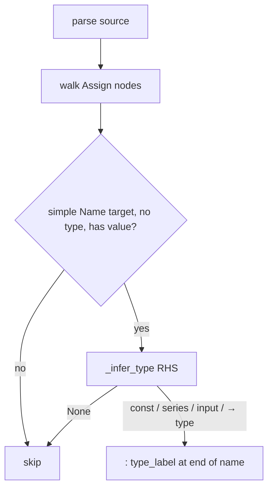

# Inlay Hints

## Abstract

Inlay hints surface **inferred types** next to simple `name = expr` assignments when no explicit type annotation is present. Inference is deliberately shallow: constants, bare series builtins (`close`, …), `input.*` constructors, and `ta`/`math`/`str`/`color` calls whose metadata `detail` contains a `→` return type. Ambiguous operators are skipped rather than guessed wrong.

## Conceptual model



Example mental model (from module docstring):

```text
length = 14                 →  length: const int
rsi = ta.rsi(close, 14)     →  rsi: series float   (from metadata detail)
n = input.int(5, "n")       →  n: input int
```

## Interface surface

- Method: `textDocument/inlayHint`
- Capability: `InlayHintOptions(resolve_provider=False)`
- Handler: `features/inlay_hints.py` → `handle_inlay_hints`

Each hint:

| Field | Value |
| --- | --- |
| `position` | End of target identifier (`lineno-1`, `col_offset + len(id)`) |
| `label` | `": {type_label}"` |
| `kind` | `InlayHintKind.Type` |
| `tooltip` | `Inferred type: {type_label}` |

Returns `[]` for empty source, `None` if parse fails (client typically treats as no hints).

## Internals

### Constant mapping

| Python value | Label |
| --- | --- |
| `bool` | `const bool` |
| `int` | `const int` |
| `float` | `const float` |
| `str` | `const string` |

### Builtin bare names

`open`, `high`, `low`, `close`, `volume`, `hl2`, `hlc3`, `ohlc4` → `series float`; time / bar index vars → `series int`; `na` → `na`.

### Calls

- `input.{int,float,bool,string,color,symbol,session,source,time,timeframe,price}` → `input {attr}`
- `ta|math|str|color.{attr}` → parse `detail` after `→`, else fallback `"series"`

### Walk

Recursive over `_fields` (same pattern as workspace symbol collection) — not limited to script top-level; nested function assigns can receive hints.

| Path | Role |
| --- | --- |
| `features/inlay_hints.py` | Collection + inference |
| `providers/builtin_metadata.py` | Return-type detail for modules |

## Invariants and edge cases

1. **Explicit `name: type = …` suppresses hints** (`node.type is not None`).
2. **Tuple / attribute targets** are ignored.
3. **BinOp / Compare / Conditional** return `None` — no speculative arithmetic types.
4. **Metadata quality bounds accuracy** — missing `→` in detail yields coarse `series`.
5. **No resolve step** — tooltips are final.

## Worked example

```pinescript
//@version=5
indicator("hints")
length = 14
src = close
avg = ta.sma(src, length)
period = input.int(20, "Period")
```

Expected hints (when parse + metadata succeed):

- `length` → `: const int`
- `src` → `: series float`
- `avg` → type from `ta.sma` detail (typically series float) or `series`
- `period` → `: input int`

`avg` will not get a hint derived from `length`’s type through the call graph — only the call’s known return shape.

## Failure modes

| Symptom | Cause |
| --- | --- |
| No hints on file | Parse error → `None` |
| `ta.*` always `: series` | Metadata detail lacks `→` segment |
| Hints mid-identifier | Incorrect `col_offset` on AST node — builder issue |

## See also

- [Completion](/pyne/docs/lsp/features/completion)
- [Builtin metadata](/pyne/docs/lsp/builtin-metadata)
- [Type system](/pyne/docs/core/type-system)
