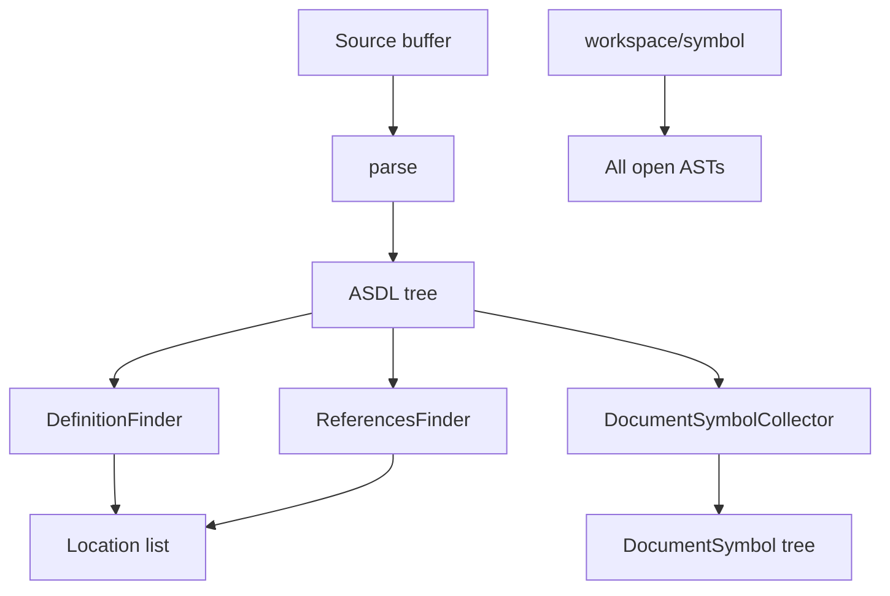

# Copyright (C) 2024-2026 jango_blockchained
#
# This file is part of pynescript.
#
# pynescript is free software: you can redistribute it and/or modify
# it under the terms of the GNU Affero General Public License as published by
# the Free Software Foundation, either version 3 of the License, or
# (at your option) any later version.
#
# pynescript is distributed in the hope that it will be useful,
# but WITHOUT ANY WARRANTY; without even the implied warranty of
# MERCHANTABILITY or FITNESS FOR A PARTICULAR PURPOSE.  See the
# GNU Affero General Public License for more details.
#
# You should have received a copy of the GNU Affero General Public License
# along with pynescript.  If not, see <https://www.gnu.org/licenses/>.
#
# SPDX-License-Identifier: AGPL-3.0-or-later

---
title: "Navigation"
description: "Go-to-definition, find-references, document outline, and workspace symbol search over the ASDL AST."
---

# Navigation

## Abstract

Navigation features operate on **user AST symbols**, not the builtin catalog. Definition and references walk a freshly parsed tree with `NodeVisitor` subclasses; document symbols build a hierarchical outline; workspace symbols scan all **open** documents. Locations currently anchor to line starts (coarse ranges) — enough for jump lists, not character-precise rename.

## Conceptual model



## Interface surface

| Method | Handler | Returns |
| --- | --- | --- |
| `textDocument/definition` | `definitions.handle_definition` | `list[Location] \| None` |
| `textDocument/references` | `references.handle_references` | `list[Location]` (possibly empty) |
| `textDocument/documentSymbol` | `symbols.handle_document_symbols` | `list[DocumentSymbol]` |
| `workspace/symbol` | `server._collect_workspace_symbols` | `list[SymbolInformation]` |

Capabilities: `definition_provider`, `references_provider`, document + workspace symbol options with work-done progress flags.

### Definition (`DefinitionFinder`)

Matches target word against:

- `FunctionDef.name`
- `TypeDef.name`
- `Assign` targets (`Name` or nested names)

Ignores mere call sites (`visit_Call` returns early when the callee name matches).

### References (`ReferencesFinder`)

- `Name` with Load / Store contexts
- Function and type definitions when `include_declaration` is true
- Call sites of bare `Name` callees

`params.context.include_declaration` controls whether declarations appear.

### Document symbols

Hierarchical:

| AST | SymbolKind | Children |
| --- | --- | --- |
| `FunctionDef` | Function | Variables assigned inside body |
| `TypeDef` | Class | Fields (`Assign` targets) |
| Top-level `Assign` | Variable | — |

Function `detail` is a coarse `function name()` string; assignments may show callee module attribute as detail when RHS is a call.

### Workspace symbols

Flat `SymbolInformation` for functions, types, and assigned names across open buffers; filtered by lowercase query substring.

## Internals

| Path | Role |
| --- | --- |
| `features/definitions.py` | Go-to-definition visitor |
| `features/references.py` | Find-all-references visitor |
| `features/symbols.py` | Document outline |
| `server.py` | Workspace symbol aggregation |

Parse is **per request** inside definition/references/symbols (not the workspace cached AST). That trades a little CPU for isolation if cache and buffer ever diverge.

## Invariants and edge cases

1. **Parse failure → empty / null** (definition `None`, others `[]`).
2. **Builtin names** have no definition in-file; clients should not expect `ta.sma` to resolve to a library file URI.
3. **Ranges are line-coarse** for many locations (`character=0`); selection ranges for document symbols use `col_offset` when present.
4. **Scope is naive** — same identifier in nested functions may collect multiple definitions; no shadowing analysis.
5. **Closed documents** disappear from workspace symbol search.

## Worked example

```pinescript
//@version=6
indicator("nav")
length = 14
mySma(src, len) =>
    ta.sma(src, len)
v = mySma(close, length)
```

- Definition on `mySma` at the call site → function line.
- References on `length` → assign + call argument (and declaration if included).
- Outline → `length` variable, `mySma` function (with locals), `v` variable.

## Failure modes

| Symptom | Cause |
| --- | --- |
| Jump lands column 0 | Expected with current Location encoding |
| Missing references inside function when targeting another function | `visit_FunctionDef` only walks body when the def name **differs** from target — intentional for declaration handling; calls inside same-named functions are a known edge |
| Empty outline | Parse error or empty source |

## See also

- [Architecture](/pyne/docs/lsp/architecture)
- [Hover](/pyne/docs/lsp/features/hover) — builtins vs user symbols
- [Diagnostics](/pyne/docs/lsp/features/diagnostics)
