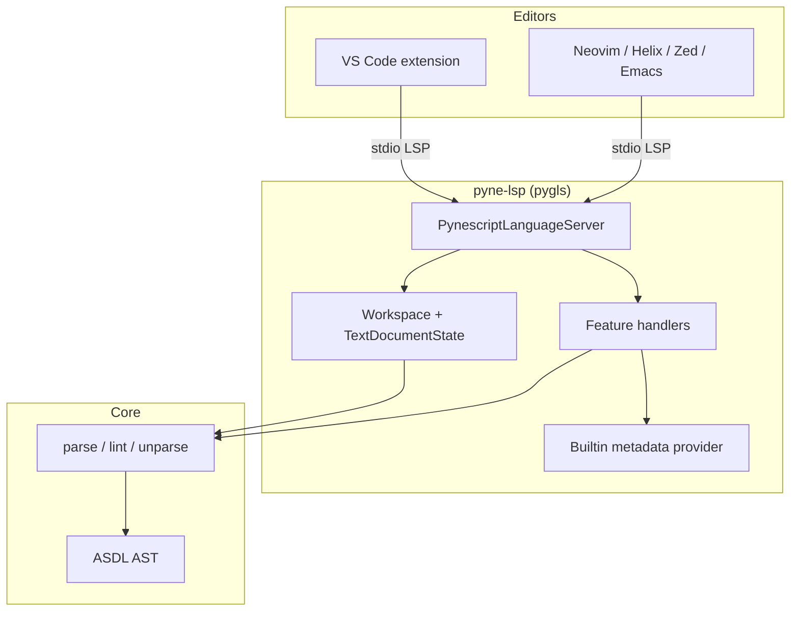

# Copyright (C) 2024-2026 jango_blockchained
#
# This file is part of pynescript.
#
# pynescript is free software: you can redistribute it and/or modify
# it under the terms of the GNU Affero General Public License as published by
# the Free Software Foundation, either version 3 of the License, or
# (at your option) any later version.
#
# pynescript is distributed in the hope that it will be useful,
# but WITHOUT ANY WARRANTY; without even the implied warranty of
# MERCHANTABILITY or FITNESS FOR A PARTICULAR PURPOSE.  See the
# GNU Affero General Public License for more details.
#
# You should have received a copy of the GNU Affero General Public License
# along with pynescript.  If not, see <https://www.gnu.org/licenses/>.
#
# SPDX-License-Identifier: AGPL-3.0-or-later

---
title: "Language Server"
description: "PYNE Language Server Protocol — diagnostics, completion, hover, formatting for .pyne / .pine and editor clients."
---

# Language Server

The PYNE **Language Server** is the editor-facing half of the evaluation stack: a pygls process that speaks LSP over STDIO (or TCP in tooling), parses Pine with the same ANTLR4 → ASDL pipeline as the runtime, and never requires a proprietary chart host. First-class file associations include **`.pyne`** (product extension) plus `.pine` / `.pinev5` / `.pinev6` / `.pinescript`.

## Abstract

Editors want *static* intelligence at typing cadence. Evaluation over OHLCV is *dynamic* and bar-loop expensive. PYNE therefore splits the stack:

| Process | Cadence | Shared substrate |
| --- | --- | --- |
| **LSP** (`pyne-lsp`) | keystroke / open / save | parse, lint, unparse, builtin metadata |
| **Pro API** (`backend.app`) | request / batch | parse, evaluate, plots / events / alerts |
| **CLI / library** | batch / embed | same AST + evaluator |

The LSP publishes diagnostics from the linter and parse errors, completes and hovers from Fernet-ready builtin metadata (plus keywords and user enums), navigates user symbols via AST visitors, emits semantic tokens from the cached tree, and formats by round-tripping through the unparser. Feature modules live under `src/pynescript/langserver/features/`; the VS Code extension (`hoox-sh.pyne` **0.3.10**) and `clients/` configs are thin protocol hosts — VS Code maps **`.pyne` first**, then legacy Pine suffixes, to language id `pinescript`. The stdio image is **`ghcr.io/hoox-sh/pyne/lsp`**.

## Conceptual model

**Invariant:** open/change/close always re-parse and re-lint the in-memory buffer. Features that need an AST re-parse on demand if the workspace cache is missing source.

## Interface surface

| Capability | LSP method(s) | Module |
| --- | --- | --- |
| Sync | `textDocument/didOpen|didChange|didClose|didSave` | `server.py` + `workspace.py` |
| Diagnostics (push + pull) | `publishDiagnostics`, `textDocument/diagnostic` | `workspace.py`, `features/diagnostics.py` |
| Completion (+ resolve) | `textDocument/completion`, `completionItem/resolve` | `features/completion.py` |
| Hover | `textDocument/hover` | `features/hover.py` |
| Definition / references | `textDocument/definition`, `textDocument/references` | `definitions.py`, `references.py` |
| Symbols | `textDocument/documentSymbol`, `workspace/symbol` | `symbols.py`, `server.py` |
| Formatting | `textDocument/formatting`, `rangeFormatting` | `features/formatting.py` |
| Inlay hints | `textDocument/inlayHint` | `features/inlay_hints.py` |
| Semantic tokens | `textDocument/semanticTokens/full` | `features/semantic_tokens.py` |

Declared capabilities: `src/pynescript/langserver/config.py` (`get_server_capabilities`).

## Internals

| Path | Role |
| --- | --- |
| `src/pynescript/langserver/server.py` | `PynescriptLanguageServer`, method registration |
| `src/pynescript/langserver/workspace.py` | Document map, incremental edits, parse+lint |
| `src/pynescript/langserver/config.py` | ServerCapabilities |
| `src/pynescript/langserver/features/*` | Per-method handlers |
| `src/pynescript/langserver/providers/*` | Metadata + completion builders |
| `src/pynescript/langserver/__main__.py` | STDIO entry (`pyne-lsp` / alias `pynescript-lsp`) |
| `vscode-extension/` | Language client + TextMate grammar (`hoox-sh.pyne` 0.3.10) |
| `clients/` | Neovim, Zed, Emacs snippets (Helix / Sublime are documented, not files) |

Console scripts are separate: `pyne` (Click CLI; alias `pynescript`) vs `pyne-lsp` (pygls; alias `pynescript-lsp`). Do not conflate them — see [architecture](/pyne/docs/lsp/architecture).

## Tracks in this tab

1. [Architecture](/pyne/docs/lsp/architecture) — server lifecycle, workspace, capabilities
2. [Diagnostics](/pyne/docs/lsp/features/diagnostics) through [Inlay hints](/pyne/docs/lsp/features/inlay-hints) — feature manuals
3. [Builtin metadata](/pyne/docs/lsp/builtin-metadata) — generation + Fernet `.enc` / `CRYPTO_KEY`
4. [VS Code extension](/pyne/docs/lsp/vscode-extension) — client packaging
5. [Clients](/pyne/docs/lsp/clients) — Neovim, Zed, Emacs, Helix, Sublime

## See also

- [Pro API](/pyne/docs/api) — HTTP evaluate path sharing the same AST
- [Evaluate contract](/pyne/docs/api/contract)
- [Linter](/pyne/docs/core/linter)
- [Unparser](/pyne/docs/core/unparser)
- [Editors guide (end user)](/pyne/docs/enduser/guides/editors)
