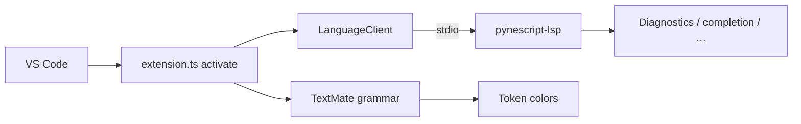

# Copyright (C) 2024-2026 jango_blockchained
#
# This file is part of pynescript.
#
# pynescript is free software: you can redistribute it and/or modify
# it under the terms of the GNU Affero General Public License as published by
# the Free Software Foundation, either version 3 of the License, or
# (at your option) any later version.
#
# pynescript is distributed in the hope that it will be useful,
# but WITHOUT ANY WARRANTY; without even the implied warranty of
# MERCHANTABILITY or FITNESS FOR A PARTICULAR PURPOSE.  See the
# GNU Affero General Public License for more details.
#
# You should have received a copy of the GNU Affero General Public License
# along with pynescript.  If not, see <https://www.gnu.org/licenses/>.
#
# SPDX-License-Identifier: AGPL-3.0-or-later

---
title: "VS Code Extension"
description: "PYNE VS Code extension: HOOX branding, TextMate grammar, LanguageClient wiring, settings, and VSIX build."
---

# VS Code Extension

## Abstract

**PYNE** is a **LanguageClient host** plus a rich TextMate grammar, branded as part of the **HOOX open trading stack**. It does not reimplement diagnostics or completion in TypeScript; it spawns `pynescript-lsp` (or a configured command) over STDIO via `vscode-languageclient`, maps **`.pyne` (first-class)** plus `*.pine` / `*.pinev5` / `*.pinev6` / `*.pinescript` to language id `pinescript`, and exposes a small settings surface for enablement and feature toggles.

> Pine Script™ and TradingView® are trademarks of TradingView, Inc. This project is independent and is not affiliated with or endorsed by TradingView, Inc.

## Conceptual model



## Interface surface

### Package identity

From `vscode-extension/package.json`:

| Field | Value |
| --- | --- |
| name | `pyne` |
| displayName | `PYNE` |
| extension id | `jango-blockchained.pyne` |
| icon | `media/icon.png` (HOOX mark) |
| engines.vscode | `^1.85.0` |
| main | `./out/extension.js` |
| dependency | `vscode-languageclient` ^9 |
| galleryBanner | `#050505` dark |

### Language contribution

- **id:** `pinescript`
- **aliases:** `PYNE`, `pyne`, `pinescript`, `Pine`
- **extensions:** **`.pyne`** (first), `.pine`, `.pinev5`, `.pinev6`, `.pinescript`
- **configuration:** `language-configuration.json`
- **grammar:** `syntaxes/pinescript.tmLanguage.json` (`scopeName: source.pinescript`) — namespaces, annotations, hex colors, UDT/enum, multiline strings, plot/strategy builtins

### Activation

```text
onLanguage:pinescript
workspaceContains:**/*.pyne
workspaceContains:**/*.pine
workspaceContains:**/*.pinev5
workspaceContains:**/*.pinev6
```

### Settings (`pynescript.*`)

| Key | Default | Meaning |
| --- | --- | --- |
| `lsp.enabled` | `true` | Skip activation when false |
| `lsp.command` | `auto` | Server executable / auto-detect |
| `lsp.python` | `python3` | Interpreter for module launch |
| `lsp.args` | `[]` | Extra server args |
| `formatting.enabled` | `true` | Passed as init option |
| `diagnostics.enabled` | `true` | Passed as init option |
| `completion.snippets` | `true` | Passed as init option |

Initialization options object:

```json
{
  "formattingEnabled": true,
  "snippetsEnabled": true,
  "diagnosticsEnabled": true
}
```

{/* TODO: verify server-side consumption of initializationOptions flags */}

### Commands

| Command | Action |
| --- | --- |
| `pynescript.restartServer` | `client.stop()` then `client.start()` |
| `pynescript.formatDocument` | `editor.action.formatDocument` |

### Client options

- Document selector: `pinescript` for `file` and `untitled` schemes
- File watcher: `**/*.pine` (and activation covers `**/*.pyne` via `workspaceContains`; open any associated suffix for language id)
- Diagnostic collection name: `pynescript`
- Default formatter id: `jango-blockchained.pyne`

## Internals

| Path | Role |
| --- | --- |
| `vscode-extension/src/extension.ts` | Activate / deactivate / client |
| `vscode-extension/package.json` | Contributes + scripts |
| `vscode-extension/syntaxes/pinescript.tmLanguage.json` | Grammar |
| `vscode-extension/language-configuration.json` | Brackets / comments |
| `out/extension.js` | Compiled JS |

Server launch:

```typescript
const serverOptions: ServerOptions = {
  command: lspCommand,           // default pynescript-lsp
  args: ['--parent-dir', scriptPath],
  transport: TransportKind.stdio,
  options: { env: { ...process.env, PYTHONPATH: scriptPath } },
};
```

`scriptPath` is resolved to `../src/pynescript/langserver` relative to the extension for monorepo development. Release packaging typically expects `pynescript-lsp` on `PATH` (pip or Nuitka binary).

### Build

```bash
cd vscode-extension
npm ci
npm run compile          # tsc → out/
npx vsce package         # VSIX
# or monorepo:
make build-vscode
```

Requires Node 22 tooling as noted in project agents docs for packaging.

## Invariants and edge cases

1. **`lsp.enabled === false` short-circuits activate** — no client, no restart command registration beyond early return (commands not registered).
2. **Binary vs module:** production users should install `pynescript[lsp]` or the Nuitka onefile and set `pynescript.lsp.command` if not on PATH.
3. **Grammar works without LSP** — open a `.pyne` or `.pine` file offline and still get TextMate highlighting.
4. **`.pyne` is first-class** in `package.json` extensions + activation; legacy `.pine*` / `.pinescript` remain fully supported.
5. File watcher primarily lists `**/*.pine`; v5/v6/`.pyne` still activate via language id on open.

## Worked example — extension development

```bash
pip install -e ".[lsp]"
cd vscode-extension && npm ci && npm run compile
# Launch Extension Development Host pointing at vscode-extension
```

Open a fixture `.pine` file; confirm Problems panel shows parse/lint diagnostics from the Python server.

## Failure modes

| Symptom | Cause |
| --- | --- |
| “Language client failed to start” | `pynescript-lsp` missing / wrong command |
| No squiggles, highlighting OK | LSP disabled or server crash; check Output → Pine Script Language Server |
| Restart does nothing | Client never started (`lsp.enabled` false) |

## See also

- [Clients](/pyne/docs/lsp/clients) — non-VS Code hosts
- [Architecture](/pyne/docs/lsp/architecture)
- [Nuitka build](/pyne/docs/devops/nuitka-build)
- [Editors guide](/pyne/docs/enduser/guides/editors)
