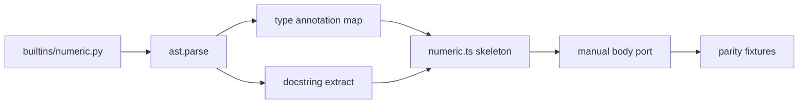

# Copyright (C) 2024-2026 jango_blockchained
#
# This file is part of pynescript.
#
# pynescript is free software: you can redistribute it and/or modify
# it under the terms of the GNU Affero General Public License as published by
# the Free Software Foundation, either version 3 of the License, or
# (at your option) any later version.
#
# pynescript is distributed in the hope that it will be useful,
# but WITHOUT ANY WARRANTY; without even the implied warranty of
# MERCHANTABILITY or FITNESS FOR A PARTICULAR PURPOSE.  See the
# GNU Affero General Public License for more details.
#
# You should have received a copy of the GNU Affero General Public License
# along with pynescript.  If not, see <https://www.gnu.org/licenses/>.
#
# SPDX-License-Identifier: AGPL-3.0-or-later

---
title: "Python → TypeScript converter"
description: "Skeleton generator that turns pynescript builtin modules into TS stubs for manual semantic porting."
---

# Python → TypeScript converter

## Abstract

`pine-worker/scripts/convert-python-to-ts.py` is a **porting accelerator**, not a verified transpiler. It reads Python builtin modules (AST of the Python source), emits TypeScript scaffolding with imports, function signatures, best-effort JSDoc from docstrings, and `TODO` bodies.

The human (or follow-on agent) still implements semantics to match the Python oracle and locks them with [parity tests](/pyne/docs/pine-worker/testing).

## Conceptual model



## Interface surface

### CLI

```bash
python pine-worker/scripts/convert-python-to-ts.py \
  src/pynescript/ast/evaluator/builtins/numeric.py

# redirect
python pine-worker/scripts/convert-python-to-ts.py \
  src/pynescript/ast/evaluator/builtins/numeric.py \
  > pine-worker/src/evaluator/builtins/numeric.ts

# namespace hint
python pine-worker/scripts/convert-python-to-ts.py \
  --namespace technical \
  --module src/pynescript/ast/evaluator/builtins/technical.py
```

### Emitted properties

| Feature | Behavior |
| --- | --- |
| Function signatures | Args + crude TS types from annotations |
| Docstrings | JSDoc blocks when present |
| Bodies | TODO / stubs — **not** executable ports |
| Types mapping | `int`/`float`→`number`, `str`→`string`, containers→broad `any[]` / `Record` |

### Explicit non-goals

- Full semantic translation of Python control flow
- NumPy / Pine series awareness
- Automatic parity proof
- Keeping output green without edits

## Internals

| Path | Role |
| --- | --- |
| `pine-worker/scripts/convert-python-to-ts.py` | Converter implementation |
| `src/pynescript/ast/evaluator/builtins/*.py` | Preferred inputs |
| `pine-worker/src/evaluator/` | Destination tree for ports |

### Type mapping (simplified)

The script applies regex-ish substitutions for common typing names (`Optional`, `List`, `Dict`, …) and strips generics crudely. Expect to **hand-fix** types toward Zod-validated AST nodes and `PineSeries`.

## Invariants & edge cases

1. **Re-running clobbers manual bodies** if you redirect over a finished file — convert to a new path or diff carefully.
2. **Mixin methods / dynamic dispatch** in Python may not map 1:1 to TS functions.
3. **Default args and `*args`** need manual TS redesign.
4. Prefer converting **one namespace at a time** to keep reviewable diffs.

## Worked examples

### Port math helpers workflow

```bash
mkdir -p pine-worker/src/evaluator/builtins
python pine-worker/scripts/convert-python-to-ts.py \
  src/pynescript/ast/evaluator/builtins/numeric.py \
  > pine-worker/src/evaluator/builtins/numeric.ts
# implement TODOs
cd pine-worker && bun test
```

### Compare against oracle

```bash
python tests/fixtures/parity/generate_fixtures.py
# add TS assertions consuming tests/fixtures/parity/json/*.json
```

## Failure modes

| Symptom | Fix |
| --- | --- |
| Empty output | Path wrong / no functions found |
| `any` everywhere | Annotations missing in Python source |
| Runtime divergence | Implement NA rules; don’t trust stubs |
| Import cycles in TS | Align module graph with evaluator design |

## See also

- [pine-worker overview](/pyne/docs/pine-worker)
- [Testing & parity](/pyne/docs/pine-worker/testing)
- [Runtime builtins](/pyne/docs/runtime/builtins)
