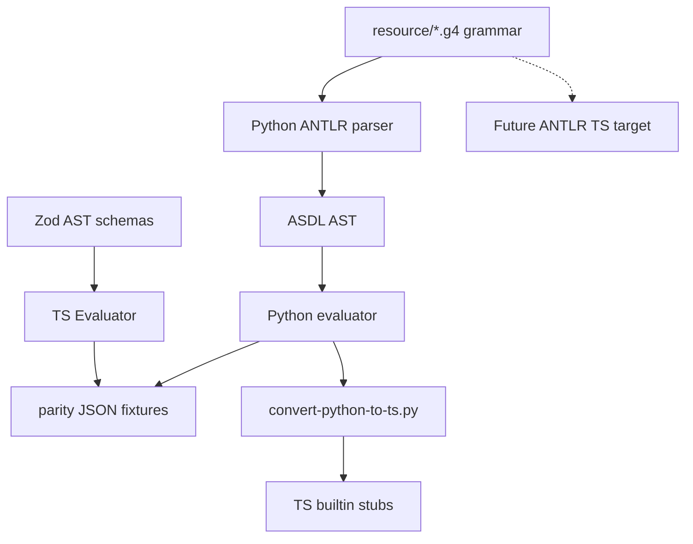

# Copyright (C) 2024-2026 jango_blockchained
#
# This file is part of pynescript.
#
# pynescript is free software: you can redistribute it and/or modify
# it under the terms of the GNU Affero General Public License as published by
# the Free Software Foundation, either version 3 of the License, or
# (at your option) any later version.
#
# pynescript is distributed in the hope that it will be useful,
# but WITHOUT ANY WARRANTY; without even the implied warranty of
# MERCHANTABILITY or FITNESS FOR A PARTICULAR PURPOSE.  See the
# GNU Affero General Public License for more details.
#
# You should have received a copy of the GNU Affero General Public License
# along with pynescript.  If not, see <https://www.gnu.org/licenses/>.
#
# SPDX-License-Identifier: AGPL-3.0-or-later

---
title: "pine-worker"
description: "TypeScript Pine evaluator port colocated in pynescript — architecture, status, and relationship to the Python oracle."
---

# pine-worker

## Abstract

**pine-worker** is a TypeScript implementation track for the Pine Script™ evaluator (AST types, visitor dispatch, series history, and eventually builtins + strategy events). It lives at `pine-worker/` inside the **pynescript** repository as an **extra tool**, not a replacement for the Python package.

Colocation goals:

- Share **parity fixtures** under `tests/fixtures/parity/`
- Keep the ANTLR **resource grammar** as single syntactic truth (TS parser target can be generated later)
- Allow cross-language porting in one checkout

Python (`pynescript` + `backend/`) remains the **semantic oracle**.

## Conceptual model



## Interface surface

### Quick start (Bun)

```bash
cd pine-worker
bun install
bun test
bun run typecheck
```

`package.json` scripts:

| Script | Action |
| --- | --- |
| `test` | `bun test` |
| `test:watch` | watch mode |
| `typecheck` | `tsc --noEmit` |
| `parity` | reserved — harness not fully wired |

Dependencies: **Zod** (AST schemas), **TypeScript**; runtime assumes **Bun** for tests.

### Current skeleton

| Area | State |
| --- | --- |
| AST Zod schemas + types | Partial (mirrors Python ASDL intent) |
| Base evaluator + visitor dispatch | Partial |
| `PineSeries` historical access | Partial |
| Core NA / loop signal semantics | Partial |
| Full builtins | In progress |
| ANTLR TS parser | Not complete |
| Strategy event emission | Plan-driven (see opencode plans) |
| Parity harness `test/parity/` | Planned |

### Relationship to HOOX

When mature, pine-worker may be vendored/submoduled into **hoox-setup** as a Cloudflare Worker bound to trade-worker. Until then it develops here. Sister: **pyne-worker** (Python edge) is a different repo.

## Internals

| Path | Role |
| --- | --- |
| `pine-worker/src/ast/types.ts` | AST typing / Zod |
| `pine-worker/src/evaluator/evaluator.ts` | Visitor evaluator |
| `pine-worker/src/evaluator/series.ts` | Series model |
| `pine-worker/src/evaluator/types.ts` | NA, signals, registries |
| `pine-worker/test/*.test.ts` | Unit tests |
| `pine-worker/scripts/convert-python-to-ts.py` | Porting aid |
| `tests/fixtures/parity/` | Shared oracle fixtures |
| `.opencode/plans/*pine-worker*` | Strategy-events plans |

## Invariants & edge cases

1. **Python wins ties.** If TS and Python disagree, fix TS (unless Python is proven wrong — then fix both + fixtures).
2. **NA is a sentinel**, not JS `null` alone — truthiness differs from ordinary JS symbols.
3. **Do not fork grammar** ad hoc in TS; prefer shared resource `.g4`.
4. **Converter emits stubs, not proofs** — manual port + parity required.
5. License follows parent pynescript project.

## Worked examples

### Minimal evaluator unit (conceptual)

TS tests construct literal AST nodes (`Literal`, `Assign`, `Script`) and assert visitor results — see `pine-worker/test/evaluator.test.ts`.

### Regenerate Python fixtures

```bash
python tests/fixtures/parity/generate_fixtures.py
```

## Failure modes

| Symptom | Cause | Fix |
| --- | --- | --- |
| `bun test` fails on NA | JS truthiness | Use Pine truth helpers |
| Parity script no-ops | Harness not wired | Implement `test/parity` per plan |
| Drift from Python builtins | Manual port error | Re-run converter diff + fixtures |

## See also

- [Converter](/pyne/docs/pine-worker/converter)
- [Testing](/pyne/docs/pine-worker/testing)
- [Runtime events](/pyne/docs/runtime/events)
- [Roadmap](/pyne/docs/reference/roadmap)
