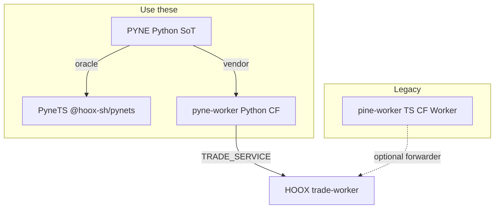

# Copyright (C) 2024-2026 jango_blockchained
#
# This file is part of pynescript.
#
# pynescript is free software: you can redistribute it and/or modify
# it under the terms of the GNU Affero General Public License as published by
# the Free Software Foundation, either version 3 of the License, or
# (at your option) any later version.
#
# pynescript is distributed in the hope that it will be useful,
# but WITHOUT ANY WARRANTY; without even the implied warranty of
# MERCHANTABILITY or FITNESS FOR A PARTICULAR PURPOSE.  See the
# GNU Affero General Public License for more details.
#
# You should have received a copy of the GNU Affero General Public License
# along with pynescript.  If not, see <https://www.gnu.org/licenses/>.
#
# SPDX-License-Identifier: AGPL-3.0-or-later

---
title: "pine-worker"
description: "Legacy TypeScript Cloudflare Worker. Not PyneTS, not pyne-worker, and not colocated inside pynescript."
---

# pine-worker

## Abstract

**pine-worker** is an earlier **TypeScript Cloudflare Worker**: its own parser/evaluator, `POST /run`-shaped handler, and optional trade-forward path. It lives in a **sister repository** ([hoox-sh/pine-worker](https://github.com/hoox-sh/pine-worker)), **not** under `pynescript/pine-worker/`.

That in-tree path **does not exist**. New TypeScript library work belongs in **[PyneTS](/pyne/docs/pynets)** (`@hoox-sh/pynets`). Production edge evaluate is **[pyne-worker](https://github.com/hoox-sh/pyne-worker)** (Python, vendors `pynescript.runtime`).

<Note>
Older pages on this site described pine-worker as a colocated Zod/AST skeleton. Treat those sentences as historical. The names below are the current taxonomy.
</Note>

## Conceptual model



| Name | Runtime | Role | In pynescript checkout? |
| --- | --- | --- | --- |
| **PyneTS** | Bun / Node library | `parse` / `unparse` / `Runtime.run` | submodule `pynets/` only |
| **pyne-worker** | Python Worker | Production `POST /run` | no (HOOX submodule / sister) |
| **pine-worker** | TypeScript Worker | Legacy evaluate + events | **no** |

## Interface surface

Sister repo layout (when you have `/home/jango/Git/pine-worker`):

| Path | Role |
| --- | --- |
| `src/run-handler.ts` | Worker `/run` |
| `src/evaluator/` | Independent TS evaluator |
| `src/parser/` | Own ANTLR TS (can drift from PYNE `.g4`) |
| `src/trade-forwarder.ts` | Strategy events → HOOX |
| `scripts/convert-python-to-ts.py` | Historical stub generator |
| `test/parity/` | Event fixtures vs Python |

```bash
cd pine-worker
bun install
bun test
```

This Worker is **not** published as `@hoox-sh/pynets`. Installing PyneTS does not deploy pine-worker.

## Internals

Python remains the semantic oracle for **PyneTS**. pine-worker's evaluator is a **parallel** port with its own grammar copy under `src/parser/grammar/`. Do not treat it as the TS SoT.

HOOX mesh submodules include **pyne-worker**, not pine-worker.

## Invariants & edge cases

1. **Do not create `pynescript/pine-worker/`.** Library code goes to [hoox-sh/pynets](https://github.com/hoox-sh/pynets).
2. **Do not fork `.g4` in pine-worker** for language work; edit grammar in PYNE and regen PyneTS.
3. **Python wins** if you still compare pine-worker plots to PYNE.
4. Production alerts + L2 webhooks + libraries on `/run` are documented for **pyne-worker** / Pro API, not this Worker.

## Worked examples

### You wanted the TS library

```bash
bun add @hoox-sh/pynets
```

See [Install PyneTS](/pyne/docs/pynets/install).

### You wanted edge `/run`

Deploy [pyne-worker](https://github.com/hoox-sh/pyne-worker) and read [HOOX isolate profile](/docs/devops/workers/pyne-worker).

## Failure modes

| Symptom | Cause | Fix |
| --- | --- | --- |
| `cd pine-worker` in a PYNE clone | Docs were stale | Use `pynets/` or the sister repo |
| Zod AST / `Evaluator` types not in PyneTS | Different codebase | ASDL names in `src/ast/nodes.ts` |
| Two TS runtimes disagree | Parallel ports | Prefer PyneTS; Python is oracle |

## See also

- [PyneTS](/pyne/docs/pynets)
- [Converter (legacy)](/pyne/docs/pine-worker/converter)
- [Testing (legacy)](/pyne/docs/pine-worker/testing)
- [Ecosystem](/pyne/docs/reference/ecosystem)
- [pyne-worker](/docs/devops/workers/pyne-worker)
- [Evaluate contract](/pyne/docs/api/contract)
