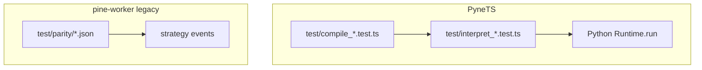

# Copyright (C) 2024-2026 jango_blockchained
#
# This file is part of pynescript.
#
# pynescript is free software: you can redistribute it and/or modify
# it under the terms of the GNU Affero General Public License as published by
# the Free Software Foundation, either version 3 of the License, or
# (at your option) any later version.
#
# pynescript is distributed in the hope that it will be useful,
# but WITHOUT ANY WARRANTY; without even the implied warranty of
# MERCHANTABILITY or FITNESS FOR A PARTICULAR PURPOSE.  See the
# GNU Affero General Public License for more details.
#
# You should have received a copy of the GNU Affero General Public License
# along with pynescript.  If not, see <https://www.gnu.org/licenses/>.
#
# SPDX-License-Identifier: AGPL-3.0-or-later

---
title: "pine-worker testing"
description: "Legacy Worker bun tests and strategy event fixtures. New library tests live in @hoox-sh/pynets."
---

# pine-worker testing

## Abstract

The **pine-worker** sister repo has its own `bun test` tree (`test/evaluator.test.ts`, `test/parity/`, builtin folders). That harness is **not** the PyneTS test suite.

For the TypeScript **library**, run tests in [hoox-sh/pynets](https://github.com/hoox-sh/pynets):

```bash
cd pynets
bun test
bun run typecheck
```

Python remains the oracle. See [PyneTS parity](/pyne/docs/pynets/parity).

## Conceptual model



## Interface surface

### PyneTS (use this)

| Command | Role |
| --- | --- |
| `bun test` | Unit + interpret + compile |
| `bun test test/interpret_ta.test.ts` | One file |
| `bun run typecheck` | `tsc --noEmit` (excludes generated noise per tsconfig) |

### pine-worker (legacy checkout)

```bash
cd pine-worker
bun test
bun test test/parity.test.ts
```

Fixtures under `test/fixtures/parity/` lock **strategy event** lists against Python-generated JSON. They do not replace plot-level PyneTS parity.

## Internals

| Tree | Tests |
| --- | --- |
| `pynets/test/` | Library |
| `pine-worker/test/` | Worker + old evaluator |
| `pynescript/tests/` | Python SoT |

## Invariants & edge cases

1. A green pine-worker suite does **not** mean PyneTS matches Python.
2. `na` in JS is `null`. Truthiness bugs show up as failed lookback tests.
3. Do not add third-party Pine corpora to either TS repo.

## Worked examples

```bash
# library
bun test test/interpret_lookback.test.ts
bun test test/compile.test.ts

# python goldens (oracle)
cd ../pynescript
pytest tests/test_first_party_ta_goldens.py -q
```

## Failure modes

| Symptom | Cause | Fix |
| --- | --- | --- |
| `cd pine-worker` missing in PYNE | Never colocated now | Test `pynets/` |
| Parity JSON no-ops | Wrong repo / stale harness | Use PyneTS + Python `Runtime.run` |

## See also

- [pine-worker](/pyne/docs/pine-worker)
- [PyneTS parity](/pyne/docs/pynets/parity)
- [Python numerical validation](/pyne/docs/reference/numerical-validation)
