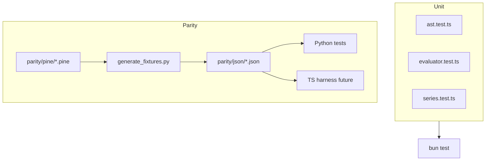

# pine-worker testing

## Abstract

Testing for pine-worker has two layers:

1. **Local Bun unit tests** — AST/evaluator/series behavior in pure TS
2. **Cross-language parity** — Python oracle generates JSON fixtures; TS must match

Until the parity harness is fully wired (`bun run parity` is a placeholder), treat Python fixtures as the contract and unit tests as constructive proofs of the port’s foundations.

## Conceptual model



## Interface surface

### Commands

```bash
cd pine-worker
bun install
bun test
bun test --watch
bun run typecheck
bun run parity   # prints note until harness lands
```

### Unit test files

| File | Focus |
| --- | --- |
| `test/ast.test.ts` | AST schema / types |
| `test/evaluator.test.ts` | Visitor eval, assign, literals |
| `test/series.test.ts` | Historical series indexing |

Tests use `bun:test` (`describe` / `test` / `expect`).

### Parity fixtures (shared with Python)

| Path | Content |
| --- | --- |
| `tests/fixtures/parity/pine/*.pine` | Minimal strategy scripts |
| `tests/fixtures/parity/json/*.json` | Expected events / series snapshots |
| `tests/fixtures/parity/generate_fixtures.py` | Oracle generator |
| `tests/fixtures/parity/ohlcv.py` | Shared bars |

Example scenarios: entry long/short, close, close_all, exit stop/limit, cancel, no-action, var counters.

### Python-side consumers

Parity is also exercised from the main suite (e.g. strategy event tests). Regenerating fixtures:

```bash
python tests/fixtures/parity/generate_fixtures.py
```

## Internals

### Evaluator test style

Tests **hand-build AST node objects** (plain dictionaries with `type` discriminators) rather than parsing Pine text — because the TS parser target is incomplete. That decouples evaluator progress from lexer work.

### NA and control-flow signals

`evaluator/types.ts` defines `NA`, `BreakSignal`, `ContinueSignal`, `ReturnSignal`. Unit tests should cover:

- arithmetic with NA → NA
- comparisons with NA → false (Pine rule)
- truthiness where NA is falsy (unlike some JS values)

### Future parity harness

Intended location: `pine-worker/test/parity/` with `bun test test/parity --timeout 30000`. Design goal: load each JSON fixture, evaluate corresponding AST/script path, assert event lists match oracle.

## Invariants & edge cases

1. **Never edit JSON fixtures by hand** to make TS pass — regenerate from Python or fix Python if oracle is wrong.
2. **OHLCV must match** between generators and consumers (`ohlcv.py`).
3. **Timeouts:** strategy loops can be heavy; parity script reserves 30s.
4. **Typecheck is mandatory** before claiming port milestones (`tsc --noEmit`).

## Worked examples

### Run a single unit file

```bash
cd pine-worker
bun test test/series.test.ts
```

### Add a unit case for assignment

Follow patterns in `evaluator.test.ts`: build `Script` → `Assign` → `Identifier` load → `expect`.

### Oracle refresh after Python strategy change

```bash
python tests/fixtures/parity/generate_fixtures.py
git diff tests/fixtures/parity/json/
pytest tests/test_strategy_events.py -q
```

## Failure modes

| Symptom | Cause | Fix |
| --- | --- | --- |
| Fixture mismatch after Python fix | Stale JSON | Regenerate |
| TS passes units, fails parity | Missing strategy builtins | Port + converter |
| Flaky floats | Compare with tolerances | Mirror Python assert style |
| `parity` script always “not wired” | Expected until harness lands | Implement under `test/parity/` |

## See also

- [pine-worker overview](/pyne/docs/pine-worker)
- [Converter](/pyne/docs/pine-worker/converter)
- [Runtime events](/pyne/docs/runtime/events)
- [Compatibility](/pyne/docs/reference/compatibility)
