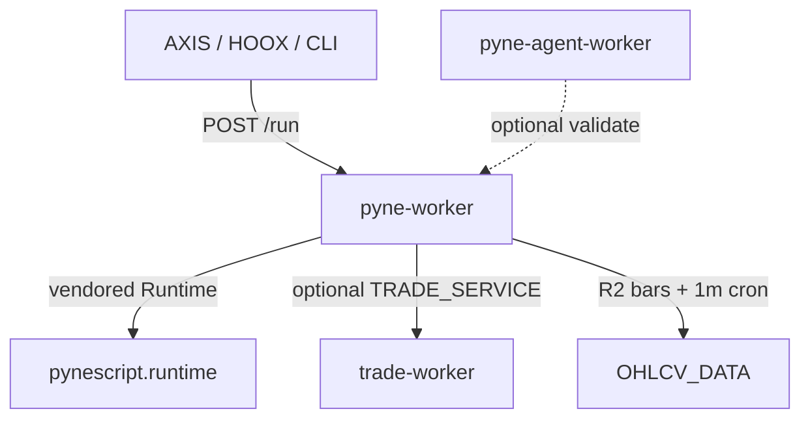

# Copyright (C) 2024-2026 jango_blockchained
#
# This file is part of pynescript.
#
# pynescript is free software: you can redistribute it and/or modify
# it under the terms of the GNU Affero General Public License as published by
# the Free Software Foundation, either version 3 of the License, or
# (at your option) any later version.
#
# SPDX-License-Identifier: AGPL-3.0-or-later

---
title: "pyne-worker"
description: "Production Python Cloudflare Worker for POST /run. Thin wrap over pynescript.runtime. Sister repo — not in this checkout."
---

# pyne-worker

## Abstract

**pyne-worker** is the production **edge evaluate host**: a Python Cloudflare Worker that vendors `pynescript.runtime` and speaks the same [evaluate contract](/pyne/docs/api/contract) as Flask `POST /run`. It is a **sister repository** — it does **not** live in this PYNE checkout.

| | |
| --- | --- |
| **Repo** | [hoox-sh/pyne-worker](https://github.com/hoox-sh/pyne-worker) |
| **Role** | Edge `POST /run` + alerts + libraries + cron |
| **Runtime** | Cloudflare Workers (Python) |
| **Engine** | Vendored `hoox-pyne` (`pynescript.runtime`) |
| **In this repo?** | **No** |

This Worker is a **thin wrap**. CLI, LSP, Flask Pro API, Numba desk compile, and the language SoT stay in **[hoox-sh/pyne](https://github.com/hoox-sh/pyne)**.

## Conceptual model

## Interface surface

| This Worker | Use PYNE (`hoox-pyne`) instead |
| --- | --- |
| `POST /run` + alerts + `libraries` | `pyne` CLI, `pyne-lsp`, VS Code |
| R2 bars, 1m cron, L2 webhooks | Flask Pro API, Docker, `/run/batch` |
| Vendored engine (`./scripts/sync_vendor.sh`) | Live package, Numba, corpus harness |
| 30s / 100KB / 100K bars / 5MB envelope | Uncapped research on your machine |

### Taxonomy

| Name | What it is |
| --- | --- |
| **PYNE** | Language SoT (this repo) |
| **[PyneTS](/pyne/docs/pynets)** | TypeScript **library** (`@hoox-sh/pynets`) |
| **pyne-worker** | Python Cloudflare **evaluate** host |
| **[pyne-agent-worker](/pyne/docs/agent)** | NL **authoring** host (optional validate via this Worker) |

Do **not** create `pynescript/pyne-worker/` or `pynescript/pine-worker/`.

The leftover name **pine-worker** is a TypeScript Cloudflare experiment ([hoox-sh/pine-worker](https://github.com/hoox-sh/pine-worker)). It is not this host and is not documented on this site. TypeScript library work is [PyneTS](/pyne/docs/pynets).

## Relationship to PYNE

- Python Runtime remains the **oracle**. The Worker vendors a snapshot; it can lag `__about__.py`.
- After a PYNE release, operators re-run `./scripts/sync_vendor.sh` in the Worker checkout before `wrangler deploy`.
- Shared JSON: [evaluate contract](/pyne/docs/api/contract). Alerts: [Alerts](/pyne/docs/runtime/alerts).

## Quick links

- [Evaluate (`POST /run`)](/pyne/docs/pyne-worker/run)
- [Deploy](/pyne/docs/pyne-worker/deploy)
- [GitHub README](https://github.com/hoox-sh/pyne-worker)

## See also

- [pyne-agent-worker](/pyne/docs/agent)
- [PyneTS](/pyne/docs/pynets)
- [Pro API usage](/pyne/docs/enduser/guides/pro-api-usage)
- [Ecosystem](/pyne/docs/reference/ecosystem)
