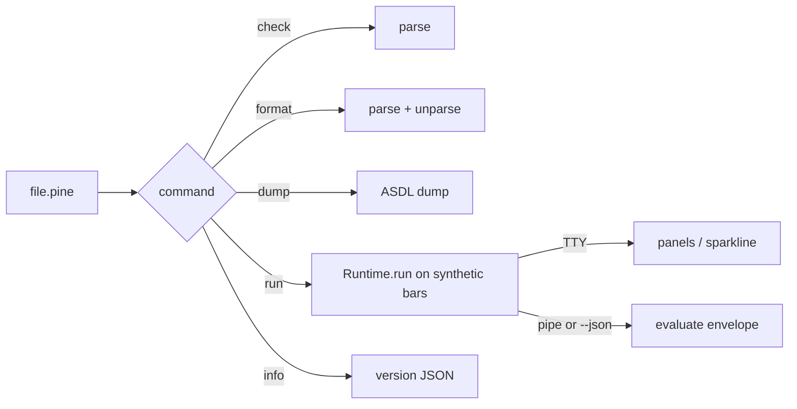

# Copyright (C) 2024-2026 jango_blockchained
#
# This file is part of pynescript.
#
# pynescript is free software: you can redistribute it and/or modify
# it under the terms of the GNU Affero General Public License as published by
# the Free Software Foundation, either version 3 of the License, or
# (at your option) any later version.
#
# pynescript is distributed in the hope that it will be useful,
# but WITHOUT ANY WARRANTY; without even the implied warranty of
# MERCHANTABILITY or FITNESS FOR A PARTICULAR PURPOSE.  See the
# GNU Affero General Public License for more details.
#
# You should have received a copy of the GNU Affero General Public License
# along with pynescript.  If not, see <https://www.gnu.org/licenses/>.
#
# SPDX-License-Identifier: AGPL-3.0-or-later

---
title: "PyneTS CLI"
description: "pynets check / format / run / dump / info — Rich TTY, JSON on pipes. run calls Runtime.run, unlike Python pyne run."
---

# PyneTS CLI

## Abstract

`pynets` is a Bun CLI for parse, format, AST dump, and evaluate. TTY output is a Rich-inspired panel (PYNE volt). **Pipes and `--json` stay machine-readable.** Exit codes: `0` ok, `1` syntax/runtime, `2` usage.

Unlike Python `pyne run` (compile-only smoke), **`pynets run` calls `Runtime.run`**. Default `--mode interpret`. `--mode compile` / `auto` select JS emit on **`@hoox-sh/pynets` 0.2.0**. The PYNE submodule CLI (0.1.0) has no `--mode` flag.

## Conceptual model



## Interface surface

```text
usage: pynets <check|format|run|dump|info> [file] [--bars N]
              [--mode interpret|compile|auto]
              [--commission N] [--slippage N] [--pyramiding N]
              [--json] [--plain] [--rich] [--full] [--indent N]
```

| Command | Action | File required |
| --- | --- | --- |
| `check` | Parse-only validation | yes |
| `format` | Parse → unparse (pretty on TTY) | yes |
| `run` | `Runtime.run` on synthetic OHLCV | yes |
| `dump` | ASDL-shaped AST | yes |
| `info` | Version and runtime extras | no |
| `help` / `-h` | Usage | no |

| Flag | Meaning |
| --- | --- |
| `--bars N` | Synthetic bar count for `run` (default **20**, max **100000**) |
| `--mode MODE` | `interpret` (default) \| `compile` \| `auto` |
| `--commission N` | Broker commission fraction (e.g. `0.001`) |
| `--slippage N` | Broker slippage in price units |
| `--pyramiding N` | Max same-direction adds |
| `--json` | Machine-readable `run` / `info` |
| `--indent N` | AST dump indent (default 2) |
| `--full` | Print the full dump (no 80-line cap) |
| `--plain` | Disable Rich (wins over `FORCE_COLOR`) |
| `--rich` | Force Rich (put **after** the command) |
| `-h, --help` | Help |

### Path resolution

`resolveUserFile` takes **only** the path you typed (cwd-relative or absolute). No search path. Missing file → exit 2 (`error: file not found`).

### Synthetic bars

`run` builds a ramp: `close = 100 + i`, `high/low = close ± 0.5`, `volume = 1`, `time = 1700000000000 + i * 60000`. Symbol is hardcoded `AAPL`. This is a desk smoke, not a data provider.

## Internals

| Path | Role |
| --- | --- |
| `src/cli.ts` | Arg parse, commands, exit codes |
| `src/cli/rich.ts` | TTY paint, help, tables, sparkline |
| `src/index.ts` | `parse` / `unparse` / `dump` / `Runtime` |

`run` constructs `new Runtime("AAPL", { broker, mode }).run(source, syntheticBars(bars))`.

## Invariants & edge cases

1. **Pipe-safe.** Non-TTY `check` prints `ok`. Non-TTY `run` prints JSON.
2. `--rich` must come **after** the command (`pynets run x.pine --rich`), because flags before the command are stripped for Rich detection.
3. Unknown flags and extra positional args are usage errors (exit 2).
4. `run` default mode is **`interpret`**, matching `new Runtime()` — not Pro API `auto`.
5. `--bars` is clamped; negative / non-integer → usage error.

## Worked examples

```bash
pynets check script.pine
pynets format script.pine
pynets dump script.pine --full
pynets run script.pine --bars 50
pynets run script.pine --mode compile --json
pynets run strat.pine --commission 0.001 --pyramiding 1
pynets info --json
```

CI:

```bash
pynets check script.pine
# stdout: ok
# exit 0 / 1 / 2
```

## Failure modes

| Symptom | Cause | Fix |
| --- | --- | --- |
| Exit 2 `missing file` | No path / ENOENT | Pass a real file |
| Exit 1 on `check` | Syntax error | Read the ANTLR message |
| `run` JSON has `error` / `error_kind: parse` | Script does not parse | `pynets check` first |
| Expected compile-only like `pyne run` | Different CLI | See [modes](/pyne/docs/enduser/reference/modes) |
| Rich garbage in logs | TTY detected | `--plain` or pipe |

## See also

- [Install](/pyne/docs/pynets/install)
- [Runtime](/pyne/docs/pynets/runtime)
- [Python CLI](/pyne/docs/enduser/guides/cli)
- [Modes](/pyne/docs/enduser/reference/modes)
