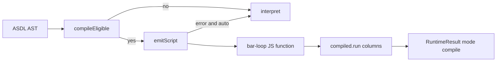

# Copyright (C) 2024-2026 jango_blockchained
#
# This file is part of pynescript.
#
# pynescript is free software: you can redistribute it and/or modify
# it under the terms of the GNU Affero General Public License as published by
# the Free Software Foundation, either version 3 of the License, or
# (at your option) any later version.
#
# pynescript is distributed in the hope that it will be useful,
# but WITHOUT ANY WARRANTY; without even the implied warranty of
# MERCHANTABILITY or FITNESS FOR A PARTICULAR PURPOSE.  See the
# GNU Affero General Public License for more details.
#
# You should have received a copy of the GNU Affero General Public License
# along with pynescript.  If not, see <https://www.gnu.org/licenses/>.
#
# SPDX-License-Identifier: AGPL-3.0-or-later

---
title: "PyneTS compile"
description: "JS bar-loop emit for mode compile | auto. Python object-mode analog — not Numba. auto falls back to interpret."
---

# PyneTS compile

## Abstract

PyneTS compile (`mode: "compile"` / `"auto"`) **emits a JavaScript bar-loop function**. It is the analog of Python **object-mode** compile, **not** Numba nopython. There is no LLVM, no `numba`, no disk IR cache like `PYNE_COMPILE_CACHE_DIR`.

Landed in standalone **`@hoox-sh/pynets` 0.2.0**. Interpret is unchanged. The PYNE `pynets/` submodule pin (**0.1.0**) has **no** `src/runtime/compile/` — `mode` is interpret-only there.

## Conceptual model



| | Python compile | PyneTS compile |
| --- | --- | --- |
| Backend | Numba nopython **or** object-mode Python loop | **JS emit only** |
| Default `Runtime.run` | `interpret` (env override) | `interpret` |
| `auto` | try compile, fallback interpret | same |
| `import` / foreign `request.*` | limited; often fallback | inline registered libs; foreign → `na` |
| Alerts / drawings / strategy | object-mode path | `__h.strategy`, drawings, `alertcondition` |

## Interface surface

```ts
import {
  compileScript,
  transpile,
  compileEligible,
  clearCompileCache,
  compileCacheStats,
  runScript,
  CompileError,
} from "@hoox-sh/pynets";

new Runtime("AAPL", { mode: "compile" }).run(src, bars);
new Runtime("AAPL", { mode: "auto" }).run(src, bars);
```

| Name | Role |
| --- | --- |
| `compileEligible(tree)` | `{ ok, reason? }` |
| `transpile` / `compileScript` | Emit + wrap `CompiledScript` |
| `compiled.run(open, high, low, close, volume, time, extras)` | Columnar execute |
| `clearCompileCache` / `compileCacheStats` | Process-local emit cache |

CLI: `pynets run script.pine --mode compile` or `--mode auto`.

### What emit covers (0.2.0)

Strategy object-mode (`__h.strategy` / fills / events), UDF series state (`src[1]`, `var` locals), array / map / matrix, UDT (`Type.new`, field get-set, `method`), drawings (`label` / `line` / `box`), named UDF kwargs, input overrides, `color.*`, enums, `request.security` same-symbol passthrough (foreign → `na`), `barstate.*` / `syminfo` stubs, calendar, `str.*` / `str.format`, `import` (inline registered sources; unresolved → `na`), `session.*` / `chart.*`, `log.*`, `ticker.new` / `standard` / `heikinashi`, `request.currency_rate`, `alertcondition`.

`mode: "auto"` no longer skips compile when inputs are set.

## Internals

| Path | Role |
| --- | --- |
| `src/runtime/compile/engine.ts` | `compileScript`, `runScript`, cache |
| `src/runtime/compile/emit.ts` | JS text emit |
| `src/runtime/compile/emit_call.ts` | Builtin / UDF calls |
| `src/runtime/compile/emit_udf.ts` | User functions |
| `src/runtime/compile/runtime.ts` | Host helpers used by emitted code |
| `src/runtime/interpret.ts` `runCompiled` / `runAuto` | `Runtime.run` wiring |

Do not edit `src/runtime/compile/*` and `src/runtime/interpret.ts` in the same agent turn. Parent wires `Runtime.run({ mode })`.

## Invariants & edge cases

1. **Not Numba.** Do not document `nopython`, `njit`, or `PYNE_COMPILE_CACHE_DIR` for this package.
2. **Python still wins** if compiled plots disagree with Python interpret on the same script+bars — unless Python compile is the thing being compared, in which case compare apples to apples (`object` vs `object`).
3. **`import` / foreign `request.*` stay interpret-or-na.** No invented bars.
4. `result.mode` reports what **ran** (`interpret` or `compile`). After `auto` fallback, read `compile_fallback_reason`.
5. Compile failures in `mode: "compile"` return an error envelope; `auto` falls back.

## Worked examples

```ts
const interpret = new Runtime("AAPL", { mode: "interpret" }).run(src, bars);
const compiled = new Runtime("AAPL", { mode: "compile" }).run(src, bars);
const auto = new Runtime("AAPL", { mode: "auto" }).run(src, bars);

if (compiled.error) {
  // inspect compiled.error / error_kind
}
console.log(auto.mode, auto.auto_backend, auto.compile_fallback_reason);
```

```bash
pynets run script.pine --mode auto --json
```

## Failure modes

| Symptom | Cause | Fix |
| --- | --- | --- |
| `CompileIneligibleError` / fallback | Surface not emitted | `interpret`, or extend emit (parity first) |
| Plots differ interpret vs compile | Emit bug | Add `test/compile_*.test.ts`; Python is still SoT |
| Expecting Numba speedups | Wrong mental model | This is JS object-mode |
| Edited compile + interpret together | Review / merge hazard | Split the change |

## See also

- [PyneTS runtime](/pyne/docs/pynets/runtime)
- [Parity](/pyne/docs/pynets/parity)
- [Python compiler overview](/pyne/docs/runtime/compiler/overview)
- [Python Numba path](/pyne/docs/runtime/compiler/numba)
- [Modes](/pyne/docs/enduser/reference/modes)
