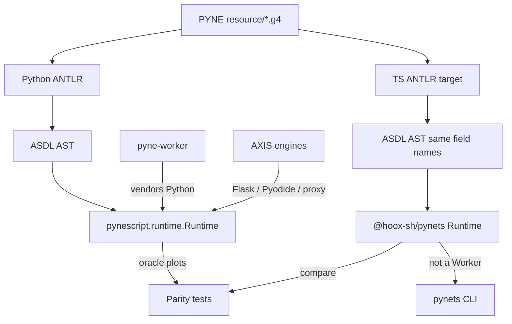

# Copyright (C) 2024-2026 jango_blockchained
#
# This file is part of pynescript.
#
# pynescript is free software: you can redistribute it and/or modify
# it under the terms of the GNU Affero General Public License as published by
# the Free Software Foundation, either version 3 of the License, or
# (at your option) any later version.
#
# pynescript is distributed in the hope that it will be useful,
# but WITHOUT ANY WARRANTY; without even the implied warranty of
# MERCHANTABILITY or FITNESS FOR A PARTICULAR PURPOSE.  See the
# GNU Affero General Public License for more details.
#
# You should have received a copy of the GNU Affero General Public License
# along with pynescript.  If not, see <https://www.gnu.org/licenses/>.
#
# SPDX-License-Identifier: AGPL-3.0-or-later

---
title: "PyneTS"
description: "TypeScript / Bun library port of PYNE — parse, unparse, Runtime.run. Python remains the semantic source of truth."
---

# PyneTS

**PyneTS** (`@hoox-sh/pynets`, currently **0.2.0**) is the TypeScript / Bun library for Pine Script: `parse`, `unparse`, and `Runtime.run`. Public names match Python `pynescript`. Python `pynescript.runtime` is the **source of truth** — when semantics disagree, Python wins.

This is **not** a Cloudflare Worker, **not** a Numba compile path, and **not** a TradingView platform substitute.

<Note>
This PYNE checkout pins the `pynets/` submodule at annotated **v0.2.0** (`@hoox-sh/pynets` **0.2.0** — interpret + JS compile, matching npm). Python `pynescript.runtime` remains the semantic oracle.
</Note>

<CardGroup cols={3}>
  <Card title="Install" icon="bolt" href="/pyne/docs/pynets/install">
    bun add / npm install / esm.sh. CLI still needs Bun.
  </Card>
  <Card title="Runtime" icon="cpu" href="/pyne/docs/pynets/runtime">
    na is null. Lookback, TA call-sites, foreign security → na.
  </Card>
  <Card title="CLI" icon="terminal" href="/pyne/docs/pynets/cli">
    check / format / run / dump / info. Pipes stay JSON.
  </Card>
  <Card title="Compile" icon="layers" href="/pyne/docs/pynets/compile">
    JS bar-loop emit. mode interpret | compile | auto.
  </Card>
  <Card title="Parity" icon="crosshair" href="/pyne/docs/pynets/parity">
    Compare plots against Python Runtime.run on the same bars.
  </Card>
  <Card title="Ecosystem" icon="mesh" href="/pyne/docs/reference/ecosystem">
    PYNE · PyneTS · pyne-worker · pyne-agent-worker · AXIS · HOOX.
  </Card>
</CardGroup>

## Abstract

Most TypeScript Pine ports rewrite the language. PyneTS does not. It is the library-shaped port of **PYNE**: the same ANTLR grammar, the same ASDL field names (`kind`, `lineno`, `col_offset`, …), the same interpret contract.

```
Source (.pine / .pyne)
  → shared PYNE .g4  (TS ANTLR target — not forked here)
  → ASDL AST
  → bar-loop  (interpret | JS compile | auto)
  → plots / series / events / drawings / alerts
```

Standalone checkout: [github.com/hoox-sh/pynets](https://github.com/hoox-sh/pynets). PYNE consumes it **only** as the `pynets/` git submodule — never copy sources into `hoox-sh/pyne`.

```ts
import { parse, unparse, Runtime } from "@hoox-sh/pynets";

const src = `//@version=5
indicator("sma")
plot(ta.sma(close, 3))
`;

const tree = parse(src);
unparse(tree);

const out = new Runtime("AAPL").run(src, [
  { close: 1 }, { close: 2 }, { close: 3 }, { close: 4 },
]);
// out.plots, out.series, out.count
// new Runtime("AAPL", { mode: "compile" }) — JS bar-loop emit (not Numba)
// mode: "auto" tries compile, then interpret
```

## Conceptual model



**Invariant:** PyneTS is a **library you import**. [pyne-worker](https://github.com/hoox-sh/pyne-worker) is the production **Python** Cloudflare isolate for `POST /run`. AXIS engines still call Python (Flask, Pyodide wheel, Worker proxy) — they do not import `@hoox-sh/pynets` today.

## Interface surface

| Name | Role |
| --- | --- |
| `parse(source)` | ANTLR → ASDL tree. Throws `PinescriptSyntaxError` |
| `unparse(tree)` | Tree → normalized source |
| `dump(tree)` | Debug dump |
| `tokenize(source)` | Lexer tokens |
| `new Runtime(symbol, options).run(source, bars, extra?)` | Bar-loop evaluate |
| `Runtime.stream(source)` | Push-driven re-eval |
| `Runtime.runProvider(source, provider)` | Fetch bars then `run` |
| `compileScript` / `transpile` | JS emit (not Numba) |
| CLI `pynets` | `check` `format` `run` `dump` `info` |

Default `mode` is **`interpret`**. Constructor and per-call `extra` accept `mode: "interpret" | "compile" | "auto"`.

### What this is not

| Confused with | Reality |
| --- | --- |
| **pyne-worker** | Python Cloudflare Worker. Vendors `pynescript.runtime`. `POST /run`. See [pyne-worker](/pyne/docs/pyne-worker). |
| **pyne-agent-worker** | NL authoring host. Not an evaluate library. See [agent](/pyne/docs/agent). |
| **Python `pyne run`** | Compile-only smoke on synthetic bars. PyneTS `pynets run` calls `Runtime.run`. |
| **Numba** | Python compile backend. PyneTS compile is **JS emit** (object-mode analog). |
| **AXIS engine** | AXIS does not load this package. |

## Internals (repo paths)

Standalone (`/home/jango/Git/pynets` or the published package):

| Path | Role |
| --- | --- |
| `src/index.ts` | Public barrel — do not re-export generated ANTLR |
| `src/ast/helper.ts` | `parse` / `unparse` / `dump` / `tokenize` |
| `src/ast/nodes.ts` | Hand-written ASDL nodes |
| `src/generated/` | ANTLR TS — **do not hand-edit**; `bun run generate` |
| `src/runtime/interpret.ts` | `Runtime`, interpret host |
| `src/runtime/compile/` | JS emit (`transpile` / `compileScript`) |
| `src/cli.ts` | TTY CLI |
| `test/interpret_*.test.ts` | Focused interpret tests |

PYNE checkout: `pynets/` submodule. Grammar SoT stays in PYNE `resource/*.g4`.

## Invariants & edge cases

1. **Python wins.** Do not invent TradingView platform behaviour that Python does not implement.
2. **`na` is `null`.** Non-finite in/out is `na`. `na == na` is true. Any other comparison involving `na` is false.
3. **Lookback:** `x[0]` current, `x[1]` previous, out of range or negative → `na`.
4. **TA is one sample per bar**, state keyed by call-site (Python incremental kernels).
5. **`request.security` foreign / HTF without a feed → `na`.** The chart series is never silently reused as another symbol.
6. **Do not fork the grammar.** Edit `.g4` only in PYNE, then regen here.
7. **Do not edit** `src/runtime/compile/*` and `src/runtime/interpret.ts` in the same agent turn.
8. License: **AGPL-3.0-or-later**.

## Worked examples

### Library (Bun)

```ts
import { parse, unparse, Runtime } from "@hoox-sh/pynets";

const src = `indicator("t")
plot(close[1])
plot(na == na ? 1 : 0)`;

const tree = parse(src);
console.log(unparse(tree));

const out = new Runtime("TEST").run(src, [
  { close: 10 },
  { close: 20 },
]);
// last bar: plots[0] = 10 (previous close), plots[1] = 1
```

### Node 20+ / browser

```js
import { parse, Runtime } from "@hoox-sh/pynets";
```

```html
<script type="module">
  import { Runtime } from "https://esm.sh/@hoox-sh/pynets";
</script>
```

Bun imports TypeScript source (`package.json` `"bun": "./src/index.ts"`). Node and browsers use `dist/` (`bun run build`; `prepack` runs it). The CLI still needs Bun on `PATH`.

## Failure modes

| Symptom | Cause | Fix |
| --- | --- | --- |
| Plots disagree with Python | Port bug or invented host behaviour | Fix TS. Python is the oracle. |
| `request.security` returns `na` | No foreign/HTF feed | Expected. Do not invent bars. |
| `mode: "compile"` misses a builtin | JS emit surface lag | Use `mode: "auto"` or `interpret` |
| Importing in a Worker and expecting `/run` | This is a library | Use [pyne-worker](https://github.com/hoox-sh/pyne-worker) |
| Editing `src/generated/*` | Overwritten on regen | `bun run generate` after PYNE `.g4` change |
| `pynets` CLI on Node-only host | `bin` is `src/cli.ts` (Bun) | Run under Bun, or call `Runtime` from Node via `dist/` |

## See also

- [Install](/pyne/docs/pynets/install)
- [Runtime contract](/pyne/docs/pynets/runtime)
- [CLI](/pyne/docs/pynets/cli)
- [JS compile](/pyne/docs/pynets/compile)
- [Parity](/pyne/docs/pynets/parity)
- [Evaluate scripts (Python)](/pyne/docs/enduser/guides/evaluate-scripts)
- [Modes matrix](/pyne/docs/enduser/reference/modes)
- [Ecosystem](/pyne/docs/reference/ecosystem)
- [pyne-worker](/pyne/docs/pyne-worker)
- [pyne-agent-worker](/pyne/docs/agent)
