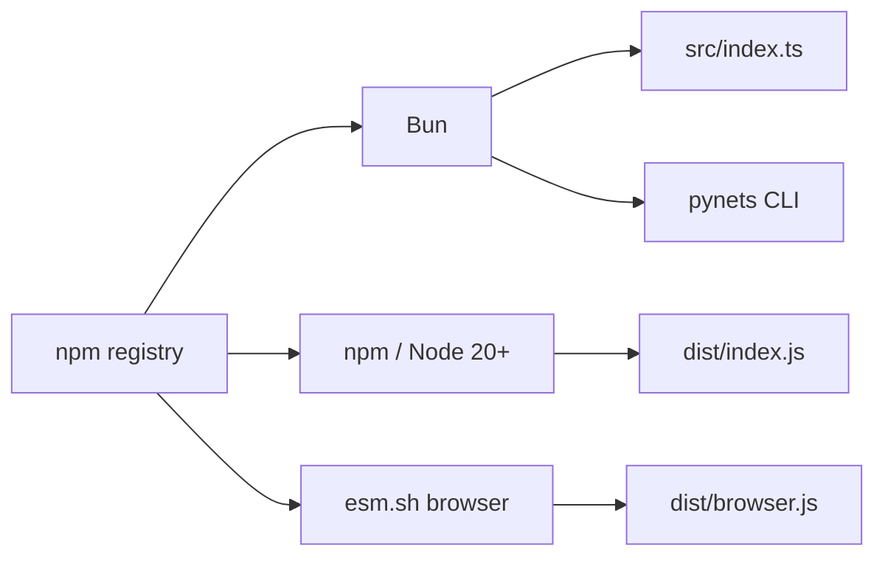

# Copyright (C) 2024-2026 jango_blockchained
#
# This file is part of pynescript.
#
# pynescript is free software: you can redistribute it and/or modify
# it under the terms of the GNU Affero General Public License as published by
# the Free Software Foundation, either version 3 of the License, or
# (at your option) any later version.
#
# pynescript is distributed in the hope that it will be useful,
# but WITHOUT ANY WARRANTY; without even the implied warranty of
# MERCHANTABILITY or FITNESS FOR A PARTICULAR PURPOSE.  See the
# GNU Affero General Public License for more details.
#
# You should have received a copy of the GNU Affero General Public License
# along with pynescript.  If not, see <https://www.gnu.org/licenses/>.
#
# SPDX-License-Identifier: AGPL-3.0-or-later

---
title: "Install PyneTS"
description: "Add @hoox-sh/pynets with Bun, npm, or esm.sh. CLI requires Bun. Node and browsers use the ESM bundle."
---

# Install PyneTS

## Abstract

`@hoox-sh/pynets` is published to the npm registry. Bun imports TypeScript source. Node 20+ and browsers consume the ESM bundle in `dist/`. The `pynets` CLI is a Bun script.

Package: [npmjs.com/package/@hoox-sh/pynets](https://www.npmjs.com/package/@hoox-sh/pynets) · source: [github.com/hoox-sh/pynets](https://github.com/hoox-sh/pynets). Current version **0.2.0**.

## Conceptual model



| Consumer | Entry | Notes |
| --- | --- | --- |
| Bun `>= 1.2` | `./src/index.ts` | No bundle required |
| Node `>= 20` | `./dist/index.js` | Run `bun run build` / `prepack` |
| Browser | `./dist/browser.js` | Same package; `exports.browser` |
| CLI | `./src/cli.ts` | Needs Bun on `PATH` |

## Interface surface

### Bun (recommended)

```bash
bun add @hoox-sh/pynets
bunx pynets -- help
bunx pynets info
```

```ts
import { parse, unparse, Runtime } from "@hoox-sh/pynets";
```

### Node 20+

```bash
npm install @hoox-sh/pynets
```

```js
import { parse, Runtime } from "@hoox-sh/pynets";
```

`npm pack` / publish runs `prepack` → `bun run build`. If you clone the repo and import from Node without building, resolution fails.

### Browser (esm.sh)

```html
<script type="module">
  import { Runtime } from "https://esm.sh/@hoox-sh/pynets";
</script>
```

This is a library import, not a hosted evaluate API.

### From a PYNE checkout

```bash
git clone --recurse-submodules https://github.com/hoox-sh/pyne.git
cd pyne/pynets
bun install
bun test
```

The submodule snapshot can lag the standalone repo. This PYNE pin is `@hoox/pynets` **0.1.0** (private, interpret-only, no `dist/`). Prefer **`@hoox-sh/pynets` 0.2.0** from npm, or the standalone checkout, for published names, JS compile, and Node/browser bundles.

### Develop the library

```bash
git clone https://github.com/hoox-sh/pynets.git
cd pynets
bun install
bun test
bun run typecheck
bun run build
```

Grammar regen (needs Java + PYNE `.g4`):

```bash
bun run generate
```

Resolution order in `scripts/generate-antlr.ts`: `PYNETS_GRAMMAR` → `PYNESCRIPT_ROOT` → parent PYNE checkout → sibling `../pynescript` or `../pyne`.

## Internals

| Path | Role |
| --- | --- |
| `package.json` `exports` | bun → `src/`, types → `dist/index.d.ts`, browser → `dist/browser.js` |
| `package.json` `bin.pynets` | `./src/cli.ts` |
| `scripts/build.ts` | Node + browser ESM → `dist/` (gitignored) |
| `scripts/generate-antlr.ts` | ANTLR TS regen |
| `.github/workflows/publish.yml` | npm publish on `v*` tags |

Local tooling is **Bun only**. Do not add npm/yarn/pnpm lockfiles. The npm registry is used only to publish.

## Invariants & edge cases

1. The CLI is **not** a Node-native binary. `npx pynets` without Bun will fail.
2. This package is **not** a Cloudflare Worker. There is no `wrangler` here.
3. Do not `npm install pynets` (unscoped). The name is **`@hoox-sh/pynets`**.
4. Do not confuse with `pip install hoox-pyne` (Python).
5. Engines field: `"bun": ">=1.2.0"`, `"node": ">=20"`.

## Worked examples

### Smoke the CLI

```bash
bunx pynets info --json
# { "name": "pynets", "package": "@hoox-sh/pynets", "version": "0.2.0", ... }

echo 'indicator("x")
plot(close)' > /tmp/x.pine
bunx pynets check /tmp/x.pine
# TTY: panel; pipe: "ok"
```

### Library one-liner

```ts
import { Runtime } from "@hoox-sh/pynets";

const out = new Runtime("AAPL").run(
  `indicator("sma")\nplot(ta.sma(close, 3))`,
  [{ close: 1 }, { close: 2 }, { close: 3 }, { close: 4 }],
);
if (out.error) throw new Error(out.error);
console.log(out.plots);
```

## Failure modes

| Symptom | Cause | Fix |
| --- | --- | --- |
| `Cannot find module '@hoox-sh/pynets'` | Typo / old `@hoox/pynets` name | Use `@hoox-sh/pynets` |
| Node import fails in a fresh clone | `dist/` not built | `bun run build` |
| `pynets: command not found` | No Bun / not on PATH | `bunx pynets` or `bun run src/cli.ts` |
| Grammar regen fails | No Java / no PYNE `.g4` | Set `PYNESCRIPT_ROOT` or `PYNETS_GRAMMAR` |
| AXIS still evaluates via Python | Expected | AXIS does not consume this package |

## See also

- [PyneTS hub](/pyne/docs/pynets)
- [CLI](/pyne/docs/pynets/cli)
- [Python install](/pyne/docs/enduser/getting-started/installation)
- [Ecosystem](/pyne/docs/reference/ecosystem)
