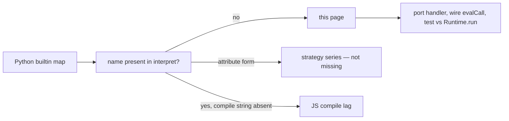

# Copyright (C) 2024-2026 jango_blockchained
#
# This file is part of pynescript.
#
# pynescript is free software: you can redistribute it and/or modify
# it under the terms of the GNU Affero General Public License as published by
# the Free Software Foundation, either version 3 of the License, or
# (at your option) any later version.
#
# pynescript is distributed in the hope that it will be useful,
# but WITHOUT ANY WARRANTY; without even the implied warranty of
# MERCHANTABILITY or FITNESS FOR A PARTICULAR PURPOSE.  See the
# GNU Affero General Public License for more details.
#
# You should have received a copy of the GNU Affero General Public License
# along with pynescript.  If not, see <https://www.gnu.org/licenses/>.
#
# SPDX-License-Identifier: AGPL-3.0-or-later

---
title: "PyneTS missing features"
description: "Builtin and host gaps between @hoox-sh/pynets and Python pynescript.runtime. Measured 2026-09-23 on the working tree, not the published 0.2.0 tag."
---

# PyneTS missing features

## Abstract

This page is the checklist of what `@hoox-sh/pynets` still does not match in Python `pynescript.runtime`. The oracle is Python `Runtime.run` on the same source and the same bars. It is not a TradingView® certification list.

Measured **2026-09-23** against the PyneTS working tree (interpret tests green: `test/interpret_once.test.ts`, `test/interpret_ta_gap.test.ts`, `test/interpret_matrix_gap.test.ts`, `test/interpret_utility_gap.test.ts`). Published npm **0.2.0** does not include that slice yet.

A raw scan of Python `_*_builtin_map` keys finds **706** names. About **280** of those strings are absent from the interpret sources. Many `strategy.*` series are false misses: they are attributes (`strategy.netprofit`), not quoted call names. The lists below are the scan plus that correction.

## Conceptual model



Port order when closing an item: read the winning Python method (mixin MRO, not a later duplicate), port `na` / lookback / call-site state, wire `evalCall` or the matching `eval*Call`, add `test/interpret_*.test.ts`, compare plots. Do not edit `src/runtime/compile/*` in the same change as `interpret.ts`.

## Interface surface

### Closed on this working tree

Do not re-open these as missing.

| Area | What landed |
| --- | --- |
| `once [cond]` | Parse, unparse, interpret, compile. Body runs the first time the test is true. Bare `once` runs on bar 0. Nested `once` inside `if` fires once. `na` does not fire. `x = once …` is a syntax error. |
| Multi-value `switch` | `1, 2 =>` matches any element on interpret and compile. |
| Matrix row/col | `sum_*`, `avg_*`, `min_*`, `max_*`, `mode_*`, `copy_row` / `copy_col`, `fill_row` / `fill_col` / `fill_diagonal`, `reverse_rows` / `reverse_cols`, `stdev`, `variance`. |
| TA | `ta.uo`, `ta.rci`, `ta.dpo`, `ta.kst`, `ta.stochrsi`, `ta.donchian`, `ta.ichimoku`, `ta.bb_pct`, `ta.emv`, `ta.fractal`, `ta.atr_stop`, `ta.zigzag`, plus the v3/v4 bare aliases Python registers. Dict results use `__taRecord` (`dc.high`, `stochrsi.signal`, …). |
| Host helpers | `timeframe.change`, `time_close` / `time_close()`, `syminfo.prefix` and `syminfo.prefix(tickerid)`, bare `round_to_mintick`, every Python `array.new*` spelling, `plotcandle` / `plotbar` (primary series is close), `timenow` / `timenow()`, `max_bars_back`, `alertcondition`, `plot.linestyle_*`, bare `random`, bare `security` / `security_lower_tf`. |
| JS compile | Emit for the TA / matrix / host names in this table so `compileToResult` matches interpret (no per-bar `time_close` column; default path is next open / last+1d). |
| Drawings | Getters, remaining setters, `*.all`, `*.copy`, remaining deletes, `chart.point.*`, `line.fill`. Constructor coords snapshot so getters after `new` are not `na`. |
| Strategy | `strategy.cash` is free cash tagged `_pine_qty_type="cash"`; `account_currency`, `position_entry_name`, `default_entry_qty`, `convert_to_*`, `max_contracts_held_*`, closed/open trade time/comment/drawdown/runup/commission/capital_held/`first_index`; `oca.*`, `direction.*`, `commission.*` constants; zero-arg series calls (`strategy.netprofit()`). |

`ta.rci` with length under 2 is a runtime error whose message contains `ta.rci length must be at least 2`.

### Language the host does not have

| Item | Python | PyneTS |
| --- | --- | --- |
| Realtime `once` | Unconfirmed ticks do not commit the fired flag; rollback can re-fire. Confirmed bar latches. | `barstate.isrealtime` is `0`. The flag commits as soon as the body runs. No interpret session, no tick rollback. |

### `strategy.*`

Attribute and zero-arg call forms for the main series and the fields listed as closed above are implemented. `strategy.cash` plots as a number; `default_qty_type=strategy.cash` still selects cash sizing.

Compile does not emit the new strategy fields (`strategy.cash` free-cash object, trade-history extras, constants). Use interpret until that emit lands.

### Drawings

Interpret now covers the Python `drawing.py` map (getters, setters, `*.all`, `*.copy`, deletes, `chart.point.*`, `line.fill`). `line.copy(na)` is `na` here; Python returns an unregistered `Line`. Compile `DRAW_METHODS` still lags some of the new setters.

### `ta.*` still absent

**Leave these alone unless a Python plot is non-`na`.** In bar mode the series argument is a one-element list, so `Runtime.run` stays `na` for the whole run. A windowed port would not match:

`ta.beta`, `ta.r_squared`, `ta.comovement`, `ta.apo`

**Indicators and detectors still unwired** (read `technical_submodules/` and the winning mixin; `AdvancedIndicators` is first in the MRO):

`ta.acceleration_factor`, `ta.atr_normalized`, `ta.bid_ask_imbalance`, `ta.cumulative_delta`, `ta.double_top_bottom`, `ta.engulfing`, `ta.gap_detector`, `ta.garman_klass`, `ta.hammer`, `ta.inside_bar_pattern`, `ta.kurtosis`, `ta.macd_signal`, `ta.parkinson`, `ta.rsi_divergence`, `ta.rsi_oversold_overbought`, `ta.skewness`, `ta.sma_weighted`, `ta.stoch_smooth`, `ta.voi`, `ta.volume_momentum`, `ta.volume_profile_high`, `ta.volume_profile_low`, `ta.volume_thrust`, `ta.volume_weighted_momentum`

**PYNE extension analytics** (present in the Python map, not the public TradingView `ta.*` reference). Port only when a caller needs that name:

`ta.advanced_breakout_detector`, `ta.breakeven_level`, `ta.breakout_detection`, `ta.contrarian_signal`, `ta.correlation_filter`, `ta.crowd_sentiment`, `ta.divergence_detector`, `ta.drawdown_recovery_level`, `ta.economic_impact_score`, `ta.ema_cross_signal`, `ta.employment_cycle_indicator`, `ta.expected_value`, `ta.fear_greed_index`, `ta.gamma_levels`, `ta.gdp_growth_proxy`, `ta.inflation_proxy_indicator`, `ta.intelligent_strategy_synthesizer`, `ta.kelly_criterion`, `ta.liquidity_score`, `ta.market_condition`, `ta.market_structure_pivot`, `ta.market_timing_index`, `ta.max_loss_level`, `ta.mean_reversion_entry`, `ta.mean_reversion_score`, `ta.momentum_divergence`, `ta.momentum_filter`, `ta.multi_timeframe_signal`, `ta.optimal_entry_zone`, `ta.order_flow_imbalance`, `ta.position_sizing`, `ta.position_sizing_score`, `ta.probability_of_movement`, `ta.profit_lock_level`, `ta.pullback_bounce_level`, `ta.regime_adaptive_signal`, `ta.risk_reward_asymmetry`, `ta.risk_reward_ratio`, `ta.signal_confluence`, `ta.smart_money_flow`, `ta.spread_analysis`, `ta.strategy_score`, `ta.trailing_exit_level`, `ta.trend_confirmation_score`, `ta.trend_strength`, `ta.volatility_regime`, `ta.volatility_regime_score`

### Request, footprint

| Names | Notes |
| --- | --- |
| `footprint.buy_volume`, `footprint.delta`, `footprint.get_row_by_price`, `footprint.poc`, `footprint.rows`, `footprint.sell_volume`, `footprint.total_volume`, `footprint.vah`, `footprint.val` | Python footprint mocks. Not in interpret. |
| `volume_row.buy_volume`, `.delta`, `.down_price`, `.has_buy_imbalance`, `.has_sell_imbalance`, `.sell_volume`, `.total_volume`, `.up_price` | Row fields on those mocks. |

`request.security` on a foreign symbol or HTF without data returns `na` on both sides. That is the Python policy, not a hole to fill with invented bars.

### JS compile lag

TA / matrix / host helpers from the previous interpret slice now emit. Still interpret-only:

- New drawing setters/getters/`*.all`/`chart.point` beyond the older `DRAW_METHODS` table
- New strategy cash object, trade-history fields, and constants
- `timenow`, `max_bars_back`, `alertcondition`, `plot.linestyle_*`, bare `random`, bare `security`

`mode: "auto"` prefers compile when emit succeeds. Names compile does not know become `na` even though interpret matches Python.

## Internals

| Path | Role |
| --- | --- |
| PYNE `src/pynescript/ast/evaluator/builtins/` | Handler source of truth. `TechnicalAnalysisMixin` MRO: Advanced, Basic, Common, MovingAverage, Oscillator, Pattern, Economics, Strategies, Synthesizer, Volatility, Volume. |
| PYNE `technical_submodules/core.py` | Incremental kernels (`_use_incremental_ta`). |
| `pynets/src/runtime/interpret.ts` | `evalCall` and `eval*Call`. |
| `pynets/src/runtime/ta.ts`, `matrix.ts`, `drawings.ts`, `strategy.ts`, `timeframe.ts` | State and values. |
| `pynets/src/runtime/compile/emit_call.ts` | Compile dispatch. Do not edit it in the same change as `interpret.ts`. |
| `pynets/test/interpret_*.test.ts` | Focused parity tests. |

`last_bar_index`, `last_bar_time`, and `syminfo.ticker` are not missing. The first two are written in `beginBar`. `syminfo.ticker` / `tickerid` return the runtime symbol.

## Invariants & edge cases

1. Python wins. If a port would plot a nicer series than `Runtime.run`, do not land it.
2. `na` is `null`. Non-finite in or out is `na`.
3. TA state is one sample per bar, keyed by call site.
4. Dict-shaped `ta.*` results are `__taRecord` objects. `evalAttribute` reads only that brand.
5. `strategy.cash` plots free cash and still tags `default_qty_type`.
6. Numba, Worker packaging, and ASDL codegen are out of scope for this repo. They are not rows on this list.

## Worked examples

Compare before closing a row:

```bash
# PyneTS
bun -e 'import { Runtime } from "./src/index.ts";
console.log(new Runtime("TEST").run(`//@version=5
indicator("t")
plot(ta.dpo(20))`, [{close:1},{close:2},{close:3}]))'

# Python
/path/to/pynescript/.venv/bin/python -c 'from pynescript.runtime import Runtime
print(Runtime("TEST").run("""//@version=5
indicator("t")
plot(ta.dpo(20))""", [{"close":1},{"close":2},{"close":3}], mode="interpret"))'
```

Suggested close order:

1. Compile emit for the new drawing, strategy, and host names.
2. The unwired indicator list. Skip the four bar-mode-`na` names and the extension-analytics list until a script needs them.
3. Footprint / `volume_row` mocks if a caller needs them.
4. Realtime `once` rollback (interpret sessions).

## Failure modes

| Symptom | Cause |
| --- | --- |
| `dc.high` is `na` on an old build | `__taRecord` field read is only on this working tree. |
| Compile plots `na`, interpret matches Python | Name not in `emit_call.ts` (drawings, new strategy fields, `timenow`). |
| New `ta.beta` port is non-`na` while Python is `na` | Bar-mode one-element series. Revert the port. |
| `once` fires again on a realtime tick in Python and once in PyneTS | No tick rollback in the TS host. |

## See also

- [PyneTS parity](/pyne/docs/pynets/parity)
- [PyneTS runtime](/pyne/docs/pynets/runtime)
- [JS compile](/pyne/docs/pynets/compile)
- [PYNE missing features](/pyne/docs/reference/missing-features)
- [Drawing and plotting](/pyne/docs/runtime/builtins/drawing-plotting)
- [Strategy](/pyne/docs/runtime/builtins/strategy)
