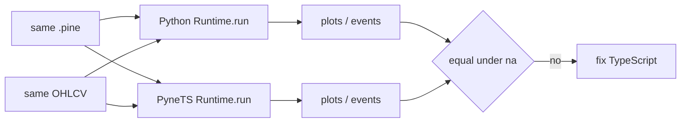

# Copyright (C) 2024-2026 jango_blockchained
#
# This file is part of pynescript.
#
# pynescript is free software: you can redistribute it and/or modify
# it under the terms of the GNU Affero General Public License as published by
# the Free Software Foundation, either version 3 of the License, or
# (at your option) any later version.
#
# pynescript is distributed in the hope that it will be useful,
# but WITHOUT ANY WARRANTY; without even the implied warranty of
# MERCHANTABILITY or FITNESS FOR A PARTICULAR PURPOSE.  See the
# GNU Affero General Public License for more details.
#
# You should have received a copy of the GNU Affero General Public License
# along with pynescript.  If not, see <https://www.gnu.org/licenses/>.
#
# SPDX-License-Identifier: AGPL-3.0-or-later

---
title: "PyneTS parity"
description: "How to compare @hoox-sh/pynets Runtime.run plots against Python pynescript.runtime. Python wins ties."
---

# PyneTS parity

## Abstract

Parity here means **TypeScript `Runtime.run` vs Python `Runtime.run`** on the same source and the same bars — not vs TradingView. Interpret↔compile alignment **inside** PyneTS is a second, narrower check (`test/compile_*.test.ts`).

Workflow when adding or fixing a builtin: read the Python handler, port `na` / lookback / call-site semantics, wire the name, add a focused `test/interpret_*.test.ts`, compare plots if PYNE is present.

## Conceptual model



## Interface surface

### Commands

```bash
# PyneTS
cd /path/to/pynets
bun test
bun test test/interpret_ta.test.ts
bun run typecheck

# Python oracle (sister checkout)
cd /path/to/pynescript
python -c "from pynescript.runtime import Runtime; ..."
```

Use `/pynets-parity` when adding or fixing builtins. Use `/pynets-generate` when touching grammar output.

### What to compare

| Field | Rule |
| --- | --- |
| `plots` / `series` | Equal length; `null` ↔ Python `None`; finite numbers match |
| `events` | Kind, direction, bar, id — same contract as [strategy events](/pyne/docs/runtime/events) |
| `error_kind` | Same class of failure (`parse` vs `runtime`) |
| TradingView screenshots | **Out of scope** as an oracle |

`na` encoding: Python interpret uses `None`; JSON / TS uses `null`; Python Numba uses `nan`. Compare after normalizing non-finite → `na`.

## Internals

| Path | Role |
| --- | --- |
| `test/interpret_*.test.ts` | Focused interpret cases |
| `test/compile_*.test.ts` | JS emit vs interpret |
| `test/helpers/first_party.ts` | First-party fixtures (live in PYNE) |
| PYNE `src/pynescript/ast/evaluator/builtins/` | Handler SoT |
| PYNE `tests/test_first_party_ta_goldens.py` | Python goldens |

Do **not** treat historical `pine-worker/test/parity/` JSON as the PyneTS harness. That tree belongs to the [legacy TS Worker](/pyne/docs/pine-worker) sister repo.

The PYNE `pynets/` submodule (0.1.0) has interpret tests only. Compile-vs-interpret cases (`test/compile_*.test.ts`) live on standalone **0.2.0**.

## Invariants & edge cases

1. **Python wins ties.** If TS and Python disagree, fix TS (unless Python is proven wrong — then fix both + tests).
2. **Do not "improve" semantics.** Port `na`, lookback, and call-site keys as Python implements them.
3. Same-symbol `request.security` may passthrough; **foreign without data is `na` on both sides**.
4. Compile-vs-interpret inside PyneTS can pass while TS-vs-Python still fails — check both.
5. First-party fixtures live in PYNE; do not copy corpora into `hoox-sh/pyne`.

## Worked examples

### Minimal Python vs TS

Python:

```python
from pynescript.runtime import Runtime

src = 'indicator("t")\nplot(close[1])'
bars = [{"close": 10}, {"close": 20}]
print(Runtime(symbol="TEST").run(src, bars))
```

TypeScript:

```ts
import { Runtime } from "@hoox-sh/pynets";

const src = 'indicator("t")\nplot(close[1])';
const bars = [{ close: 10 }, { close: 20 }];
console.log(new Runtime("TEST").run(src, bars));
```

Last-bar plot should be `10` on both.

### Adding a builtin

1. Read `src/pynescript/ast/evaluator/builtins/…` (Python).
2. Port into `src/runtime/ta.ts` / `math.ts` / … and `evalCall` in `interpret.ts`.
3. Add `test/interpret_<area>.test.ts`.
4. If PYNE is present, compare `Runtime.run` plots on the same bars.
5. `bun test` and `bun run typecheck`.

## Failure modes

| Symptom | Cause | Fix |
| --- | --- | --- |
| Off-by-one vs Python | Lookback / bar_index | Match `PineSeries` to Python |
| `null` vs `0` | `na` collapsed | Keep `null`; do not coerce |
| Foreign security equals chart | Invented bars | Return `na` |
| Compile matches interpret, both wrong | Shared host bug | Fix interpret first (Python SoT) |
| Copied sources into PYNE | Submodule rule | PYNE consumes `pynets/` only |

## See also

- [PyneTS hub](/pyne/docs/pynets)
- [Runtime](/pyne/docs/pynets/runtime)
- [Python interpret↔compile parity](/pyne/docs/runtime/compiler/parity)
- [Compatibility](/pyne/docs/reference/compatibility)
- [Contributing](/pyne/docs/contributing)
