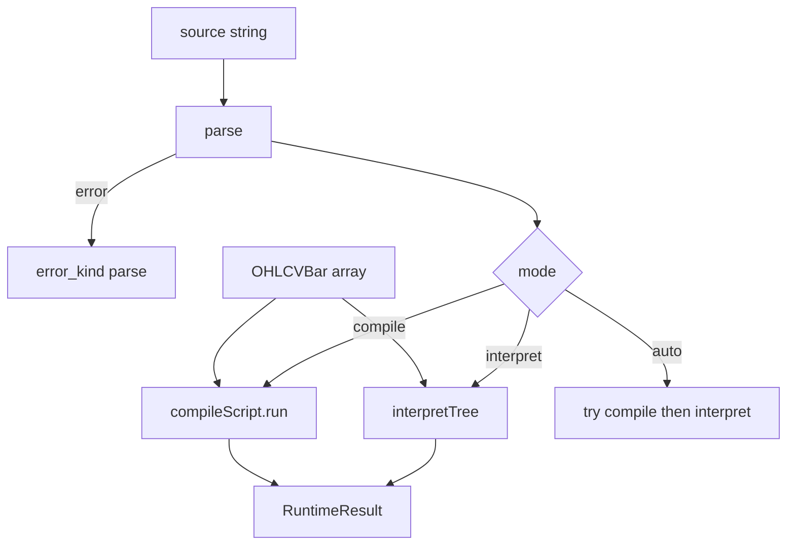

# Copyright (C) 2024-2026 jango_blockchained
#
# This file is part of pynescript.
#
# pynescript is free software: you can redistribute it and/or modify
# it under the terms of the GNU Affero General Public License as published by
# the Free Software Foundation, either version 3 of the License, or
# (at your option) any later version.
#
# pynescript is distributed in the hope that it will be useful,
# but WITHOUT ANY WARRANTY; without even the implied warranty of
# MERCHANTABILITY or FITNESS FOR A PARTICULAR PURPOSE.  See the
# GNU Affero General Public License for more details.
#
# You should have received a copy of the GNU Affero General Public License
# along with pynescript.  If not, see <https://www.gnu.org/licenses/>.
#
# SPDX-License-Identifier: AGPL-3.0-or-later

---
title: "PyneTS runtime"
description: "Runtime.run envelope: na is null, series lookback, call-site TA, request.security without data → na, stream and providers."
---

# PyneTS runtime

## Abstract

`Runtime` is the TypeScript counterpart of `pynescript.runtime.Runtime`. It is **not** a port of `runtime/host.py` line-by-line; it matches the **public envelope**: `run(source, ohlcv) → plots / series / events / drawings`. Default `mode` is `interpret` (AST walk). `compile` / `auto` select [JS emit](/pyne/docs/pynets/compile).

There is **no** `Runtime.evaluate`.

## Conceptual model



## Interface surface

```ts
new Runtime(symbol = "AAPL", options?: RuntimeOptions)

runtime.run(source, ohlcv, extra?: RuntimeOptions | InputOverrides): RuntimeResult
runtime.stream(source): RuntimeStream
runtime.runProvider(source, provider, extra?): Promise<RuntimeResult>
runtime.registerLibrarySource(namespace, name, version, source): void
```

### `RuntimeOptions`

| Field | Meaning |
| --- | --- |
| `inputs` | `input.*` overrides (`Record<string, number \| string \| boolean>`) |
| `broker` | `{ commission?, slippage?, pyramiding? }` |
| `timeframe` | Chart TF string, or `null` |
| `libraries` | `LibraryRegistry` instance |
| `mode` | `interpret` (default) \| `compile` \| `auto` |

Per-call `extra` merges over the constructor. A plain object of input values (no `mode` / `broker` / …) is treated as `InputOverrides`.

### `OHLCVBar`

All fields optional: `open`, `high`, `low`, `close`, `volume`, `time`. Missing numeric fields become `na` at use.

### `RuntimeResult`

| Field | Meaning |
| --- | --- |
| `series` | Titled plot series → `Array<number \| null>` |
| `plots` | First / default plot column |
| `plot_meta` | `{ title }[]` |
| `count` | Bar count consumed |
| `script_name` / `script_type` | From `indicator` / `strategy` |
| `mode` | `"interpret"` or `"compile"` (what actually ran) |
| `auto_backend` | When `mode: "auto"` |
| `compile_fallback_reason` | Why auto fell back |
| `events` | `StrategyEvent[]` |
| `fills` | Broker fills |
| `drawings` | `line` / `label` / `box` / … |
| `logs` | `log.*` records |
| `strategy` | Book scalars when the script is a strategy |
| `error` / `error_kind` | Soft failure (`parse` \| `runtime` \| …) |

Parse and runtime failures **return** an error envelope; they do not throw from `run` (except unexpected host bugs). `interpret(source, bars)` (helper) **does** throw if `out.error`.

### Stream

```ts
const s = new Runtime("AAPL").stream(src);
s.on("bar", (out) => { /* full re-eval on bars so far */ });
s.on("error", (err) => {});
s.push({ close: 10 });
s.push({ close: 11 });
s.close();
```

Each `push` re-runs the script on **all bars so far** (Python-shaped, not incremental-only).

### Providers

```ts
import { Runtime, MemoryProvider } from "@hoox-sh/pynets";

const provider = new MemoryProvider({
  AAPL: [{ close: 1 }, { close: 2 }, { close: 3 }],
});
const out = await new Runtime("AAPL").runProvider(src, provider, { limit: 3 });
```

Also: `StaticMapProvider`, `JsonBarProvider`. `request.security` without a matching feed stays `na`.

## Internals

| Path | Role |
| --- | --- |
| `src/runtime/interpret.ts` | Host, `Runtime`, `interpretTree` |
| `src/runtime/series.ts` | `NA`, `PineSeries` |
| `src/runtime/ta.ts` | Incremental `TaEngine` |
| `src/runtime/strategy.ts` | Broker, fills, risk, OCA |
| `src/runtime/request.ts` | `request.security` policy |
| `src/runtime/library.ts` | In-process `import ns/Name/ver` |
| `src/runtime/provider.ts` | Bar providers |
| `src/runtime/drawings.ts` | Drawing book + GC |

## Invariants & edge cases

1. **`na` is `null`.** A non-finite number in or out becomes `na`.
2. **`na == na` is true.** Any other comparison involving `na` is false.
3. **Lookback:** `close[1]` is the previous bar; OOB → `na`.
4. **Call-site TA.** Two `ta.sma(close, 14)` at different AST nodes do **not** share state.
5. **Foreign / HTF `request.security` without data → `na`.** Same-symbol simple OHLCV may passthrough; the chart is never invented as another ticker.
6. **v3/v4 bare aliases** (`sma`, `ema`, `rsi`, …) resolve when Python does.
7. Libraries: `registerLibrarySource` then `import namespace/Name/version`. Unresolved aliases stub to `na` (soft), they do not crash the run.

## Worked examples

### na and lookback

```ts
const out = new Runtime("TEST").run(
  `indicator("t")
plot(close[1])
plot(na == na ? 1 : 0)`,
  [{ close: 10 }, { close: 20 }],
);
// last bar: plots[0] === 10, plots[1] === 1
```

### Inputs and strategy

```ts
const out = new Runtime("AAPL", {
  inputs: { len: 5 },
  broker: { commission: 0.001, pyramiding: 1 },
}).run(src, bars);

if (out.error) throw new Error(out.error);
console.log(out.events, out.fills, out.strategy);
```

## Failure modes

| Symptom | Cause | Fix |
| --- | --- | --- |
| `error_kind: "parse"` | Grammar failure | `parse(source)` / `pynets check` |
| All `request.security` values `null` | No foreign feed | Expected. Pass a provider or accept `na` |
| Plots off-by-one vs TV | Lookback / `na` policy | Compare to **Python**, not to TradingView |
| Stream looks "slow" | Full re-eval each push | Expected host model |
| `mode` in the result is `interpret` after `auto` | Compile ineligible / error | Read `compile_fallback_reason` |

## See also

- [JS compile](/pyne/docs/pynets/compile)
- [Parity](/pyne/docs/pynets/parity)
- [Python series and history](/pyne/docs/runtime/series-and-history)
- [request.*](/pyne/docs/runtime/builtins/request-input)
- [Evaluate scripts](/pyne/docs/enduser/guides/evaluate-scripts)
