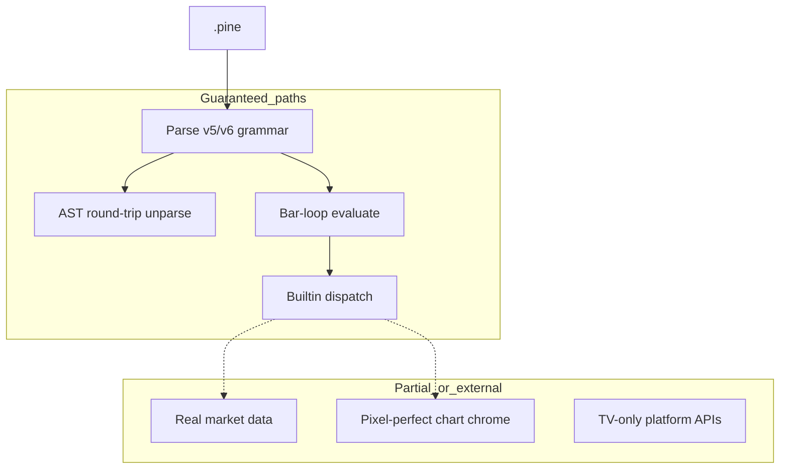

# Compatibility guarantee

## Abstract

PYNE aims for **high syntactic fidelity** and **strong semantic compatibility** with TradingView® Pine Script™ v5/v6 on the language core: parser, AST round-trip, type system, collections, technical builtins, and strategy primitives. Compatibility is **not** a claim of full platform parity (hosted chart, proprietary market data, editor-only features).

Source distillations: `docs/compatibility_guarantee.md` (v1.1, 2026-07-12) and live test inventory. Metrics move as the suite grows — prefer CI and the [implementation status](/pyne/docs/reference/implementation-status) matrix for current checkmarks.

## Conceptual model



## Interface surface

### Compatibility metrics (summary)

| Category | Claim | Status posture |
| --- | --- | --- |
| Parser & syntax | Full grammar on real scripts (138+ builtin corpus) | Solid |
| AST round-trip | Structural match on corpus | Verified |
| Builtins | Broad coverage (200+ / dispatch hundreds) | Good → excellent by namespace |
| Technical indicators | Core + advanced; numerical cross-checks | Validated in tests / reports |
| Strategy | entry/exit/close, events, risk, OCA, commission | Functional / improved 2026-07 |
| Type system | int/float/bool/string/color/series/UDT/collections | Strong |
| Real-world scripts | High parse success on corpus | Tested |

Historical guarantee doc cited **1142 automated tests** at last update — re-run `make test` for live counts.

### Language features (core)

Documented at 100% support posture for:

- `var` / `varip`, type annotations, functions/methods
- Control flow, UDTs, operators, string interpolation
- Imports/libraries, v6 `enum`, switch expressions
- Series history, array/matrix/map, tuple unpacking, method chaining

### Builtins (guarantee lens)

| Family | Guarantee style |
| --- | --- |
| `math.*` | IEEE-oriented precision; exact for discrete ops |
| `ta.*` | Cross-validated vs reference implementations within tight relative error |
| `str.*` / `array.*` | Behavioral parity on exercised surface |
| Plotting | Signature + registry effects; rendering is external (AXIS / clients) |
| `strategy.*` | Execution model in-process; not a licensed broker |

## Internals

| Artifact | Role |
| --- | --- |
| `docs/compatibility_guarantee.md` | Long-form guarantee text |
| `tests/data/builtin_scripts/*.pine` | Parametrized corpus |
| `tests/test_parse_and_unparse.py` | Round-trip |
| `tests/test_real_world_compatibility.py` | Real-script posture |
| `tests/fixtures/parity/` | Cross-impl strategy events |
| `reports/compatibility_report.json` | Machine-readable reports if generated |

## Invariants & edge cases

1. **Parse success ≠ evaluate success.** A script may round-trip yet depend on mock `request.*` data.
2. **Plot functions are not TradingView’s renderer.** They validate and record; pixels are optional.
3. **Undocumented / beta TV syntax** may fail (guarantee doc notes a v7-beta edge).
4. **Floating-point parity is statistical**, not bit-identical for all recursive smoothers — see [Numerical validation](/pyne/docs/reference/numerical-validation).
5. **Library `export` / import** require in-process registration paths when not on TV’s CDN.

## Worked examples

### Round-trip check

```python
from pynescript.ast.helper import parse, unparse
src = open("strategy.pine").read()
assert unparse(parse(src))  # structural fidelity; exact whitespace may differ
```

### Corpus pytest (narrow)

```bash
pytest tests/test_parse_and_unparse.py -q --example-scripts-dir=tests/data/builtin_scripts
```

## Failure modes

| Observation | Interpretation |
| --- | --- |
| Parse error on new TV release notes feature | Surface gap — see [Missing features](/pyne/docs/reference/missing-features) |
| Numerical drift on custom indicator | Compare bar-mode vs list-mode; check `na` propagation |
| Strategy equity mismatch vs TV | Commission/slippage/fill model differences; seed data |
| Import resolution fails | Library not registered in runtime |

## See also

- [Implementation status](/pyne/docs/reference/implementation-status)
- [Missing features](/pyne/docs/reference/missing-features)
- [Pine v6 surface inventory](/pyne/docs/reference/pine-v6-surface)
- [Numerical validation](/pyne/docs/reference/numerical-validation)
