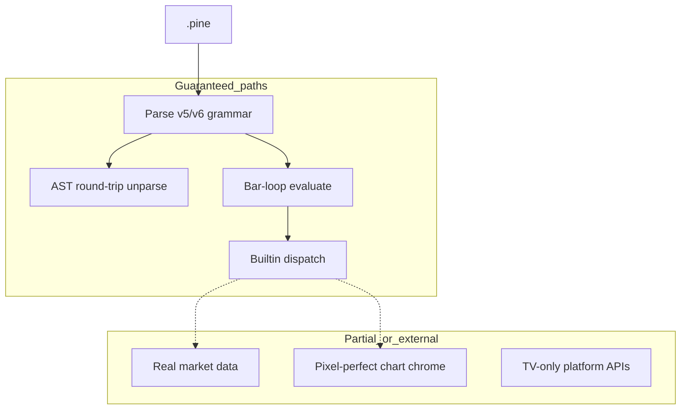

# Copyright (C) 2024-2026 jango_blockchained
#
# This file is part of pynescript.
#
# pynescript is free software: you can redistribute it and/or modify
# it under the terms of the GNU Affero General Public License as published by
# the Free Software Foundation, either version 3 of the License, or
# (at your option) any later version.
#
# pynescript is distributed in the hope that it will be useful,
# but WITHOUT ANY WARRANTY; without even the implied warranty of
# MERCHANTABILITY or FITNESS FOR A PARTICULAR PURPOSE.  See the
# GNU Affero General Public License for more details.
#
# You should have received a copy of the GNU Affero General Public License
# along with pynescript.  If not, see <https://www.gnu.org/licenses/>.
#
# SPDX-License-Identifier: AGPL-3.0-or-later

---
title: "Compatibility guarantee"
description: "What PYNE promises for Pine Script™ v5/v6 syntax, semantics, builtins, and real-world script corpora — and what it does not."
---

# Compatibility guarantee

## Abstract

PYNE aims for **high syntactic fidelity** and **strong semantic compatibility** with TradingView® Pine Script™ v5/v6 on the language core: parser, AST round-trip, type system, collections, technical builtins, and strategy primitives. Compatibility is **not** a claim of full platform parity (hosted chart, proprietary market data, editor-only features).

Source distillations: `docs/compatibility_guarantee.md` (v1.1, 2026-07-12) and live test inventory. Metrics move as the suite grows — prefer CI and the [implementation status](/pyne/docs/reference/implementation-status) matrix for current checkmarks.

## Conceptual model



## Interface surface

### Compatibility metrics (summary)

| Category | Claim | Status posture |
| --- | --- | --- |
| Parser & syntax | Full grammar on real scripts (138+ builtin corpus) | Solid |
| AST round-trip | Structural match on corpus | Verified |
| Builtins | Broad coverage (200+ / dispatch hundreds) | Good → excellent by namespace |
| Technical indicators | Core + advanced; numerical cross-checks | Validated in tests / reports |
| **Interpret ↔ compile plot parity** | Same OHLCV → matching plot/`series` values (nan-aware allclose) | Testing pillar — harness + goldens |
| Strategy | entry/exit/close, events, risk, OCA, commission | Functional / improved 2026-07 |
| Type system | int/float/bool/string/color/series/UDT/collections | Strong |
| Real-world scripts | High parse success on corpus | Tested |

Historical guarantee doc cited **1142 automated tests** at last update — re-run `make test` for live counts.

### Testing pillar: interpret ↔ compile plot parity

Dual-host **plot/`series` parity** is a first-class correctness pillar: the same script and bars run under `Runtime.run(..., mode="interpret")` and `mode="compile"`, then series keys are compared with nan-aware allclose (`rtol=1e-5`, `atol=1e-6`).

| Artifact | Role |
| --- | --- |
| `scripts/compare_interp_compile.py` | Full corpus harness (default ~50 scripts × 1000 bars); report `.cache/interp_compile_parity.json` |
| `tests/test_interp_compile_parity.py` | Always-on smoke subset + optional `-m interp_compile_full` |
| `tests/test_compiler_numba.py` (`TestInterpCompilePlotParityFixes`) | Targeted goldens (Wilder RSI, ROC, WMA, `ta.cum`, …) |

**Intentional / known dual-host differences** (not treated as silent value bugs when both sides agree on the contract):

1. **Foreign `request.*` on compile** — compile does **not** invent multi-asset series. Same-symbol simple OHLCV may lower; foreign tickers and complex security expressions emit `na` (interpret may still serve mocks/feeds). See [Missing features](/pyne/docs/reference/missing-features).
2. **EMA seed family (some kernels)** — nested DEMA/TEMA and related paths may use compile’s SMA-seed EMA family vs interpret first-value seed on older kernels; ATR’s EMA-of-TR is aligned first-TR seed. Re-check `numba_builtins.py` when investigating residual maxdiff.
3. **Pivot-starved scripts (e.g. Auto Fib)** — synthetic harness bars lack structure; both backends should `runtime.error` with matching messages (`both_error_same`), not invent pivots.

### Language features (core)

Documented at 100% support posture for:

- `var` / `varip`, type annotations, functions/methods
- Control flow, UDTs, operators, string interpolation
- Imports/libraries, v6 `enum`, switch expressions
- Series history, array/matrix/map, tuple unpacking, method chaining

### Builtins (guarantee lens)

| Family | Guarantee style |
| --- | --- |
| `math.*` | IEEE-oriented precision; exact for discrete ops |
| `ta.*` | Cross-validated vs reference implementations within tight relative error |
| `str.*` / `array.*` | Behavioral parity on exercised surface |
| Plotting | Signature + registry effects; rendering is external (AXIS / clients) |
| `strategy.*` | Execution model in-process; not a licensed broker |

## Internals

| Artifact | Role |
| --- | --- |
| `docs/compatibility_guarantee.md` | Long-form guarantee text |
| `tests/data/builtin_scripts/*.pine` | Parametrized corpus |
| `tests/test_parse_and_unparse.py` | Round-trip |
| `tests/test_real_world_compatibility.py` | Real-script posture |
| `tests/fixtures/parity/` | Cross-impl strategy events |
| `scripts/compare_interp_compile.py` | Interpret ↔ compile series/plot parity harness |
| `tests/test_interp_compile_parity.py` | Parity smoke / full subset |
| `reports/compatibility_report.json` | Machine-readable reports if generated |

## Invariants & edge cases

1. **Parse success ≠ evaluate success.** A script may round-trip yet depend on mock `request.*` data.
2. **Plot functions are not TradingView’s renderer.** They validate and record; pixels are optional.
3. **Interpret success ≠ compile success** for multi-asset / foreign `request.*`, imports, or object-mode fallout — prefer the parity harness over assuming `mode=auto` is silent.
4. **Undocumented / beta TV syntax** may fail (guarantee doc notes a v7-beta edge).
5. **Floating-point parity is statistical**, not bit-identical for all recursive smoothers — see [Numerical validation](/pyne/docs/reference/numerical-validation). Hot kernels (RSI/ROC/WMA/cum/highestbars) are aligned across hosts where fixed.
6. **Library `export` / import** require in-process registration paths when not on TV’s CDN.

## Worked examples

### Round-trip check

```python
from pynescript.ast.helper import parse, unparse
src = open("strategy.pine").read()
assert unparse(parse(src))  # structural fidelity; exact whitespace may differ
```

### Corpus pytest (narrow)

```bash
pytest tests/test_parse_and_unparse.py -q --example-scripts-dir=tests/data/builtin_scripts
```

### Interpret ↔ compile plot parity

```bash
python scripts/compare_interp_compile.py --bars 1000 --limit 50
python scripts/compare_interp_compile.py --ignore-hline-keys --ignore-fill-keys --strict-keys
pytest tests/test_interp_compile_parity.py -q
```

## Failure modes

| Observation | Interpretation |
| --- | --- |
| Parse error on new TV release notes feature | Surface gap — see [Missing features](/pyne/docs/reference/missing-features) |
| Numerical drift on custom indicator | Compare bar-mode vs list-mode; check `na` propagation |
| Interpret vs compile series mismatch | Check foreign `request.*`, EMA seed family, UDF last-assign `na`; run parity harness |
| Strategy equity mismatch vs TV | Commission/slippage/fill model differences; seed data |
| Import resolution fails | Library not registered in runtime |

## See also

- [Implementation status](/pyne/docs/reference/implementation-status)
- [Missing features](/pyne/docs/reference/missing-features)
- [Pine v6 surface inventory](/pyne/docs/reference/pine-v6-surface)
- [Numerical validation](/pyne/docs/reference/numerical-validation)
