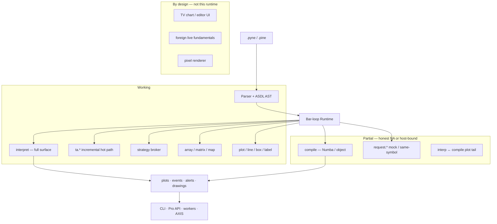
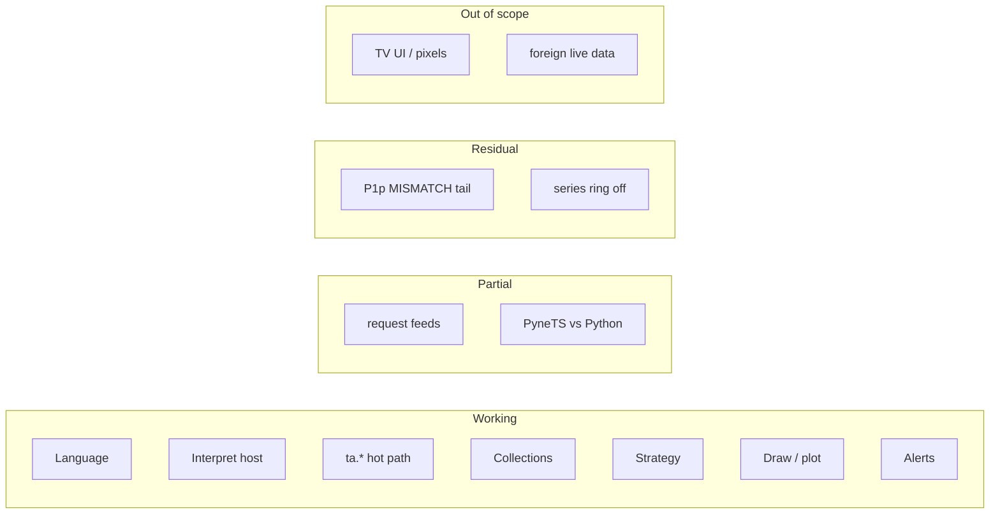

# Copyright (C) 2024-2026 jango_blockchained
#
# This file is part of pynescript.
#
# pynescript is free software: you can redistribute it and/or modify
# it under the terms of the GNU Affero General Public License as published by
# the Free Software Foundation, either version 3 of the License, or
# (at your option) any later version.
#
# pynescript is distributed in the hope that it will be useful,
# but WITHOUT ANY WARRANTY; without even the implied warranty of
# MERCHANTABILITY or FITNESS FOR A PARTICULAR PURPOSE.  See the
# GNU Affero General Public License for more details.
#
# You should have received a copy of the GNU Affero General Public License
# along with pynescript.  If not, see <https://www.gnu.org/licenses/>.
#
# SPDX-License-Identifier: AGPL-3.0-or-later

---
title: "Compatibility guarantee"
description: "Grouped map of what PYNE implements for Pine Script™ v5/v6 — working, partial, residual, and by-design out of scope. hoox-pyne 0.3.11."
---

# Compatibility guarantee

## Abstract

PYNE implements Pine Script™ **v5/v6 language core** as an inspectable pipeline: parse → AST → bar-loop evaluate. The map below is the product-facing compatibility surface for **`hoox-pyne` 0.3.11**. It is **not** TradingView® platform identity (chart host, proprietary data, editor-only UI) and **not** bit-identical results vs the hosted platform on every script or bar.

Name-level dispatch lives in [Pine v6 surface](/pyne/docs/reference/pine-v6-surface) (`docs/pine_v6_full_surface_inventory.md`). Gaps: [Missing features](/pyne/docs/reference/missing-features). Checkmarks: [Implementation status](/pyne/docs/reference/implementation-status).

## Conceptual model



## Legend

| Mark | Meaning |
| --- | --- |
| **Working** | Implemented, usable, covered by first-party tests |
| **Partial** | Callable but mock, host-bound, or incomplete vs hosted Pine |
| **Residual** | Known open hole on an otherwise landed surface |
| **Out of scope** | Intentionally not a TV platform clone |

Dispatch snapshot (2026-07-25): **640** callables, **0 missing** vs the public TV v6 function list (434 symbols). A registered name is not the same as hosted-platform semantics.

<CardGroup cols={4}>
  <Card title="Working" icon="check">
    Language, series, TA hot path, collections, strategy broker, drawings, alerts, libraries, interpret Runtime.
  </Card>
  <Card title="Partial" icon="triangle-alert">
    `request.*` feeds (honest `na`), compile eligibility, compile alerts, PyneTS vs Python oracle.
  </Card>
  <Card title="Residual" icon="circle-dot">
    Plot MISMATCH corpus tail (P1p), `PYNE_SERIES_RING` default off.
  </Card>
  <Card title="Out of scope" icon="ban">
    Pixel chart, editor UX, foreign live data, bit-identical TV bars.
  </Card>
</CardGroup>

## Interface surface

### Corpus (set01–04 · 2477 scripts · 2026-08-09)

Open-source sets, **not shipped** in git. Not a TradingView® platform score.

| Suite | Rate | Notes |
| --- | ---: | --- |
| Parse + unparse | **99.96%** (2476/2477) | Residual: one intentional invalid line-wrap demo |
| Runtime interpret (50 bars) | **100%** excl. EXPECTED_FAIL | 2466 OK + 11 listed demos |
| set01 Runtime | **249/249** | Interpret (and prior compile sweep) |

EXPECTED_FAIL are path-listed demos (`runtime.error` library guards, lower-TF security, pathological loops) — not silent suppression.

### Grouped map

<AccordionGroup>
  <Accordion title="Language — working">
    | Area | Status | Notes |
    | --- | --- | --- |
    | ANTLR4 grammar v5/v6 | Working | Multiline strings, soft keywords, bitwise, typed UDF returns (`FunctionDef.returns`) |
    | Parse → unparse | Working | Structural fidelity; whitespace may differ |
    | `var` / `varip` / `:=` | Working | Execution-site init; start-of-bar carry |
    | Functions, methods, type annotations | Working | |
    | Control flow, `switch`, enums | Working | Strict bool; `na` is false in conditions |
    | UDTs + `.new` | Working | Field defaults on compile (0.3.8) |
    | Libraries `export` / `import ns/Name/ver` | Working | In-process `register_library_source`; `Runtime.run(..., libraries=)` |
    | String interpolation, tuple unpack, method chaining | Working | |
    | Series `[]` history | Working | OOB / negative → `na` (not wrap) |
  </Accordion>

  <Accordion title="Bar-loop host — working">
    | Area | Status | Notes |
    | --- | --- | --- |
    | `pynescript.runtime.Runtime` | Working | Package SoT; `backend.runtime` re-exports |
    | Modes `interpret` / `compile` / `auto` | Working | Defaults differ by surface — [modes](/pyne/docs/enduser/reference/modes) |
    | Series caps | Working | `PYNE_SERIES_CAP` default **on** |
    | Incremental `ta.*` | Working | Default **on**; `PYNE_TA_INCREMENTAL=0` full recompute |
    | Derived OHLCV skip | Working | Unused `hl2`/`hlc3`/`ohlc4`/`tr` not written; `ta.vwap` still updates `hlc3` |
    | `timeout_seconds` | Working | Library / edge / Flask `/run` + `/run/batch` (omit = no budget) |
    | Ring buffer | Residual | `PYNE_SERIES_RING` default **off** |
  </Accordion>

  <Accordion title="ta.* — working">
    | Area | Status | Notes |
    | --- | --- | --- |
    | MAs | Working | `sma`/`ema`/`rma`/`wma`/`hma`/`vwma`/`kama`/`dema`/`tema`/`alma` incremental |
    | Oscillators | Working | `rsi`/`macd`/`stoch`/`cci`/`cmo`/`tsi`/`roc`/`wpr` |
    | Volatility / structure | Working | `atr` (Wilder `rma(tr)`), `bb`, `kc`, `stdev`, `highest`/`lowest`, `linreg`, `adx`/`dmi`, `supertrend`, `sar` |
    | Volume | Working | Incremental `obv`/`wad`/`wvad`/`cmf`/`klinger`/`mfi`/`vwap`/`nvi`/`pvi` |
    | Supertrend | Working | Locked mid±factor·ATR (inc ≡ compile ≡ Numba). TV band ratchet is out of scope |
  </Accordion>

  <Accordion title="Collections — working">
    | Area | Status | Notes |
    | --- | --- | --- |
    | `array.*` | Working | Negative indices; UDT `sort_field` + `binary_search*` |
    | `matrix.*` | Working | LA (`det`/`inv`/`eigen`…), predicates, `sort_field` |
    | `map.*` | Working | |
  </Accordion>

  <Accordion title="Strategy — working with OHLC-path limits">
    | Area | Status | Notes |
    | --- | --- | --- |
    | `entry` / `close` / `cancel` / events | Working | `StrategyEvent` stream |
    | `exit` stop/limit + OCA | Working | OHLC path, not tick path |
    | `profit` / `loss` | Working | Ticks × mintick from entry avg |
    | `from_entry` / `qty_percent` | Working | Interpret + compile |
    | Trail | Working | `trail_offset` / `trail_points` / `trail_price` on OHLC high/low (dual-host). Tick path is out of scope |
    | Risk cascade | Working | `allow_entry_in`, max size/drawdown/cons-loss-days/intraday |
    | Open/closed trade fields + MAE/MFE | Working | Extremes from bar high/low |
    | Pending-fill average (pyramiding ≤ 0) | Working | F2 |
    | Licensed broker / exchange fills | Out of scope | In-process model only |
  </Accordion>

  <Accordion title="Drawing and plots — working; renderer external">
    | Area | Status | Notes |
    | --- | --- | --- |
    | `plot` / `plotshape` / `plotchar` / `plotarrow` / `hline` / `bgcolor` / `fill` | Working | Registry + columnar capture |
    | `line` / `box` / `label` / `table` / `polyline` / `linefill` | Working | `*.all`, `set_*` / `delete` fold on compile |
    | `max_*_count` GC | Working | Interpret registry |
    | `force_overlay` | Working | Export payload |
    | Pixel paint | Out of scope | AXIS / clients consume series + drawings |
    | Compile `hline`/`fill`/`bgcolor`/`plotshape` keys | Working | First-party key sets match interpret. Harness ignore flags stay optional CLI |
  </Accordion>

  <Accordion title="request.* and data — partial by design">
    | Area | Status | Notes |
    | --- | --- | --- |
    | Same-symbol simple OHLCV / HTF | Working | Allowlisted `ta.sma`/`ema`/`rsi`/`atr` on HTF |
    | Foreign / complex `request.security` | Partial | Resolves to **`na`** (no invented chart-close) |
    | `request.footprint` / financial / economic | Partial | Mock / feed-scaled; not a live vendor |
    | `input.*` including `active` / `enum` | Working | Values + metadata |
    | Bid/ask omitted | Partial | `na` when host does not supply |
    | Real multi-symbol market data (B1) | Out of scope | Needs a host adapter |
  </Accordion>

  <Accordion title="Alerts, compile, hosts">
    | Area | Status | Notes |
    | --- | --- | --- |
    | `alert()` / `alertcondition()` | Working | Frequency rules; `/run` export |
    | L2 webhooks | Working | `webhook_url` / `ALERT_WEBHOOK_URL` |
    | Compile alerts | Partial | Interpret is the alert oracle |
    | Numba + object-mode compile | Working | `mode=auto` falls back; `import` / `request.*` / `inputs=` skip compile |
    | Warm compile / disk IR | Working | Prewarm CLI/API; cache meta v10 |
    | Interp ↔ compile plot parity | Partial | Harness + first-party goldens; residual corpus MISMATCH tail (P1p) |
    | CLI / LSP / Pro API / Docker | Working | `pyne` / `pyne-lsp`; Flask `/run` |
    | Flask `/run` `libraries` | Working | Max 32; also `/run/batch` |
    | Flask `timeout_seconds` | Working | Optional on `/run` and `/run/batch`; omit / `≤ 0` = no timeout |
  </Accordion>

  <Accordion title="Sister implementations">
    | Surface | Status | Notes |
    | --- | --- | --- |
    | Python Runtime | Working | Language oracle |
    | PyneTS `@hoox-sh/pynets` 0.2.0 | Partial | Interpret + JS compile on npm; Python Runtime is the oracle |
    | `pynets/` submodule in this repo | Partial | Pin **v0.2.0** — same surface as npm (interpret + JS compile) |
    | pyne-worker | Working | Thin Python CF host; vendors engine (may lag 0.3.10) |
    | pine-worker | Partial | Legacy TS Worker; **not** in this checkout |
  </Accordion>
</AccordionGroup>

### Residual and out of scope (compact)

| Item | Class |
| --- | --- |
| Interpret↔compile value `MISMATCH` corpus tail | Residual (P1p) |
| `PYNE_SERIES_RING` default-on | Residual (flagged off) |
| Pixel chart / editor word-wrap / TV UI | Out of scope |
| Foreign live fundamentals without a feed | Out of scope |
| TV Supertrend band ratchet | Out of scope |
| Tick-path trail / broker | Out of scope |
| Bit-identical every recursive smoother vs TV | Out of scope |
| Parallel bars / whole-script vectorization | Out of scope |



### Dual-host plot parity

Same script + OHLCV under `mode="interpret"` and `mode="compile"`; series compared with nan-aware allclose (`rtol=1e-5`, `atol=1e-6`).

| Artifact | Role |
| --- | --- |
| `scripts/compare_interp_compile.py` | Corpus harness → `.cache/interp_compile_parity.json` |
| `tests/test_interp_compile_parity.py` | Always-on smoke |
| `tests/test_first_party_ta_goldens.py` | ATR / Supertrend / Keltner dual-host |

Known **contract** differences (not silent value bugs):

1. Foreign / complex `request.*` → `na` on both hosts when no feed.
2. First-party `hline` / `fill` / `bgcolor` / `plotshape` keys match; harness `--ignore-hline-keys` / `--ignore-fill-keys` remain optional for leftover corpus noise.
3. Pivot-starved Auto Fib → matching `runtime.error` (`both_error_same`), not invented pivots.

## Internals

| Artifact | Role |
| --- | --- |
| `docs/compatibility_guarantee.md` | Historical long-form; this page is the map |
| `COMPATIBILITY.md` | Repo-root distillation of this map |
| `docs/pine_v6_full_surface_inventory.md` | Name-level dispatch tables |
| `docs/known_divergences.md` | Semantic deltas vs public Pine docs |
| `tests/fixtures/parity/` | First-party strategy fixtures |

## Invariants & edge cases

1. **Parse success ≠ evaluate success.** Round-trip can still depend on `request.*` data.
2. **Dispatch success ≠ hosted semantics.** 0 missing vs the public function list does not mean TV-identical bars.
3. **Interpret is the oracle.** Compile matches where eligible; `mode=auto` falls back.
4. **Plots are not a renderer.** Registry + series export; pixels are AXIS / clients.
5. **Floating-point is statistical** for some recursive smoothers — [Numerical validation](/pyne/docs/reference/numerical-validation).
6. **Libraries** need in-process registration; there is no TV CDN.

## Worked examples

### Round-trip

```python
from pynescript.ast.helper import parse, unparse

src = open("strategy.pine").read()
assert unparse(parse(src))  # structural; whitespace may differ
```

### Interpret ↔ compile

```bash
python scripts/compare_interp_compile.py --bars 1000 --limit 50
python scripts/compare_interp_compile.py --ignore-hline-keys --ignore-fill-keys
pytest tests/test_interp_compile_parity.py -q
```

## Failure modes

| Observation | Read as |
| --- | --- |
| Parse error on a new TV release-notes feature | Surface gap — [Missing features](/pyne/docs/reference/missing-features) |
| Numerical drift on a custom smoother | Bar-mode vs list-mode; `na`; [known divergences](https://github.com/hoox-sh/pyne/blob/main/docs/known_divergences.md) |
| Interpret vs compile series mismatch | Foreign `request.*`, UDF last-assign `na`, hline/fill keys |
| Strategy equity ≠ TV | Commission / slippage / OHLC vs tick path |
| `import` unresolved | Library not in `libraries=` / registry |
| `/run` 400 `UNKNOWN_FIELDS` | Extra key not in `RUN_SCHEMA` |

## See also

- [Implementation status](/pyne/docs/reference/implementation-status)
- [Missing features](/pyne/docs/reference/missing-features)
- [Pine v6 surface inventory](/pyne/docs/reference/pine-v6-surface)
- [Numerical validation](/pyne/docs/reference/numerical-validation)
- [Runtime modes](/pyne/docs/enduser/reference/modes)
- [Roadmap](/pyne/docs/reference/roadmap)
