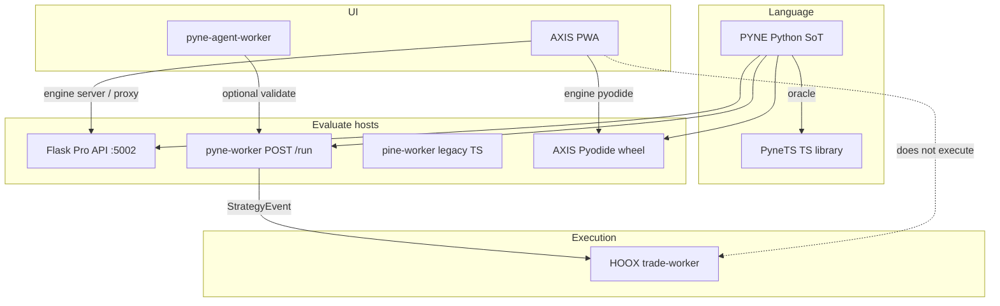

# Copyright (C) 2024-2026 jango_blockchained
#
# This file is part of pynescript.
#
# pynescript is free software: you can redistribute it and/or modify
# it under the terms of the GNU Affero General Public License as published by
# the Free Software Foundation, either version 3 of the License, or
# (at your option) any later version.
#
# pynescript is distributed in the hope that it will be useful,
# but WITHOUT ANY WARRANTY; without even the implied warranty of
# MERCHANTABILITY or FITNESS FOR A PARTICULAR PURPOSE.  See the
# GNU Affero General Public License for more details.
#
# You should have received a copy of the GNU Affero General Public License
# along with pynescript.  If not, see <https://www.gnu.org/licenses/>.
#
# SPDX-License-Identifier: AGPL-3.0-or-later

---
title: "Ecosystem"
description: "PYNE, PyneTS, pyne-worker, pine-worker, pyne-agent-worker, AXIS, and HOOX — what each one is and is not."
---

# Ecosystem

## Abstract

The HOOX family splits **language**, **chart**, and **execution**. Mixing the names is the most common docs failure: `pine-worker` is not `pynets`, and AXIS does not place HOOX orders.

| Product | Role | Docs |
| --- | --- | --- |
| **PYNE** (`hoox-pyne`, import `pynescript`) | Python language SoT: parse, LSP, Pro API, `Runtime.run` | this site |
| **PyneTS** (`@hoox-sh/pynets`) | TypeScript / Bun **library + CLI** | [PyneTS](/pyne/docs/pynets) |
| **pyne-worker** | Python Cloudflare isolate — `POST /run` | [HOOX pyne-worker](/docs/devops/workers/pyne-worker) |
| **pine-worker** | Legacy TypeScript Cloudflare Worker | [pine-worker](/pyne/docs/pine-worker) |
| **pyne-agent-worker** | NL → Pine (Workers AI) | [agent](/pyne/docs/agent) |
| **AXIS** | Charting PWA (engines call Python) | [AXIS](/axis/docs) |
| **HOOX** | Edge trade mesh | [HOOX](/docs) |

## Conceptual model

**Invariant:** evaluation never requires a proprietary chart host. AXIS is an optional chart. HOOX is an optional execution mesh. PyneTS is an optional TypeScript import.

## Interface surface

### Checkouts (this repo vs sisters)

| Checkout | What you open |
| --- | --- |
| [hoox-sh/pyne](https://github.com/hoox-sh/pyne) | PYNE SoT (`hoox-pyne` **0.3.10**) |
| [hoox-sh/pynets](https://github.com/hoox-sh/pynets) | Standalone `@hoox-sh/pynets` **0.2.0** (JS compile + stream) |
| `pynets/` **submodule** in this repo | Snapshot may lag — currently `@hoox/pynets` **0.1.0**, interpret-only |
| [hoox-sh/pyne-worker](https://github.com/hoox-sh/pyne-worker) | Python edge `/run` |
| [hoox-sh/pine-worker](https://github.com/hoox-sh/pine-worker) | Legacy TS Worker (**not** in this tree) |
| [hoox-sh/pyne-agent-worker](https://github.com/hoox-sh/pyne-agent-worker) | NL authoring (**not** in this tree) |
| [hoox-sh/axis](https://github.com/hoox-sh/axis) | AXIS PWA |
| [hoox-sh/hoox](https://github.com/hoox-sh/hoox) | Mesh monorepo |

### Evaluate contract

Flask `POST /run`, pyne-worker `POST /run`, and in-process `Runtime.run` share the [evaluate contract](/pyne/docs/api/contract): `script` + OHLCV + `mode` → `plots` / `events` / `alerts`. PyneTS speaks the **library** form of that envelope (`RuntimeResult`), not HTTP.

## Internals

Docs are authored in product trees and synced to hoox.sh:

| Tree | Public base |
| --- | --- |
| `pynescript/docs/pyne/**` | `/pyne/docs` |
| `axis/docs/**` | `/axis/docs` |
| `hoox/docs/**` | `/docs` |

Do not author in `hoox-landing-page/content/*` — that is a sync artifact.

## Invariants & edge cases

1. **Python wins** language semantics. PyneTS does not invent TradingView behaviour.
2. **AXIS ≠ engine.** AXIS never embeds a closed interpreter; engines are plugins.
3. **AXIS ≠ execution.** Drawing a strategy on AXIS does not call `trade-worker`.
4. **Alerts ≠ orders.** `alert()` webhooks are not `StrategyEvent` forwards unless you point them at the HOOX gateway yourself.
5. **Do not** `pip install pyne` or `pip install pynescript` for this project. Dist name is **`hoox-pyne`**.
6. **Do not** treat this repo’s `pynets/package.json` (`@hoox/pynets` **0.1.0** on the current submodule pin) as the published name. npm is **`@hoox-sh/pynets` 0.2.0**.

## Worked examples

### Pick a surface

| You want | Use |
| --- | --- |
| Parse / lint / LSP on a laptop | `pip install "hoox-pyne[lsp]"` |
| Embed evaluate in TypeScript | `bun add @hoox-sh/pynets` |
| HTTP evaluate at the edge | Deploy **pyne-worker** |
| Chart + editor | AXIS PWA + Flask or Pyodide |
| Live CEX orders from strategy events | pyne-worker `TRADE_SERVICE` → HOOX |
| Chat → script | pyne-agent-worker |

## Failure modes

| Mix-up | What goes wrong |
| --- | --- |
| Opening `pine-worker/` inside PYNE | Directory **does not exist** — use `@hoox-sh/pynets` or the sister repo |
| Expecting AXIS to flatten a position | No trade-worker hop |
| Pointing AXIS at pynets as an engine | No such engine. Use Flask / Pyodide / Worker proxy |
| `pyne run` vs `Runtime.run` vs `pynets run` | Different defaults — see [modes](/pyne/docs/enduser/reference/modes) |

## See also

- [PYNE index](/pyne/docs)
- [PyneTS](/pyne/docs/pynets)
- [Modes](/pyne/docs/enduser/reference/modes)
- [Evaluate contract](/pyne/docs/api/contract)
- [AXIS](/axis/docs)
- [HOOX](/docs)
- [HOOX live trading](/docs/enduser/guides/pyne-live-trading)
- [AXIS and HOOX](/docs/enduser/guides/axis-and-hoox)
