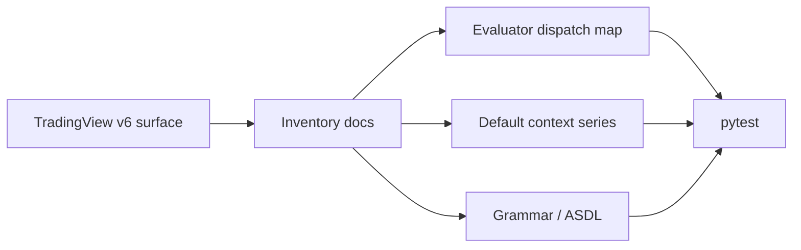

# Copyright (C) 2024-2026 jango_blockchained
#
# This file is part of pynescript.
#
# pynescript is free software: you can redistribute it and/or modify
# it under the terms of the GNU Affero General Public License as published by
# the Free Software Foundation, either version 3 of the License, or
# (at your option) any later version.
#
# pynescript is distributed in the hope that it will be useful,
# but WITHOUT ANY WARRANTY; without even the implied warranty of
# MERCHANTABILITY or FITNESS FOR A PARTICULAR PURPOSE.  See the
# GNU Affero General Public License for more details.
#
# You should have received a copy of the GNU Affero General Public License
# along with pynescript.  If not, see <https://www.gnu.org/licenses/>.
#
# SPDX-License-Identifier: AGPL-3.0-or-later

---
title: "Implementation status"
description: "Checklist-style status of Pine Script™ series, strategy, builtins, and language constructs in PYNE."
---

# Implementation status

## Abstract

This annex summarizes the **feature matrix** maintained in `docs/pinescript_implementation_status.md`: a large ✅/❌/🔄 inventory of series variables, strategy fields, and related surfaces. It is the human-readable twin of the [full surface inventory](/pyne/docs/reference/pine-v6-surface) (dispatch-oriented, auto-countable).

Status here is **implementation judgment**, not marketing completion percentage.

## Conceptual model



## Interface surface

### Legend

| Mark | Meaning |
| --- | --- |
| ✅ | Implemented and usable |
| 🔄 | Partial / stub / mock |
| ❌ | Missing |
| ⚙️ | By design out of scope |
| ⬜ | Editor/platform N/A |

### Component rollup

| Component | Posture (2026-07 consolidation) |
| --- | --- |
| Parser (ANTLR4) | Complete for v5/v6 core + multiline / export / **`once` (0.4.4)** |
| Evaluator | Full bar-loop with var/varip, reassignment |
| Builtins | 224+ historical count; **640 callables** on live dispatch inventory (2026-07-25) |
| TA | 150+ `ta.*` keys in inventory |
| Collections | array / matrix / map complete on exercised surface |
| Strategy events | `StrategyEvent`, parity corpus, risk enforcement |
| Drawing / plot | Registry effects; AXIS is external |
| Linter | Present (`pynescript lint`) |
| Data providers | Mock, Yahoo, AlphaVantage, CCXT + datafeed wiring |
| LSP | Diagnostics, completion, hover, format, symbols, defs/refs, … |
| PyneTS | `@hoox-sh/pynets` **0.2.0** (npm + this repo’s `pynets/` pin **v0.2.0**) — interpret + JS compile. Python Runtime remains the oracle — see [PyneTS](/pyne/docs/pynets) |
| pyne-worker | Python Cloudflare evaluate host (sister repo) — [docs](/pyne/docs/pyne-worker) |
| pyne-agent-worker | NL authoring host (sister repo) — [docs](/pyne/docs/agent) |
| Numba compile path | MVP + object-mode fallback; **0.3.16–0.3.17** UDT/switch/matrix/drawing/round/color residual recovery |
| Incremental `ta.*` | Default on (`PYNE_TA_INCREMENTAL`); **0.3.10** volume `obv`/`wad`/`cmf`/`klinger`; **0.3.11** `nvi`/`pvi`; **0.3.12** `aroon`/`dpo`/`donchian`/`kst` |
| Interpret bar-loop | **0.3.10** dispatch inlining + unused derived-series skip |

### Series & context (illustrative ✅ families)

Fully listed in the source doc; representative groups:

- **Price:** `open`/`high`/`low`/`close`/`volume`/`hl2`/`ohlc4`/…
- **Time:** `year`…`second`, `time_close`, `timenow`, …
- **Barstate / chart:** `bar_index`, `barstate.*`, `last_bar_*`
- **syminfo.*** ticker, mintick, session, fundamentals fields tracked as ✅
- **session.*** / **dividends.*** / **earnings.*** context fields tracked as ✅
- **strategy.*** position, trades, equity, risk, OCA, commission constants

### July 2026 enhancements called out in source

- Full strategy event emission with bar context
- `strategy.long` / `strategy.short` constants
- `var` / `varip` + `:=` reassignment
- Parity fixtures for cross-implementation validation
- Risk helpers and performance series expansion

## Internals

| Path | Role |
| --- | --- |
| `docs/pinescript_implementation_status.md` | Exhaustive checklist (do not paste wholesale here) |
| `docs/pine_v6_full_surface_inventory.md` | Dispatch-centric inventory |
| `src/pynescript/ast/evaluator/builtins/` | Per-namespace implementations |
| `scripts/regenerate_inventory_summary.py` | Inventory regeneration aid |

## Invariants & edge cases

1. **Checklist lag:** a ✅ may trail a commit by a day; prefer tests when shipping.
2. **Context fields may be defaults** rather than live exchange feeds.
3. **Partial stubs still appear callable** — inventory marks 🔄 when docstrings/heuristics say mock.
4. **Namespace counts ≠ quality.** Many drawing setters are thin mutators; TA is heavier.

## Worked examples

### Smoke a strategy series field

```python
from pynescript.ast.helper import parse
# evaluate via Runtime / library API with OHLCV — see runtime docs
```

### Regenerate inventory summary

```bash
python scripts/regenerate_inventory_summary.py
```

## Failure modes

| Symptom | Action |
| --- | --- |
| Doc says ✅, runtime AttributeError | File bug; fix dispatcher or demote status |
| Partial mock accepted silently | Assert data_feed wiring in tests |
| Status doc conflicts inventory | Prefer live dispatch + tests |

## See also

- [Compatibility map](/pyne/docs/reference/compatibility) — grouped working / partial / residual / out of scope
- [Missing features](/pyne/docs/reference/missing-features)
- [Pine v6 surface](/pyne/docs/reference/pine-v6-surface)
- [Roadmap](/pyne/docs/reference/roadmap)
