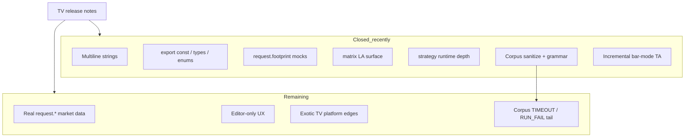

# Missing features

## Abstract

“Missing” in PYNE is a **moving frontier**. As of **2026-07-28**, core v6 support remains very high (~99%+ for core language), with post-launch TV items closed (multiline strings, library `export const`, footprint mocks, risk enforcement, matrix LA, compile-mode strategy, …) **plus** open-source corpus parse/Runtime hardening and **incremental bar-mode TA** for hot indicators. Remaining gaps cluster into **by-design platform differences**, **editor-only features**, **fidelity edges**, and a **long-tail Runtime/corpus** bucket (truncated scrapes, timeouts, exotic arity).

Authoritative narrative: `docs/missing_features.md` (last updated **2026-07-28**).

## Conceptual model



## Interface surface

### Recently completed (do not re-open as “missing”)

Summarized — full prose in source doc:

| Area | Notes |
| --- | --- |
| Multiline `"""` / `'''` | Lexer + LexerBase + unparser |
| Library `export const` + types/enums | Parse/AST/runtime registry |
| UDT `sort_field` on array/matrix sort | Implemented |
| `input.*.active` | Metadata-driven |
| Dynamic `request.*` | Shared resolvers; mock/feed scaling |
| Enums runtime + input.enum | Type kind + LSP partial |
| Strategy open/closed trades, risk, OCA, commission | Golden tests |
| Drawing `*.all`, plot registry | Effects recorded |
| Numba compile + object mode | See compiler docs |
| Official matrix LA & predicates | det/inv/eigen/… |
| **0 missing** vs public TV v6 function reference list (434 symbols, 2026-07-25) |
| Corpus sanitize + soft keywords / bitwise / typed UDF returns | set01–04 parse ~94.8% |
| Runtime `_pine_defs_locked` + append-only `current_series` | Host hygiene (backend + pyne-worker) |
| Incremental `ta.sma/ema/rma/rsi/macd/atr` | Bar mode; `PYNE_TA_INCREMENTAL=0` to disable |

### Still incomplete / by design

| Item | Status posture |
| --- | --- |
| Real (non-mock) `request.*` market data | ⚙️ By design for library core; feeds optional |
| Pixel chart host | External (AXIS / clients) |
| Some unlimited-history / trim edge cases | High-level support; exotic TV behaviors may differ |
| Editor word-wrap / UI-only release notes | ⬜ N/A |
| pine-worker full builtin port | In progress (extra tool) |
| Bit-identical every recursive smoother vs TV | Numerical bounds, not bits |
| Corpus Runtime tail (TIMEOUT / RUN_FAIL / stubs) | ⚙️ Execution + scrape quality, not missing grammar |
| Incremental for remaining heavy kernels | ⬜ Partial — hot path done; BB/nested internal full paths remain |
| Dual Runtime host copies | ⬜ Unify backend vs pyne-worker still open |
| TV Wilder RMA-ATR (if re-baselined) | ⚠️ Current oracle uses EMA-of-TR; change is correctness, not silent perf |

### Post-v6 launch themes (historical gap list)

v6 launch items (dynamic requests, strict bool, enums, polylines, `log.*`, negative indices, truediv, …) are largely supported or intentionally stubbed where platform-bound.

2025–2026 monthly TV updates introduced footprint types, `active` inputs, multiline strings, `export const`, UDT sort fields — tracked and largely closed in this repo’s July 2026 work.

### Corpus + performance snapshot (2026-07-28)

| Metric | Value |
| --- | --- |
| set01–04 parse | ~94.8% OK |
| set01–04 Runtime (projected after fail re-runs) | **~89.8%** OK (≈2224/2477) |
| PARSE_FAIL residual | ~118 files — almost all truncated/non-Pine |
| `ta_sma` bar loop (≈3.2k bars) | **~9.5×** vs full recompute |
| `ta_atr` bar loop | **~10×** |
| macd+atr+rsi+sma combo | **~8.5×** |

Plans: `.opencode/plans/2026-07-28-runtime-performance.md`. Skill: `.grok/skills/pynescript-perf/`. Golden: `tests/test_ta_incremental.py`.

## Internals

| Path | Role |
| --- | --- |
| `docs/missing_features.md` | Living gap analysis |
| `tests/test_v6_features.py` | v6 feature coverage |
| `tests/test_pine_surface_gaps.py` | Surface gap probes |
| `tests/test_ta_incremental.py` | Incremental TA ≡ full recompute |
| `docs/pine_v6_full_surface_inventory.md` | Full name-level inventory |
| `resource/*.g4` + builder | Grammar-level feature work |
| `.../technical_submodules/core.py` | `_sma_inc_update`, `_macd_inc_update`, `_atr_inc_update`, … |

## Invariants & edge cases

1. **Closing a syntax gap requires grammar + builder + unparser + tests**, not only an evaluator stub.
2. **Mock data can green tests while production feeds differ** — declare data source explicitly.
3. **“0 missing vs reference list” ≠ identical semantics for every edge case.**
4. **Perf changes must keep bar-by-bar semantics** — no whole-script vectorization; prefer golden tests vs current oracle.
5. Update this annex when `missing_features.md` changes major status lines.

## Worked examples

### Detect multiline string support

```python
from pynescript.ast.helper import parse, unparse
src = '''//@version=6
indicator("m")
s = """a
b"""
plot(1)
'''
tree = parse(src)
assert '"""' in unparse(tree) or "'''" in unparse(tree)
```

### Footprint mock call

Prefer tests in `tests/test_v6_features.py` as executable specification for `request.footprint` methods.

### Incremental TA parity smoke

```bash
.venv/bin/python -m pytest tests/test_ta_incremental.py -q
# Disable hot path if needed:
PYNE_TA_INCREMENTAL=0 python -c "from backend.runtime import Runtime; ..."
```

## Failure modes

| Symptom | Likely gap class |
| --- | --- |
| Lexer error on triple quotes | Stale generated lexer (should be fixed on main) |
| Import member missing | Library export registration |
| Empty footprint rows | Mock seed / data_feed not configured |
| Risk not blocking entry | Old runtime path; ensure risk kwargs applied |
| Runtime TIMEOUT on method-heavy scripts | Missing `_pine_defs_locked` on host (fixed 2026-07-28) |
| Corpus PARSE_FAIL mid-block | Truncated scrape — not a grammar hole |

## See also

- [Implementation status](/pyne/docs/reference/implementation-status)
- [Pine v6 surface](/pyne/docs/reference/pine-v6-surface)
- [Roadmap](/pyne/docs/reference/roadmap)
- [Compatibility](/pyne/docs/reference/compatibility)
- [Technical analysis (`ta.*`)](/pyne/docs/runtime/builtins/technical)
