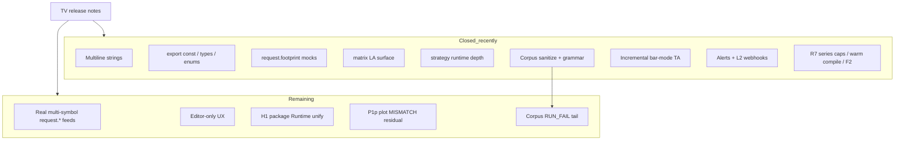

# Copyright (C) 2024-2026 jango_blockchained
#
# This file is part of pynescript.
#
# pynescript is free software: you can redistribute it and/or modify
# it under the terms of the GNU Affero General Public License as published by
# the Free Software Foundation, either version 3 of the License, or
# (at your option) any later version.
#
# pynescript is distributed in the hope that it will be useful,
# but WITHOUT ANY WARRANTY; without even the implied warranty of
# MERCHANTABILITY or FITNESS FOR A PARTICULAR PURPOSE.  See the
# GNU Affero General Public License for more details.
#
# You should have received a copy of the GNU Affero General Public License
# along with pynescript.  If not, see <https://www.gnu.org/licenses/>.
#
# SPDX-License-Identifier: AGPL-3.0-or-later

---
title: "Missing features"
description: "Known gaps and closed Pine Script™ v6 items — H2/T1/F2/L2 shipped; first-party fixtures; foreign-na and plot parity harness landed."
---

# Missing features

## Abstract

“Missing” in PYNE is a **moving frontier**. As of **2026-08**, core v6 support remains very high (~99%+ for core language), with post-launch TV items closed (multiline strings, library `export const`, footprint mocks, risk enforcement, matrix LA, compile-mode strategy, drawing GC, …) **plus** open-source corpus parse/Runtime hardening, **incremental bar-mode TA**, **alert engine + L2 webhooks**, **series caps**, **warm-compile**, and **pending-fill** averaging. Remaining gaps cluster into **dual-host package Runtime unify**, **plot parity residual MISMATCH**, **by-design platform differences**, **editor-only features**, **fidelity edges**, and residual runtime edge cases.

Authoritative narrative: `docs/missing_features.md` (alerts + L2 closed; roadmap residual H1 package unify / C1 / P1p). Canonical IDs: `docs/ROADMAP.md` (**2026-08-03**).

## Conceptual model



## Interface surface

### Recently completed (do not re-open as “missing”)

Summarized — full prose in source doc:

| Area | Notes |
| --- | --- |
| Multiline `"""` / `'''` | Lexer + LexerBase + unparser |
| Library `export const` + types/enums | Parse/AST/runtime registry |
| UDT `sort_field` on array/matrix sort | Implemented |
| `input.*.active` | Metadata-driven |
| Dynamic `request.*` | Shared resolvers; mock/feed scaling |
| Enums runtime + input.enum | Type kind + LSP partial |
| Strategy open/closed trades, risk, OCA, commission | Golden tests |
| Drawing `*.all`, plot registry, **`max_*_count` GC** | Effects recorded; GC on package + Pro + AXIS |
| Numba compile + object mode + **warm-compile (H2)** | Disk IR cache, prewarm API/CLI, deploy defaults |
| Official matrix LA & predicates | det/inv/eigen/… |
| **0 missing** vs public TV v6 function reference list (434 symbols, 2026-07-25) |
| Runtime `_pine_defs_locked` + append-only `current_series` | Host hygiene (backend + pyne-worker) |
| Incremental `ta.sma/ema/rma/rsi/macd/atr` + R7 `bb/kama/cmo/stochrsi` | Bar mode; `PYNE_TA_INCREMENTAL=0` to disable |
| **Series caps (T1)** | `PYNE_SERIES_CAP` default ON + goldens |
| **Pending-fill averaging (F2)** | Pyramiding ≤ 0; interpret + compile broker goldens |
| Alert engine + **L2 webhooks (L2)** | Dual-host `/run` export, `ALERT_WEBHOOK_URL` / `webhook_url` |
| **`request.security` foreign-na policy** | Foreign/complex → `na` both backends; same-symbol OHLCV passthrough |
| **Plot parity harness (P1p partial)** | `scripts/compare_interp_compile.py`, smoke tests; residual MISMATCH open |
| `fill()` export for AXIS | series + `plot_meta` / compile `__drawings` |

### Still incomplete / by design

| Item | Status posture |
| --- | --- |
| Real (non-mock) multi-symbol `request.*` market data (**B1**) | ⚙️ By design for library core; feeds optional. **Foreign-na policy landed** (no invent). |
| **`request.security` foreign data** | ⚙️ **Not filled with real series** — emits `na` for foreign/complex (honest). Same-symbol simple OHLCV may lower. |
| **Auto Fib / pivot-heavy scripts** | ⚙️ Need real pivot structure (or registered ZigZag lib). Flat synthetic bars → intentional `runtime.error` (insufficient pivots); both hosts should agree (`both_error_same` in parity harness). |
| Pixel chart host | External (AXIS / clients) |
| Some unlimited-history / trim edge cases | High-level support; exotic TV behaviors may differ |
| Editor word-wrap / UI-only release notes | ⬜ N/A |
| pine-worker full builtin port (**L3**) | In progress (extra tool) |
| Bit-identical every recursive smoother vs TV | Numerical bounds, not bits |
| Dual Runtime host copies (**H1**) | ⚙️ Host surface + dual-host **alerts** export; package-level Runtime unify still open |
| Warm-compile product path (**H2**) | ✅ SLOs / prewarm / deploy IR cache defaults (2026-08) |
| Runtime residual (**C1**) | ⚙️ tracked on first-party fixtures; no third-party corpus shipped |
| Series cap (**T1**) | ✅ `PYNE_SERIES_CAP` default ON |
| Residual TA inc (**T2**) | ⚙️ Partial — bb/kama/cmo/stochrsi done; nested full-list paths residual |
| Pending-fill (**F2**) | ✅ R7 interpret + compile goldens |
| Plot parity residual (**P1p**) | ⚙️ Harness + smoke goldens landed; value MISMATCH / structural hline-fill keys remain |
| TV Wilder RMA-ATR / supertrend (**F1**) | ⚙️ RSI Wilder compile↔interpret aligned; ATR EMA→Wilder + supertrend still need explicit goldens |
| Alert webhooks (**L2**) | ✅ Pro API + pyne-worker; see [Alerts](/pyne/docs/runtime/alerts) |

### Post-v6 launch themes (historical gap list)

v6 launch items (dynamic requests, strict bool, enums, polylines, `log.*`, negative indices, truediv, …) are largely supported or intentionally stubbed where platform-bound.

2025–2026 monthly TV updates introduced footprint types, `active` inputs, multiline strings, `export const`, UDT sort fields — tracked and largely closed in this repo’s July 2026 work.

### Corpus + performance snapshot

| Metric | Value |
| --- | --- |
| PARSE_FAIL residual | ~118 files — almost all truncated/non-Pine |
| Residual RUN_FAIL | ~21 — library `runtime.error` demos, lower-TF guards, long-tail edges |
| `ta_sma` bar loop (≈3.2k bars) | **~9.5×** vs full recompute |
| `ta_atr` bar loop | **~10×** |
| macd+atr+rsi+sma combo | **~8.5×** |

Plans: `.opencode/plans/2026-07-28-runtime-performance.md`. Skill: `.grok/skills/pynescript-perf/`. Golden: `tests/test_ta_incremental.py`, `tests/test_series_cap.py`.

## Internals

| Path | Role |
| --- | --- |
| `docs/missing_features.md` | Living gap analysis |
| `tests/test_v6_features.py` | v6 feature coverage |
| `tests/test_pine_surface_gaps.py` | Surface gap probes |
| `tests/test_ta_incremental.py` | Incremental TA ≡ full recompute |
| `tests/test_series_cap.py` | Series cap goldens (T1) |
| `scripts/compare_interp_compile.py` | Plot parity harness (P1p) |
| `docs/pine_v6_full_surface_inventory.md` | Full name-level inventory |
| `resource/*.g4` + builder | Grammar-level feature work |
| `.../technical_submodules/core.py` | `_sma_inc_update`, `_macd_inc_update`, `_atr_inc_update`, … |

## Invariants & edge cases

1. **Closing a syntax gap requires grammar + builder + unparser + tests**, not only an evaluator stub.
2. **Mock data can green tests while production feeds differ** — declare data source explicitly.
3. **Compile does not fill foreign `request.security` data** — multi-asset plots stay `na` on compile unless same-symbol simple OHLCV; do not treat invent-as-close as a fix.
4. **Auto Fib needs pivots** — without swing structure (or ZigZag library registration), expect structured insufficient-pivot errors, not fib lines.
5. **“0 missing vs reference list” ≠ identical semantics for every edge case.**
6. **Perf changes must keep bar-by-bar semantics** — no whole-script vectorization; prefer golden tests vs current oracle.
7. Update this annex when `missing_features.md` changes major status lines.

## Worked examples

### Detect multiline string support

```python
from pynescript.ast.helper import parse, unparse
src = '''//@version=6
indicator("m")
s = """a
b"""
plot(1)
'''
tree = parse(src)
assert '"""' in unparse(tree) or "'''" in unparse(tree)
```

### Footprint mock call

Prefer tests in `tests/test_v6_features.py` as executable specification for `request.footprint` methods.

### Incremental TA parity smoke

```bash
.venv/bin/python -m pytest tests/test_ta_incremental.py -q
# Disable hot path if needed:
PYNE_TA_INCREMENTAL=0 python -c "from backend.runtime import Runtime; ..."
```

## Failure modes

| Symptom | Likely gap class |
| --- | --- |
| Lexer error on triple quotes | Stale generated lexer (should be fixed on main) |
| Import member missing | Library export registration |
| Empty footprint rows | Mock seed / data_feed not configured |
| Risk not blocking entry | Old runtime path; ensure risk kwargs applied |
| Runtime TIMEOUT on method-heavy scripts | Missing `_pine_defs_locked` on host (fixed 2026-07-28) |
| Corpus PARSE_FAIL mid-block | Truncated scrape — not a grammar hole |

## See also

- [Implementation status](/pyne/docs/reference/implementation-status)
- [Pine v6 surface](/pyne/docs/reference/pine-v6-surface)
- [Roadmap](/pyne/docs/reference/roadmap)
- [Compatibility](/pyne/docs/reference/compatibility)
- [Technical analysis (`ta.*`)](/pyne/docs/runtime/builtins/technical)
- [Alerts](/pyne/docs/runtime/alerts)
- [Interpret ↔ compile parity](/pyne/docs/runtime/compiler/parity)
