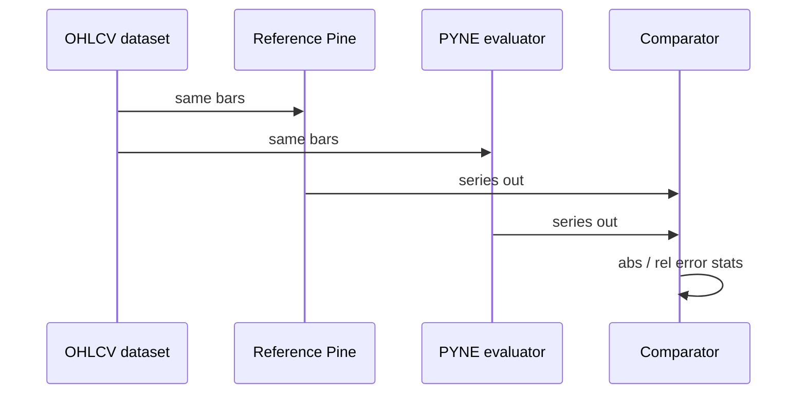

# Numerical validation

## Abstract

PYNE’s technical and mathematical builtins are validated for **numerical agreement** with reference Pine Script™ implementations under IEEE 754 realities. The long-form report (`docs/numerical_validation_report.md`, v1.0, Nov 2025) documents methodology, per-family error tables, and edge cases.

Headline (from that report): max observed relative error **0.0022%** (ADX, extreme volatility); average error **&lt; 0.0005%**; deterministic ops (SMA, OBV, discrete math) often **exact**.

Treat percentages as **report-era measurements**, not eternal SLAs — re-validate after changing smoothers or bar-mode semantics.

## Conceptual model



## Interface surface

### Acceptable thresholds (report)

| Band | Relative error | Verdict |
| --- | --- | --- |
| Excellent | &lt; 0.001% | Pass |
| Good | &lt; 0.01% | Pass |
| Acceptable | &lt; 0.1% | Review |
| Unacceptable | ≥ 0.1% | Fail |

### Metric definitions

- **Absolute error:** `|ref − pyne|`
- **Relative error:** `|ref − pyne| / |ref| × 100%` (guard zero refs)
- **Max / mean / std** over bars and scenarios

### Category highlights

| Family | Notes |
| --- | --- |
| Moving averages | SMA exact; EMA/WMA/… tiny FP error |
| Oscillators | RSI/stoch slightly higher smoothing error still ≪ 0.01% |
| Trend | ADX highest in report (0.0022% max) |
| Volume | OBV exact cumulative; MFI inherits typical-price FP |
| Stats | percentrank exact; variance/stdev excellent |
| Math | Discrete exact; transcendentals ~1e-15 class |

### Error distribution (report aggregate)

| Error range | Share (approx.) |
| --- | --- |
| Exact 0 | ~38% |
| &lt; 0.0001% | ~46% |
| 0.0001–0.001% | ~14% |
| 0.001–0.01% | ~2% |
| ≥ 0.1% | 0% |

## Internals

| Path | Role |
| --- | --- |
| `docs/numerical_validation_report.md` | Full tables + bias analysis |
| `tests/test_ta_indicators_*.py` | Executable TA tests |
| `tests/test_indicators.py` / builtins tests | Additional numeric guards |
| Bar-mode vs list-mode (`_pine_bar_mode`) | Scalar-per-bar vs full series — compare like with like |

### Methodology (report)

1. Generate synthetic 1k-bar OHLCV across regimes (trend, range, vol, gaps)
2. Validate with real histories (equities, crypto, FX samples)
3. Export reference outputs; run PYNE; element-wise compare
4. Search systematic bias; inspect tails

## Invariants & edge cases

1. **na propagation** must match Pine truthiness — numerical compare should mask `na` pairs.
2. **Bar-mode scalars** vs full-series list mode can look like “bugs” if misaligned.
3. **Seeded mocks** (`request.seed`) stabilize stochastic feeds for regression.
4. **Recursive smoothers** accumulate FP differently across languages; bounds &gt; bits.
5. **Extreme prices** (near-zero, huge) tested; still within excellent band in report.

## Worked examples

### Relative error helper

```python
def rel_err(a: float, b: float) -> float:
    if a == 0 and b == 0:
        return 0.0
    denom = abs(a) if a != 0 else abs(b)
    return abs(a - b) / denom * 100.0
```

### Run TA tests

```bash
pytest tests/test_ta_indicators_1.py tests/test_ta_indicators_2.py -q
```

## Failure modes

| Symptom | Investigation |
| --- | --- |
| Sudden ADX drift | Check Wilder smoothing / seed bars |
| SMA not exact | Off-by-one window or float input casts |
| Good unit tests, bad TV export compare | Timezone/session alignment of bars |
| Only bar 0 differs | Warm-up / `na` initialization |

## See also

- [Compatibility](/pyne/docs/reference/compatibility)
- [Runtime technical builtins](/pyne/docs/runtime/builtins/technical)
- [Implementation status](/pyne/docs/reference/implementation-status)
