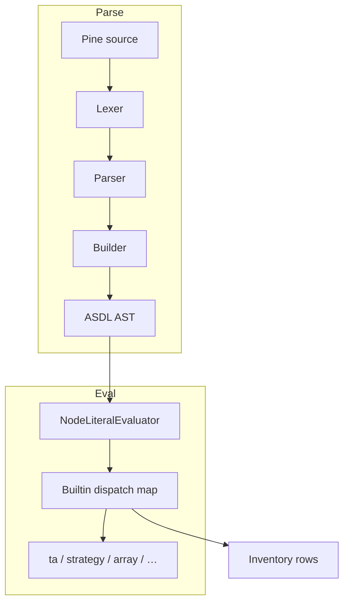

# Pine v6 surface inventory

## Abstract

The **full surface inventory** enumerates every registered evaluator builtin, major series/variable, language construct, and known gap against Pine Script™ v6. It is deliberately large (tens of thousands of tokens when fully expanded). **This page is the navigable summary**; the exhaustive tables live in-repo at:

**`docs/pine_v6_full_surface_inventory.md`**

Generated snapshot referenced here: **2026-07-25**, from live `NodeLiteralEvaluator` dispatch, `builtin_metadata.json`, and design docs.

Do **not** paste the entire inventory into product docs — regenerate and link.

## Conceptual model



## Interface surface

### Status schema

| Status | Definition |
| --- | --- |
| ✅ implemented | Handler/parser path exists and is usable |
| 🔄 partial | Mock/stub, incomplete semantics, or metadata-only |
| ❌ missing | Expected on TV v6; not resolving |
| ⚙️ by design | Intentionally not full TV platform |
| ⬜ N/A | Editor/UI-only |

Each inventory row also carries: **Name**, **Namespace**, **Kind**, **Metadata** (LSP JSON present?), **Source** (e.g. `dispatch`), **Notes**.

### Summary counts (2026-07-25)

| Metric | Count |
| ---: | ---: |
| Dispatch builtins (callable) | **640** |
| Dispatch partial-heuristic (stub/mock docstring) | 8 |
| Top-level namespaces | 60 |
| Official TV v6 function reference list | 434 symbols — **0 missing** in dispatch |

### Top namespaces by dispatch keys

| Namespace | Count |
| --- | ---: |
| `ta` | 159 |
| `matrix` | 74 |
| `strategy` | 70 |
| `array` | 56 |
| `box` | 31 |
| `label` | 28 |
| `table` | 26 |
| `math` | 24 |
| `line` | 22 |
| `str` | 19 |
| `input` | 14 |
| `map` | 11 |
| `request` | 11 |
| `footprint` | 9 |
| `ticker` | 9 |
| *(remaining namespaces)* | smaller |

### Kinds covered

`function` · `series/var` · `constant` · `declaration` · `control` · `operator` · `type system` · `literal` · `semantics` · `export` · `import`

## Internals

| Path | Role |
| --- | --- |
| `docs/pine_v6_full_surface_inventory.md` | Full tables + architecture diagrams |
| `scripts/regenerate_inventory_summary.py` | Regeneration helper |
| `scripts/generate_builtin_metadata.py` | LSP metadata from live surface |
| Evaluator `_build_builtin_map()` | Source of dispatch truth |

### How to use the full file

1. Open `docs/pine_v6_full_surface_inventory.md` in the repo or Sphinx/site mirror.
2. Search by namespace (`## ta`, `strategy`, …).
3. Trust **dispatch** source rows for “is there a callable?”; read **Notes** for mock/feed caveats.
4. After large builtin PRs, regenerate summary counts before quoting them publicly.

## Invariants & edge cases

1. **Inventory size is a feature** — summarization must not drop 🔄 rows when claiming coverage.
2. **Metadata presence ≠ semantic completeness.**
3. **Partial heuristic count (8)** is docstring-based — real partials may be higher.
4. **Language constructs** (control/export) may be parser-complete without every runtime edge.

## Worked examples

### Quote coverage honestly

> “Against the public Pine v6 function reference (434 symbols), pynescript registered **0 missing** dispatch entries as of 2026-07-25; 640 total callables across 60 namespaces. See `docs/pine_v6_full_surface_inventory.md`.”

### Programmatic check (sketch)

```bash
# regenerate after evaluator changes
python scripts/regenerate_inventory_summary.py
```

## Failure modes

| Mistake | Consequence |
| --- | --- |
| Pasting 134KB inventory into Mintlify page | Unreadable docs; broken UX |
| Citing counts without date | Stale marketing |
| Equating dispatch hit with TV gold | False precision claims |

## See also

- [Implementation status](/pyne/docs/reference/implementation-status)
- [Missing features](/pyne/docs/reference/missing-features)
- [Compatibility](/pyne/docs/reference/compatibility)
- [Runtime builtins](/pyne/docs/runtime/builtins)
