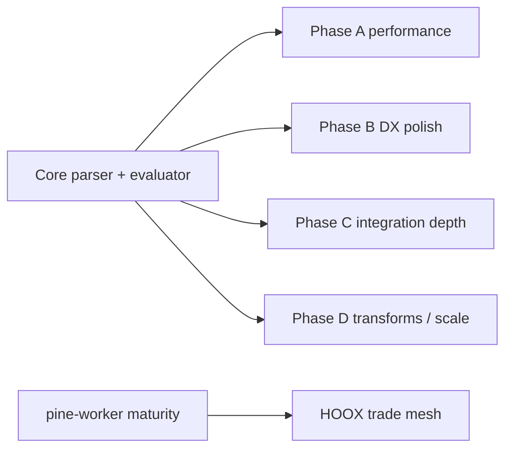

# Copyright (C) 2024-2026 jango_blockchained
#
# This file is part of pynescript.
#
# pynescript is free software: you can redistribute it and/or modify
# it under the terms of the GNU Affero General Public License as published by
# the Free Software Foundation, either version 3 of the License, or
# (at your option) any later version.
#
# pynescript is distributed in the hope that it will be useful,
# but WITHOUT ANY WARRANTY; without even the implied warranty of
# MERCHANTABILITY or FITNESS FOR A PARTICULAR PURPOSE.  See the
# GNU Affero General Public License for more details.
#
# You should have received a copy of the GNU Affero General Public License
# along with pynescript.  If not, see <https://www.gnu.org/licenses/>.
#
# SPDX-License-Identifier: AGPL-3.0-or-later

---
title: "Roadmap"
description: "PYNE forward plan — completed consolidation items, remaining performance, DX, and integration work."
---

# Roadmap

## Abstract

The roadmap is a **living prioritization document**, not a contract. Source: `docs/ROADMAP.md` (updated 2026-07-13 consolidation) plus subsequent surface work. Many historically “remaining” items — Jupyter, linter, data providers, strategy events, pine-worker skeleton, deep strategy runtime — are **done**. What remains clusters into performance, packaging polish, and ecosystem integration.

## Conceptual model



## Interface surface

### Status snapshot

| Component | Status |
| --- | --- |
| Parser ANTLR4 | ✅ |
| Evaluator | ✅ incl. var/varip / reassign |
| Builtins / TA / collections | ✅ broad |
| Strategy events + parity | ✅ |
| pine-worker (TS + converter) | ✅ colocated tool (port ongoing) |
| Drawing/input/request | ✅ (plots registry; data mock/feed) |
| Linter / Jupyter / data providers | ✅ |
| LSP advanced features | ✅ core set |
| Numba compile path | ✅ MVP |
| Full TV platform identity | ⚙️ out of scope |

### Completed themes (do not re-plan as greenfield)

- Error message / typing hygiene
- `%%pinescript` Jupyter magic + sample data helpers
- `pynescript lint`
- Yahoo / AlphaVantage / CCXT + realtime datafeed wiring
- StrategyEvent emission + parity fixtures
- pine-worker extra tool + Python→TS converter

### Remaining high-value work

#### Phase A — Performance

- JIT / deeper numba coverage beyond MVP paths
- Vectorized array hot loops
- Caching for repeated calculations

#### Phase B — Developer experience

- Deeper debugging / profiling tools
- Docs: tutorials, interactive examples (this Mintlify tree is part of that)
- Editor client polish beyond VS Code

#### Phase C — Integration

- Hardened REST API productization (auth, SLOs)
- Webhook alerts beyond stubs
- Cloud deploy recipes (see [DevOps](/pyne/docs/devops))

#### Phase D — Longer horizon

- Pine v5 ↔ v6 converter maturity (`scripts/convert_pine_version.py` started)
- Automatic refactor / optimization suggestions
- Parallel / distributed evaluation experiments

### Priority recommendation (from source)

| Horizon | Focus |
| --- | --- |
| Short | API server productization, LSP/editor depth |
| Medium | Performance (JIT, cache, vectorize), advanced stats/ML wrappers |
| Long | Converters, parallel execution |

## Internals

| Path | Role |
| --- | --- |
| `docs/ROADMAP.md` | Canonical roadmap prose |
| `docs/PROGRESS_REPORT.md` | Historical completion narrative |
| `docs/COMPILER_PLAN.md` | Compile/numba plan |
| `.opencode/plans/` | Engineering plans (strategy events, consolidation) |
| `pine-worker/` | TS port track |

## Invariants & edge cases

1. **Roadmap dates lag code** — always diff against `missing_features.md` and tests.
2. **Sister repos** (pyne-worker, hoox-setup, pine-worker packaging) may absorb “integration” items.
3. **AXIS is a separate product tree** (`docs/axis`) — chart UX roadmap is not PYNE-core.
4. Avoid reintroducing deleted backups (`builder.py.bak`, etc.) as “plan items.”

## Worked examples

### Track a roadmap item with a test

```bash
# pick a gap, write failing test first, implement, update missing_features.md
pytest tests/test_v6_features.py -k footprint -v
```

### pine-worker maturity gate

```bash
cd pine-worker && bun test && bun run typecheck
# future: bun run parity once harness lands
```

## Failure modes

| Anti-pattern | Why it hurts |
| --- | --- |
| Planning features already ✅ | Duplicated work |
| Roadmap without tests | Unverifiable “done” |
| Ignoring by-design limits | Infinite platform chase |

## See also

- [Missing features](/pyne/docs/reference/missing-features)
- [Implementation status](/pyne/docs/reference/implementation-status)
- [pine-worker](/pyne/docs/pine-worker)
- [Contributing](/pyne/docs/contributing)
