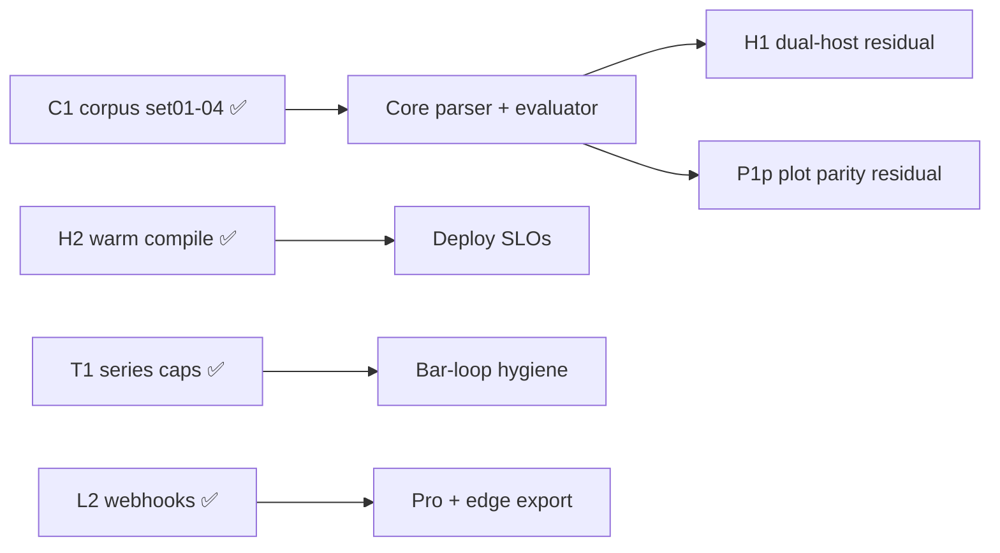

# Copyright (C) 2024-2026 jango_blockchained
#
# This file is part of pynescript.
#
# pynescript is free software: you can redistribute it and/or modify
# it under the terms of the GNU Affero General Public License as published by
# the Free Software Foundation, either version 3 of the License, or
# (at your option) any later version.
#
# pynescript is distributed in the hope that it will be useful,
# but WITHOUT ANY WARRANTY; without even the implied warranty of
# MERCHANTABILITY or FITNESS FOR A PARTICULAR PURPOSE.  See the
# GNU Affero General Public License for more details.
#
# You should have received a copy of the GNU Affero General Public License
# along with pynescript.  If not, see <https://www.gnu.org/licenses/>.
#
# SPDX-License-Identifier: AGPL-3.0-or-later

---
title: "Roadmap"
description: "PYNE forward plan — dual-host residual, runtime residual, plot parity harness; H2/T1/F2/L2 landed (2026-08)."
---

# Roadmap

## Abstract

The roadmap is a **living prioritization document**, not a contract. Source: `docs/ROADMAP.md` (updated **2026-08-16**). Core v6 language/builtins are essentially closed. Product **warm-compile (H2)**, **series caps (T1)**, **pending-fill (F2)**, **L2 webhooks**, **corpus Runtime residual (C1)**, and **interpret Round 9 (0.3.10)** have **landed** (set01–04 parse **99.96%**, Runtime interpret **100%** excl. intentional demos). What remains: **dual-host package-level Runtime unify (H1 residual)**, **interpret↔compile plot residuals (P1p harness landed)**, leftover full-list TA (**T2**: `nvi`/`pvi`), and optional **TV-oracle re-baselines (F1)**.

## Conceptual model

```text
P0 docs honesty → P1 dual-host (H1 residual: package unify)
                → P1 plot parity residual (P1p)
                → H2 warm compile ✅ · T1 series caps ✅ · F2 pending-fill ✅ · C1 corpus ✅
                              ↘ T2 residual nested TA · F1 ATR/supertrend goldens
                                  → P6 long-horizon (L1 / L3; L2 ✅)
```



## Interface surface

### Status snapshot

| Component | Status |
| --- | --- |
| Parser ANTLR4 | ✅ v5/v6 + multiline / export const |
| Evaluator | ✅ incl. full var/varip, ReAssign |
| Builtins / TA / collections | ✅ broad (0 missing vs public TV ref list) |
| Strategy events + broker (OCA, commission, risk) | ✅ |
| Numba + object-mode compile | ✅ MVP+ (disk IR cache, `mode=auto`, `time_arr`, cache recovery) |
| Pro API + auth + Docker | ✅ (`mode` default `auto`; targets api / api-dev / lsp / **cli**) |
| PyPI **`hoox-pyne`** | ✅ live **0.3.10+** ([pypi.org/project/hoox-pyne](https://pypi.org/project/hoox-pyne/)); CLIs `pyne` / `pyne-lsp` |
| CLI surface (`check`/`format`/`compile`/`run`/`prewarm`/…) | ✅ + Nuitka binaries + CLI Docker image |
| Alert engine + L2 webhooks | ✅ dual-host export + outbound webhooks |
| Drawing `max_*_count` GC | ✅ package + Pro API + AXIS Pyodide |
| Package Runtime SoT (`pynescript.runtime`) | ✅ 0.3.4 — Pro API + worker thin wrap |
| Strategy exits (`from_entry`, `qty_percent`, trail, risk cascade) | ✅ 0.3.4 |
| `request.security` HTF simple TA + foreign-na | ✅ same-symbol OHLCV/HTF allowlist; foreign → `na` |
| Free-tier Pro API guards | ✅ bar/script caps, rate, concurrency, mock-only free data |
| Dual-host TA goldens (ATR / Supertrend / Keltner) | ✅ first-party + `test_ta_incremental` CI |
| Interpret dispatch + unused derived skip + volume inc (Round 9) | ✅ **0.3.10** — bench @ 2000 bars: minimal 2.7×, `ta_sma` 2.0×, `ta_combo` 1.45× |
| Series caps (`PYNE_SERIES_CAP`) | ✅ T1 |
| Warm-compile product path | ✅ H2 (SLOs, prewarm, deploy IR cache) |
| Pending-fill averaging (pyramiding ≤ 0) | ✅ F2 |
| Interpret↔compile plot parity | ⚙️ harness + goldens landed; residual MISMATCH tail |
| Runtime `timeout_seconds` | ✅ 0.3.6 — wall-clock circuit breaker on interpret |
| UDT `array.binary_search*` `sort_field` | ✅ 0.3.6 — interpret + compile (Pine August 2026) |
| `Runtime.run(..., libraries=)` / `POST /run` `libraries` | ✅ 0.3.7+ — AXIS `import ns/Name/ver`; export finalize in 0.3.8; auto fallback keeps libs |
| pyne-worker 0.6.0 | ✅ edge `/run` libraries + plot_meta/logs; engine vendor 0.3.8 |
| PyneTS (`@hoox-sh/pynets`) | ✅ standalone TS library 0.2.0 — interpret + JS compile; Python remains oracle |
| pine-worker | ⚙️ legacy TS Cloudflare Worker (sister repo; **not** in this checkout) |
| Full TV platform identity | ⚙️ out of scope |

### Completed themes (do not re-plan as greenfield)

- Error message / typing hygiene
- `%%pinescript` Jupyter magic + sample data helpers
- `pynescript lint`
- Yahoo / AlphaVantage / CCXT + realtime datafeed wiring
- StrategyEvent emission + parity fixtures
- pine-worker extra tool + Python→TS converter
- Alert engine + dual-host export + **L2 webhooks**
- Round 7: series caps, incremental TA (bb/kama/cmo/stochrsi), parse cache, warm compile, pending-fill, drawing GC
- Round 9 / **0.3.10**: interpret dispatch inlining, unused derived OHLCV skip, incremental `obv`/`wad`/`cmf`/`klinger`

### Open backlog (IDs stable)

| ID | Item | Pri | Status |
| --- | --- | --- | --- |
| **H1** | Dual-host Runtime (host surface + alerts export dual-host ✅; package-level unify open) | P1 | ⚙️ residual |
| **H2** | Product warm-compile (SLOs, prewarm API/CLI, IR cache on in deploy) | P1 | ✅ |
| **C1** | Corpus set01–04 residual (parse 99.96%; Runtime 100% excl. EXPECTED) | P1 | ✅ 2026-08-09 |
| **P1p** | Compile/interpret **plot parity** residual | P1 | ⚙️ harness landed (`scripts/compare_interp_compile.py`, `tests/test_interp_compile_parity.py`) |
| **T1** | Cap `current_series` to `max_bars_back` / `_SERIES_MAX` | P2 | ✅ `PYNE_SERIES_CAP` default ON |
| **T2** | Incremental TA for remaining heavy kernels | P2 | ✅ R7 bb/kama/cmo/stochrsi + wma/hma/linreg; **0.3.10** obv/wad/wvad/cmf/klinger. Residual: nvi/pvi |
| **F1** | ATR Wilder / TV supertrend re-baseline only with dedicated goldens | P2 | ⚙️ RSI Wilder aligned; ATR/supertrend goldens open |
| **F2** | Pending-fill averaging when pyramiding ≤ 0 | P2 | ✅ |
| **L1** | v5↔v6 converter maturity | P3 | open |
| **L2** | Webhook alerts productization | P3 | ✅ Pro + pyne-worker |
| **L3** | pine-worker (TS) full builtin parity | P3 | open |
| **B1** | Real (non-mock) `request.*` market data | — | ⚙️ by design; **foreign-na policy landed** |

Longer horizon (not next): ML wrappers, automatic refactor, parallel/distributed eval experiments.

### Priority recommendation

| Horizon | Focus |
| --- | --- |
| Short | H1 package unify residual, **P1p** plot MISMATCH goldens |
| Medium | **T2** residual nested TA; optional **F1** ATR/supertrend goldens |
| Long | **L1** converter maturity; **L3** TS pine-worker parity (**L2** ✅) |

### Landed residual notes (2026-08)

- **Plot parity:** Always-on smoke in `tests/test_interp_compile_parity.py`. Full corpus compare: `python scripts/compare_interp_compile.py` → `.cache/interp_compile_parity.json`. Flags `--ignore-hline-keys` / `--ignore-fill-keys` drop structural residuals.
- **Corpus residual (C1):** set01–04 parse **99.96%** (2476/2477); Runtime interpret **100%** excl. EXPECTED_FAIL (2466 OK + 11 intentional demos); set01 **249/249**. Third-party corpora are not shipped in git.
- **Foreign-na:** `request.security` on foreign/complex expressions → `na` both backends; `ChartOHLCVProvider` refuses non-chart symbols.

## Internals

| Path | Role |
| --- | --- |
| `docs/ROADMAP.md` | Canonical roadmap prose |
| `docs/PROGRESS_REPORT.md` | Historical completion narrative |
| `docs/COMPILER_PLAN.md` | Compile/numba plan |
| `scripts/compare_interp_compile.py` | Plot parity harness |
| `.opencode/plans/` | Engineering plans (strategy events, consolidation) |
| `pine-worker/` | TS port track |

## Invariants & edge cases

1. **Roadmap dates lag code** — always diff against `missing_features.md` and tests.
2. **Sister repos** (pyne-worker, hoox-setup, pine-worker packaging) may absorb “integration” items.
3. **AXIS is a separate product tree** (`docs/axis`) — chart UX roadmap is not PYNE-core.
4. Avoid reintroducing deleted backups (`builder.py.bak`, etc.) as “plan items.”
5. Do **not** re-open **H2 / T1 / F2 / L2** as open work — they are marked ✅ in `docs/ROADMAP.md` (2026-08-03).

## Worked examples

### Track a roadmap item with a test

```bash
# pick a gap, write failing test first, implement, update missing_features.md
pytest tests/test_v6_features.py -k footprint -v
```

### Plot parity smoke

```bash
pytest tests/test_interp_compile_parity.py -q
python scripts/compare_interp_compile.py   # opt-in full compare
```

### pine-worker maturity gate

```bash
cd pine-worker && bun test && bun run typecheck
# future: bun run parity once harness lands
```

## Failure modes

| Anti-pattern | Why it hurts |
| --- | --- |
| Planning features already ✅ | Duplicated work (H2/T1/F2/L2 are done) |
| Roadmap without tests | Unverifiable “done” |
| Ignoring by-design limits | Infinite platform chase |

## See also

- [Missing features](/pyne/docs/reference/missing-features)
- [Implementation status](/pyne/docs/reference/implementation-status)
- [Interpret ↔ compile parity](/pyne/docs/runtime/compiler/parity)
- [Alerts](/pyne/docs/runtime/alerts)
- [pine-worker](/pyne/docs/pine-worker)
- [Contributing](/pyne/docs/contributing)
