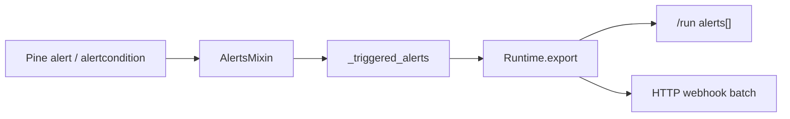

# Copyright (C) 2024-2026 jango_blockchained
#
# This file is part of pynescript.
#
# pynescript is free software: you can redistribute it and/or modify
# it under the terms of the GNU Affero General Public License as published by
# the Free Software Foundation, either version 3 of the License, or
# (at your option) any later version.
#
# pynescript is distributed in the hope that it will be useful,
# but WITHOUT ANY WARRANTY; without even the implied warranty of
# MERCHANTABILITY or FITNESS FOR A PARTICULAR PURPOSE.  See the
# GNU Affero General Public License for more details.
#
# You should have received a copy of the GNU Affero General Public License
# along with pynescript.  If not, see <https://www.gnu.org/licenses/>.
#
# SPDX-License-Identifier: AGPL-3.0-or-later

---
title: "Alerts"
description: "alert() / alertcondition() engine, host export, and L2 HTTP webhooks (Pro API + pyne-worker)."
---

# Alerts

## Abstract

Pine `alert()` and `alertcondition()` fire into a **host side-channel**, not [strategy events](/pyne/docs/runtime/events). The evaluator records structured firings with TradingView-style frequency rules. Hosts (Pro API and **pyne-worker**) export them on evaluate responses and can **POST** them to HTTP webhooks (roadmap **L2**).

## Conceptual model



| Layer | Module |
| --- | --- |
| Engine | `src/pynescript/ast/evaluator/builtins/alerts.py` |
| Pro API host | `backend/runtime.py` + `backend/alert_forwarder.py` |
| Edge host | pyne-worker `runtime.py` + `alert_engine.py` + `alert_forwarder.py` |

## Pine surface

### `alert(message, freq)`

- Default `freq`: `alert.freq_once_per_bar` (canonical token `once_per_bar`).
- Constants (also bare strings): `alert.freq_once_per_bar`, `alert.freq_once_per_bar_close`, `alert.freq_all`.
- **once_per_bar** — first fire per bar for the same (source, title, message, freq) key.
- **once_per_bar_close** — only when the host marks the bar confirmed (`barstate.isconfirmed` / `islast`; hosts without barstate treat bars as confirmed).
- **all** — every call.

### `alertcondition(condition, title, message)`

- Records each evaluation in `alert_conditions` (debug / UI).
- When `condition` is true, also **fires** a host alert with `source: "alertcondition"` and once-per-bar semantics.

### Event shape (`to_dict` / API)

```json
{
  "message": "cross up",
  "freq": "once_per_bar",
  "bar_index": 42,
  "time": 1700000000000,
  "title": "optional",
  "source": "alert"
}
```

`source` is `"alert"` or `"alertcondition"`. Hosts stamp `script_id` / `run_id` (and edge cron may add `symbol` / `timeframe`).

## Host export

### Pro API (`POST /run`)

- Interpret path: full history of firings in `alerts` (and optional `alert_conditions`).
- Compile path: `alerts: []` today (alert side effects are interpret-only).
- See [POST /run](/pyne/docs/api/endpoints/run).

### pyne-worker

- `POST /run` returns the same `alerts` array.
- Cron filters to the **last closed bar** before webhook delivery so historical bars do not re-fire every minute.
- Health: `features.alerts`, `features.alert_webhooks`.

## L2 webhooks

Both hosts POST JSON to an HTTPS endpoint.

| Host | Default URL | Per-request / per-job |
| --- | --- | --- |
| Pro API | env `ALERT_WEBHOOK_URL` | body `webhook_url` |
| pyne-worker | secret/var `ALERT_WEBHOOK_URL` | script/job `webhook_url` |

### Pro API request flags

| Field | Default | Meaning |
| --- | --- | --- |
| `webhook_url` | `""` | Override destination |
| `forward_alerts` | `true` | Skip POST when false |
| `alert_last_bar` | `true` | Only firings on the last OHLCV bar |
| `alert_batch` | `true` | One batch body vs one POST per alert |

Optional timeout: env `ALERT_WEBHOOK_TIMEOUT` (seconds, default 10).

### Batch body

```json
{
  "type": "pine_alert_batch",
  "source": "pyne-pro-api",
  "count": 1,
  "content": "cross up",
  "alerts": [
    {
      "type": "pine_alert",
      "source": "pyne-pro-api",
      "message": "cross up",
      "freq": "once_per_bar",
      "alert_source": "alert",
      "bar_index": 42,
      "time": 1700000000000
    }
  ]
}
```

Edge worker uses `"source": "pyne-worker"`. Discord-friendly `content` is set when a message is present.

### Response meta

Successful `/run` may include:

```json
"alert_forward": {
  "forwarded": 1,
  "failed": 0,
  "filter": "last_bar",
  "url": "https://hooks.example.com/pine",
  "batch": true,
  "count": 1
}
```

Webhook failures never fail the evaluate status; inspect `alert_forward` / `alert_forward_error`.

## Worked example

```bash
curl -sS -X POST http://127.0.0.1:5002/run \
  -H 'Content-Type: application/json' \
  -d '{
    "script": "//@version=6\nindicator(\"a\")\nif bar_index == last_bar_index\n    alert(\"fire\")\nplot(close)",
    "mode": "interpret",
    "webhook_url": "https://hooks.example.com/pine",
    "data": [
      {"time": 1, "open": 1, "high": 2, "low": 0.5, "close": 1.5, "volume": 10},
      {"time": 2, "open": 1.5, "high": 2.5, "low": 1.0, "close": 2.0, "volume": 12}
    ]
  }'
```

## Invariants

1. **Not strategy events** — trade mesh uses `events[]`; alerts are independent.
2. **Per-run clear** — hosts call `clear_alerts()` so runs do not leak firings.
3. **Last-bar default for webhooks** — full-history still available in the `alerts` response field.
4. **Compile path** — prefer `mode: "interpret"` (or auto fallback) when you need alerts.

## See also

- [Strategy events](/pyne/docs/runtime/events)
- [POST /run](/pyne/docs/api/endpoints/run)
- [Pro API usage](/pyne/docs/enduser/guides/pro-api-usage)
- [Runtime bridge](/pyne/docs/api/runtime-bridge)
- [Roadmap](/pyne/docs/reference/roadmap) (L2 ✅)
