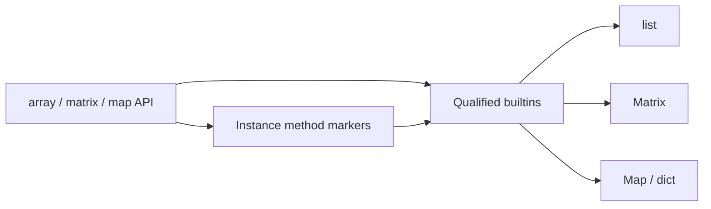

# Copyright (C) 2024-2026 jango_blockchained
#
# This file is part of pynescript.
#
# pynescript is free software: you can redistribute it and/or modify
# it under the terms of the GNU Affero General Public License as published by
# the Free Software Foundation, either version 3 of the License, or
# (at your option) any later version.
#
# pynescript is distributed in the hope that it will be useful,
# but WITHOUT ANY WARRANTY; without even the implied warranty of
# MERCHANTABILITY or FITNESS FOR A PARTICULAR PURPOSE.  See the
# GNU Affero General Public License for more details.
#
# You should have received a copy of the GNU Affero General Public License
# along with pynescript.  If not, see <https://www.gnu.org/licenses/>.
#
# SPDX-License-Identifier: AGPL-3.0-or-later

---
title: "Collections"
description: "array.*, matrix.*, and map.* runtime semantics, method dispatch, and type tags."
---

# Collections

## Abstract

Pine collections—**arrays**, **matrices**, and **maps**—are mutable values that live in the evaluator context (often under `var` so identity persists across bars). PYNE maps them to Python `list`, a dedicated `Matrix` type, and a `Map` / `dict`-like type respectively, with builtin functions and instance-method sugar (`a.push(x)` → `array.push(a, x)`).

## Conceptual model



## Interface surface

### Arrays (`array.*`)

Represented as Python lists. Highlights from the dispatch map:

| Category | Functions |
| --- | --- |
| Construct | `array.new`, `array.new_<type>`, `array.from` |
| Mutate | `push`, `pop`, `shift`, `unshift` (if present), `insert`, `remove`, `set`, `fill`, `clear`, `reverse`, `sort` |
| Access | `get`, `first`, `last`, `size`, `includes`, `indexof`, `lastindexof`, `slice` |
| Aggregate | `sum`, `avg`, `min`, `max`, `median`, `mode`, `range`, `stdev`, `variance`, covariance, percentiles, percentrank |
| Search | `binary_search`, `binary_search_leftmost`, `binary_search_rightmost` — UDT arrays take `sort_field` (const int index, default 0, or const string name; array must be sorted by that field ascending) |
| Higher-order | `every`, `some`, `copy`, `concat`, `join`, `abs` |

**Indexing:** Pine array indices are **0-based from the start of the list** (unlike series history). Negative indices are rejected for series; array paths use list semantics consistent with the builtin handlers.

**UDT `sort_field` (0.3.6 / Pine August 2026):** `array.sort`, `array.sort_indices`, and `array.binary_search*` compare one field of user-defined type elements. Pass a const int field index (`0` is the first declared field, and the default for search) or a const string field name. Binary search requires the array to already be sorted by that field in ascending order. Method form (`a.binary_search(value, "id")`) and `sort_field=` kwargs work on interpret and compile.

Series-like values passed into array ops unwrap via `.history` (reversed to chronological) when duck-typed.

### Matrices (`matrix.*`)

`Matrix` supports:

- Construction: `matrix.new`
- Element access: `matrix.get` / `set`, and `m[row, col]` via subscript
- Shape: `rows`, `columns`, `elements_count`
- Row/column ops: add/remove/copy, sum/avg/min/max/mode, fill
- Aggregates: sum/avg/min/max/mode all
- Transforms: `transpose`, fill diagonal, and further linear helpers in the evaluator map

Method sugar: `m.rows()` → `matrix.rows(m)`.

### Maps (`map.*`)

| Function | Role |
| --- | --- |
| `map.new` | Empty map |
| `put` / `put_all` / `get` / `remove` / `clear` | Mutation |
| `contains` / `keys` / `values` / `size` / `copy` | Query |

Keys follow Pine map rules as implemented (hashable Python keys). Compile object-mode lowers maps to ordinary Python `dict`s.

## Internals

| Path | Role |
| --- | --- |
| `src/pynescript/ast/evaluator/builtins/arrays.py` | Array builtins |
| `src/pynescript/ast/evaluator/builtins/matrix.py` | `Matrix` type |
| `src/pynescript/ast/evaluator/builtins/matrix_evaluator.py` | matrix.* handlers |
| `src/pynescript/ast/evaluator/builtins/map.py` | `Map` type |
| `src/pynescript/ast/evaluator/builtins/map_evaluator.py` | map.* handlers |
| `src/pynescript/ast/evaluator/names.py` | Method markers for list/Matrix |
| `tests/test_collections*.py`, `test_map_collections.py`, `test_matrix_*.py` | Coverage |

Multi-dispatch type tags (`array.float`, `matrix.string`, …) interact with method overloading and `na` exclusion lists so `na`-typed optionals do not bind to collection `tostring` overloads.

## Invariants & edge cases

1. **Identity under `var`.** `var a = array.new_float(0)` keeps one list across bars; reassigning `a := array.new_float(0)` replaces it.
2. **Drawing-typed arrays.** `array.new_label` etc. store drawing object references; delete semantics remain drawing-registry concerns.
3. **Empty array overload match.** Empty arrays match any `array.*` element tag in dispatch (no sample element).
4. **Matrix unpack hazard.** StatementEvaluator refuses to treat matrices as general iterables for tuple unpack—prevents corrupting multi-assign from row iteration.
5. **Compile mode.** Maps/UDTs force **object mode**; pure array numeric work may still numeric-compile depending on visitor detection—verify generated code when performance-critical.

## Worked examples

### Rolling buffer

```pine
//@version=6
indicator("buf")
var floats = array.new_float(0)
array.push(floats, close)
if array.size(floats) > 20
    array.shift(floats)
plot(array.avg(floats))
```

### Matrix element

```pine
var m = matrix.new<float>(2, 2, 0.0)
matrix.set(m, 0, 1, close)
plot(matrix.get(m, 0, 1))
```

### Map counter

```pine
var counts = map.new<string, int>()
map.put(counts, "n", nz(map.get(counts, "n")) + 1)
```

### Binary search on a UDT array

```pine
//@version=6
indicator("udt search")
type Item
    int id
    float v
var a = array.new<Item>()
if bar_index == 0
    array.push(a, Item.new(2, 20.0))
    array.push(a, Item.new(1, 10.0))
    array.push(a, Item.new(3, 30.0))
    array.sort(a, order.ascending, "id")
plot(array.binary_search(a, 2, "id"))
plot(a.binary_search_leftmost(2, sort_field="id"))
```

## Failure modes

| Symptom | Cause |
| --- | --- |
| `map.get requires map and key` | Wrong arity or non-Map receiver |
| Index errors | OOB get/set without Pine `na` guard in that handler |
| Method not found | Typo or non-list receiver after series unwrap failed |
| Shared mutation across runs | Reused evaluator context without reset |

## See also

- [Expressions & statements](/pyne/docs/runtime/expressions-statements)
- [Drawing & plotting](/pyne/docs/runtime/builtins/drawing-plotting) — arrays of labels/lines
- [Compiler object mode](/pyne/docs/runtime/compiler/overview)
