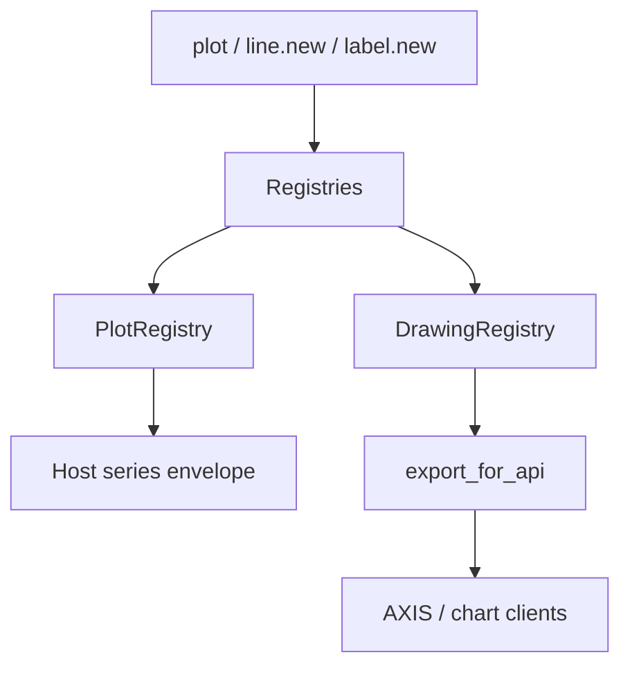

# Drawing and plotting

## Abstract

Visual effects in Pine are **side channels**: they do not change pure arithmetic results, but they are first-class runtime outputs. PYNE records plots in `PlotRegistry` and drawing primitives (lines, boxes, labels, tables, polylines, linefills) in `DrawingRegistry`, then serializes them for the Pro API and optional AXIS. Evaluation never requires a UI—tests assert on registries alone.

## Conceptual model



## Interface surface

### Plotting (`PlottingFunctionsMixin`)

| Function | Kind | Notes |
| --- | --- | --- |
| `plot` | `plot` | Returns `Plot` id for `fill(plot1, plot2)` |
| `plotshape` / `plotchar` / `plotarrow` | markers | location, char, text metadata |
| `plotbar` / `plotcandle` | OHLC visuals | open/high/low/close fields |
| `hline` | horizontal | price level |
| `bgcolor` / `barcolor` | coloring | series-driven colors |
| `fill` | fill | references two plot ids |

Style constants: `plot.linestyle_solid` / `dashed` / `dotted`.

Each call constructs a `Plot` dataclass (`kind`, `series`, `title`, `color`, linewidth, text formatting, force_overlay, …) and appends it to `PlotRegistry.plots`.

Hosts often **also** capture per-bar plot values on the evaluator (`plot_outputs`) for time-aligned series maps—see `backend/runtime.py`.

### Drawing objects (`DrawingBuiltinsMixin`)

Object types: `Line`, `Box`, `Label`, `Table`, `Polyline`, `LineFill`, `ChartPoint`.

Typical factories: `line.new`, `box.new`, `label.new`, `table.new`, `polyline.new`, `linefill.new`, plus getters/setters/deletes and `*.all` / last-bar helpers where implemented.

Instance methods resolve through namespace markers:

```text
la.get_text()  →  label.get_text(la)
```

`DrawingRegistry.export_for_api(bar_times)` maps `xloc=bar_index` coordinates to wall times for chart clients, normalizes colors, and skips deleted objects.

### Registry lifecycle

```python
DrawingRegistry.reset()  # clears drawings + PlotRegistry
```

Hosts must reset at run start so labels from a previous evaluation do not leak.

## Internals

| Path | Role |
| --- | --- |
| `src/pynescript/ast/evaluator/builtins/plotting.py` | `Plot`, `PlotRegistry`, plot* handlers |
| `src/pynescript/ast/evaluator/builtins/drawing.py` | Drawing types, registry, builtins, export |
| `src/pynescript/ast/evaluator/names.py` | `_DRAWING_METHOD_NS` |
| `tests/test_plotting_effects.py`, `test_drawing_all_and_last_bar.py` | Behavior |
| Compiler object mode | Accumulates `__drawings` event list instead of full registry parity |

## Invariants & edge cases

1. **`plot` returns an id.** Required for `fill`; treating it as “void” breaks band fills.
2. **Deleted flag.** Soft-delete keeps history for debugging; `active()` filters deleted plots.
3. **Series in drawings.** Prices may be series wrappers—export coerces `.current` and maps NaN → omit.
4. **Compile path.** Numeric mode supports `plot` arrays; drawings force object mode with a simplified event list—not full delete/style parity with the interpreter.
5. **No GPU/canvas in-process.** Registries are data; AXIS/HOOX render elsewhere.

## Worked examples

### Dual plot + fill

```pine
//@version=5
indicator("BB mid")
basis = ta.sma(close, 20)
p1 = plot(basis)
p2 = plot(basis * 1.01)
fill(p1, p2, color=color.new(color.blue, 80))
```

### Label on last bar

```pine
//@version=5
indicator("lbl", overlay=true)
if barstate.islast
    label.new(bar_index, high, str.tostring(close))
```

Hosts read `DrawingRegistry.labels` or API export after the run.

## Failure modes

| Symptom | Cause |
| --- | --- |
| Empty drawings in API | Forgot `DrawingRegistry.reset` timing / export; or script never called `*.new` |
| fill no-ops | plot ids not retained from `plot()` returns |
| Stale labels across HTTP runs | Missing registry reset between `Runtime.run` calls (Runtime resets—custom hosts must) |
| Object mode missing delete | Known compile limitation—use interpret mode |

## See also

- [Builtins hub](/pyne/docs/runtime/builtins)
- [Pro API preview / chart renderer](/pyne/docs/api/services/chart-renderer)
- [AXIS docs](/axis/docs)
- [Compiler overview](/pyne/docs/runtime/compiler/overview)
