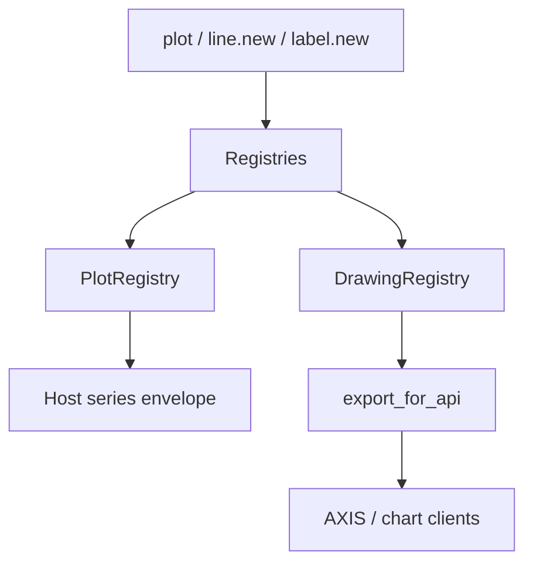

# Copyright (C) 2024-2026 jango_blockchained
#
# This file is part of pynescript.
#
# pynescript is free software: you can redistribute it and/or modify
# it under the terms of the GNU Affero General Public License as published by
# the Free Software Foundation, either version 3 of the License, or
# (at your option) any later version.
#
# pynescript is distributed in the hope that it will be useful,
# but WITHOUT ANY WARRANTY; without even the implied warranty of
# MERCHANTABILITY or FITNESS FOR A PARTICULAR PURPOSE.  See the
# GNU Affero General Public License for more details.
#
# You should have received a copy of the GNU Affero General Public License
# along with pynescript.  If not, see <https://www.gnu.org/licenses/>.
#
# SPDX-License-Identifier: AGPL-3.0-or-later

---
title: "Drawing and plotting"
description: "plot* side effects, DrawingRegistry objects, and export shapes for hosts and AXIS."
---

# Drawing and plotting

## Abstract

Visual effects in Pine are **side channels**: they do not change pure arithmetic results, but they are first-class runtime outputs. PYNE records plots in `PlotRegistry` and drawing primitives (lines, boxes, labels, tables, polylines, linefills) in `DrawingRegistry`, then serializes them for the Pro API and optional AXIS. Evaluation never requires a UI—tests assert on registries alone.

## Conceptual model



## Interface surface

### Plotting (`PlottingFunctionsMixin`)

| Function | Kind | Notes |
| --- | --- | --- |
| `plot` | `plot` | Returns `Plot` id for `fill(plot1, plot2)`; series values in host export |
| `plotshape` / `plotchar` / `plotarrow` | markers | Condition series + `plot_meta.kind` (style/location/char). Visuals are **not** in `drawings` |
| `barcolor` / `plotbar` / `plotcandle` | overlays | Per-bar color / OHLC series + kind stamp (0.3.12 dual-host) |
| `hline` | horizontal | **Both** hosts export a **constant price series** keyed by title + `plot_meta.kind: "hline"`. Not in `drawings` |
| `bgcolor` / `barcolor` | coloring | Color-string series + `plot_meta.kind`. Not in `drawings` |
| `fill` | fill | **Both** export a **titled series key** (values often all-null); band color + plot refs live in `plot_meta` |

Style constants: `plot.linestyle_solid` / `dashed` / `dotted`. Plot style tokens: `plot.style_line`, `linebr`, `stepline`, `steplinebr`, `stepline_diamond`, `histogram`, `columns`, `cross`, `area`, `areabr`, `circles`.

Each call constructs a `Plot` dataclass (`kind`, `series`, `title`, `color`, linewidth, text formatting, force_overlay, …) and appends it to `PlotRegistry.plots`.

Hosts often **also** capture per-bar plot values on the evaluator (`plot_outputs` / `_plot_value_cols`) for time-aligned series maps—see `src/pynescript/runtime/evaluator.py` and packaging in `src/pynescript/runtime/host.py` (`backend.evaluator` / `backend.runtime` re-export those modules).

`PYNE_LIGHT_PLOTS=1` skips columnar capture, plot-registry handles, and `input.*` metadata (corpus OK/fail only).

### Title defaults and series keys

Runtime packages plots into `result["series"]` / `result["plot_meta"]` on **both** hosts. `result["drawings"]` is **geometry-only** (line / box / label / polyline / table / linefill). Compile `__drawings` is an internal event list that Runtime **folds and strips** before JSON — hosts never need it. Empty or missing titles get defaults; collisions get `_2`, `_3`, … suffixes so map keys stay unique.

| Call | Default title | Notes |
| --- | --- | --- |
| `plot` | `plot_0`, `plot_1`, … | Compile emits `plot_{n}` at emit time; interpret empty title → `plot_{index}` at JSON packaging |
| `hline` | `hline` | Uniquified `hline`, `hline_2`, … when untitled levels repeat |
| `fill` | `fill` | Same uniquify rule (`Background` / `Background_2`, …) |
| `bgcolor` | `bgcolor` | Series + `plot_meta` (both hosts) |
| `plotshape` | `shape` | Series + `plot_meta` (both hosts) |

Explicit `title=` (or positional title) wins when present.

### `hline` — constant series (both modes)

Interpret (`src/pynescript/runtime/evaluator.py` + Runtime packaging):

- Captures kind `hline` with the price as the series cell each bar.
- JSON export **forward-fills** nulls with the known constant so AXIS can draw a full-width level.
- `plot_meta[title]` includes `kind: "hline"`, `price`, `color`, `linewidth`, …

Compile:

- Emits a **plot array** (`safe_float(price)` every bar) under the uniquified title and stamps `plot_meta.kind: "hline"`.
- May also append an internal `__drawings` event; Runtime packaging **strips** visual kinds so host `drawings` stays geometry-only.
- Host wraps NaN → null; constant levels remain numeric across the bar range.

Parity tests: `tests/test_multi_plot_cross.py` (`test_hline_series_keys_compile_matches_interpret`), `tests/test_plot_drawing_dual_host.py`, `tests/test_compiler_objects.py`.

### `fill` — titled series key for key-set parity (both modes)

Interpret:

- Meta stores sibling series titles as `plot1` / `plot2` (resolved from `plot()` handles).
- Capture may hold a color string on the column; **Runtime JSON packaging** typically emits **all-null** series cells for fills (non-numeric / non-bgcolor strings → `null`). Band **color** and plot refs stay in `plot_meta` (and registry fill objects when ids are enabled).

Compile:

- Registers a series key with expression `None` (float64 NaN → JSON `null`) under the uniquified title so **series key sets match interpret**.
- Band details (plot refs, color) land in `plot_meta`. An internal `__drawings` `fill` event, if emitted, is **stripped** before Runtime JSON.

Parity tests: `test_fill_background_series_keys_compile_matches_interpret`, `test_fill_title_series_key_and_drawings`, `tests/test_plot_drawing_dual_host.py`.

### Import stubs must not leak as series strings

Unresolved `import …` libraries become chainable stubs marked `__pine_import_stub__ = True` (repr like `<PineImportStub namespace/name/version>`). If a script plots a stub member, Runtime’s `_json_plot_value` maps those cells to **`null`**—never the stub repr or a color-like string—so AXIS and interpret/compile comparisons never see `"<PineImportStub …>"` as a plot series value.

### Drawing objects (`DrawingBuiltinsMixin`)

Object types: `Line`, `Box`, `Label`, `Table`, `Polyline`, `LineFill`, `ChartPoint`.

Typical factories: `line.new`, `box.new`, `label.new`, `table.new`, `polyline.new`, `linefill.new`, plus getters/setters/deletes and `*.all` / last-bar helpers where implemented.

Instance methods resolve through namespace markers:

```text
la.get_text()  →  label.get_text(la)
```

`DrawingRegistry.export_for_api(bar_times)` maps `xloc=bar_index` coordinates to wall times for chart clients, normalizes colors, and skips deleted objects. `xloc.bar_index` **past the last bar** (classic `bar_index + 1` on `barstate.islast`) is extrapolated from the series period (0.3.5); empty `bar_times` passes the bare bar index.

Line / box / label payloads include **`force_overlay`** for AXIS pane routing (0.3.6). `linefill.new` serializes as `type: "linefill"` quads (`t1`/`p1` … `t4`/`p4` from the two line endpoints, plus `color` / `bgcolor`).

### Registry lifecycle

```python
DrawingRegistry.reset()  # clears drawings + PlotRegistry
```

Hosts must reset at run start so labels from a previous evaluation do not leak.

### Drawing GC (`max_*_count`)

Interpret path enforces TradingView®-style **garbage collection** on drawing factories (`line.new`, `label.new`, `box.new`, `polyline.new`, …):

| Declaration kwargs (`indicator` / `strategy`) | Default | Hard cap |
| --- | --- | --- |
| `max_lines_count` | 50 | 500 |
| `max_labels_count` | 50 | 500 |
| `max_boxes_count` | 50 | 500 |
| `max_polylines_count` | 50 | 100 |

When more **active** objects of a type exist than the cap, the **oldest** are marked `deleted=True` so they leave `*.all` and `DrawingRegistry.export_for_api`. Caps are applied from the script declaration at run start (`DrawingRegistry.configure_from_declaration`); shrinking a cap immediately collects.

```pine
//@version=6
indicator("labels", overlay=true, max_labels_count=100)
if barstate.islast
    label.new(bar_index, high, "x")
```

Compile object-mode drawings are a simplified event list—GC caps apply on the **interpret** registry path; prefer interpret when you need full last-bar / `*.all` / cap behavior.

### `fill` + `plot_meta` for AXIS

For dual `plot` + `fill` bands:

1. Each `plot()` contributes a **numeric series** under its title (default `plot_0`, …).
2. `fill(p1, p2, …)` contributes a **titled series key** (often all-null cells) so key-sets stay stable, plus `plot_meta` that carries band color and plot refs.
3. Hosts such as AXIS should read **`plot_meta[title]`** for `kind`, colors, and sibling plot titles (`plot1` / `plot2`) rather than treating fill series as prices.

Interpret packaging lives in `src/pynescript/runtime/host.py` / `evaluator.py`; compile emits matching series keys. Internal `__drawings` fill events are folded/stripped before Runtime JSON.

## Internals

| Path | Role |
| --- | --- |
| `src/pynescript/ast/evaluator/builtins/plotting.py` | `Plot`, `PlotRegistry`, plot* handlers |
| `src/pynescript/ast/evaluator/builtins/drawing.py` | Drawing types, registry, builtins, `export_for_api`, `fold_compile_drawing_mutations` |
| `src/pynescript/runtime/evaluator.py` | Host plot capture: hline / fill / bgcolor / plotshape series + meta |
| `src/pynescript/runtime/host.py` | JSON packaging: series keys, stub nulling, hline fill-forward, fill plot refs |
| `src/pynescript/compiler/compiler.py` | `hline`/`fill` series + internal `__drawings`; visual events lifted then stripped |
| `src/pynescript/ast/evaluator/names.py` | `_DRAWING_METHOD_NS` |
| `tests/test_plotting_effects.py`, `test_drawing_all_and_last_bar.py`, `test_multi_plot_cross.py`, `test_bgcolor_plotshape_export.py`, `test_plot_drawing_dual_host.py`, `test_compiler_objects.py` | Behavior / parity |

### Compile object-mode notes

Geometry factories and some marker-style calls force **object mode** (pure-Python bar loop with an append-only `__drawings` event list). Runtime packaging **lifts** visual events into `series` + `plot_meta.kind`, then **strips** them so host `drawings` is geometry-only — the same AXIS shape as interpret `export_for_api`.

| Call | Host export (both modes) | Compile internals |
| --- | --- | --- |
| `hline` | Constant series + `plot_meta.kind` | Series array; optional `__drawings` event stripped |
| `fill` | All-null series key + `plot_meta` color/refs | Series key; optional `__drawings` event stripped |
| `plotshape` / `plotchar` / `plotarrow` | Condition/signed series + `plot_meta.kind` | Visual events lifted into series, then stripped |
| `bgcolor` / `barcolor` | Color-string series + `plot_meta.kind` | Same lift/strip as other visuals |
| `plotbar` / `plotcandle` | OHLC series + kind stamp | Same lift/strip |
| `label` / `line` / `box` / `polyline` / `table` / `linefill` | Geometry objects in `drawings` | Handle dict + `__drawings`; `set_*` / `*.delete` fold via `DrawingRegistry.fold_compile_drawing_mutations` |

Numeric mode still supports plain `plot` float64 arrays; geometry or marker calls can flip object mode for that script.

## Invariants & edge cases

1. **`plot` returns an id.** Required for `fill`; treating it as “void” breaks band fills. Hosts that skip `PlotRegistry` unless `fill(` appears in source must still soft-fail fill gracefully.
2. **Deleted flag.** Soft-delete keeps history for debugging; `active()` filters deleted plots and GC-collected drawings.
3. **`max_*_count` GC.** Oldest active drawings are deleted when caps are exceeded (interpret registry).
4. **Series in drawings.** Prices may be series wrappers—export coerces `.current` and maps NaN → omit.
5. **Compile path.** Numeric mode supports `plot` arrays; geometry/markers force object mode with an internal `__drawings` event list. Runtime **folds** `set_*` / `*.delete`, **lifts** visual events into `series` + `plot_meta.kind`, then **strips** them so `drawings` is geometry-only. Prefer interpret when you need full last-bar / `*.all` / registry GC — not because visuals lack series.
6. **Import stubs → null.** `__pine_import_stub__` and `"<PineImportStub…>"` strings never appear as plot series cells after Runtime packaging.
7. **No GPU/canvas in-process.** Registries are data; AXIS/HOOX render elsewhere.

## Worked examples

### Dual plot + fill

```pine
//@version=6
indicator("BB mid")
basis = ta.sma(close, 20)
p1 = plot(basis)
p2 = plot(basis * 1.01)
fill(p1, p2, color=color.new(color.blue, 80))
```

### Label on last bar

```pine
//@version=6
indicator("lbl", overlay=true)
if barstate.islast
    label.new(bar_index, high, str.tostring(close))
```

Hosts read `DrawingRegistry.labels` or API export after the run.

## Failure modes

| Symptom | Cause |
| --- | --- |
| Empty drawings in API | Forgot `DrawingRegistry.reset` timing / export; or script never called `*.new` |
| fill no-ops | plot ids not retained from `plot()` returns |
| Stale labels across HTTP runs | Missing registry reset between `Runtime.run` calls (Runtime resets—custom hosts must) |
| Object mode missing drawing | Compile still folds `set_*` / `delete`; leftover events usually mean fold did not run |
| Only 50 labels/lines visible | Default `max_*_count`; raise on `indicator`/`strategy` (≤ hard cap) |
| fill series all null | Expected for band keys; use `plot_meta` for color + plot refs |

## See also

- [Builtins hub](/pyne/docs/runtime/builtins)
- [Pro API preview / chart renderer](/pyne/docs/api/services/chart-renderer)
- [AXIS docs](/axis/docs)
- [Compiler overview](/pyne/docs/runtime/compiler/overview)
