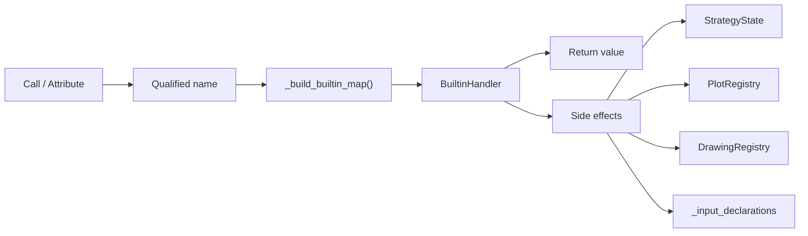

# Builtins

## Abstract

Pine’s standard library is not a single module: it is a **flat qualified-name dispatch table** (`"ta.sma"`, `"strategy.entry"`, `"array.push"`, …) assembled from category mixins. Each entry is a handler `(args, kwargs?) → value` with side effects when the language requires them (orders, plots, drawings, inputs). This hub orients the surface; child pages go deep on technical, strategy, collections, drawing/plotting, and request/input.

## Conceptual model



`BuiltinEvaluator` merges mixin maps in a fixed order and then registers ticker, logging, color, timeframe, and script-declaration functions. The `strategy()` declaration handler is wrapped so broker settings apply to `StrategyState`.

## Interface surface

| Namespace / area | Mixin / module | Docs |
| --- | --- | --- |
| `ta.*` | `TechnicalAnalysisMixin` + `technical_submodules/*` | [Technical](/pyne/docs/runtime/builtins/technical) |
| `strategy.*` | `StrategyBuiltinsMixin`, `StrategyConstantsMixin` | [Strategy](/pyne/docs/runtime/builtins/strategy) |
| `array.*` / `matrix.*` / `map.*` | `ArrayBuiltinsMixin`, matrix/map evaluators | [Collections](/pyne/docs/runtime/builtins/collections) |
| `plot*` / `hline` / `line` / `label` / … | `PlottingFunctionsMixin`, `DrawingBuiltinsMixin` | [Drawing & plotting](/pyne/docs/runtime/builtins/drawing-plotting) |
| `request.*` / `input.*` | `RequestBuiltinsMixin`, `InputBuiltinsMixin` | [Request & input](/pyne/docs/runtime/builtins/request-input) |
| `math.*`, min/max, `nz`, … | `NumericBuiltinsMixin` | (this page) |
| `str.*` | `StringBuiltinsMixin` | (this page) |
| `color.*` | `register_color_functions` | (this page) |
| `syminfo` / `ticker.*` | `register_ticker_functions` | (this page) |
| `timeframe.*` | `register_timeframe_functions` | (this page) |
| `alert` / logging | `AlertsMixin`, `register_logging_functions` | (this page) |
| `indicator` / `strategy` / `library` | `register_script_declaration_functions` | [Libraries](/pyne/docs/runtime/libraries) |
| Footprint / volume_row | `FootprintBuiltinsMixin` | [Request & input](/pyne/docs/runtime/builtins/request-input) |

### Numeric and string essentials

- **Numeric:** `math.*` constants from `BaseEvaluator` (`math.pi`, `math.e`, golden-ratio helpers); functions cover abs, min/max, rounding, logs, trig, and NA helpers (`nz`, `na` predicates via utility).
- **String:** `str.*` formatting, conversion (`str.tostring` respects `format.*` constants), and manipulation aligned with common Pine scripts in the builtin corpus.

### Color, ticker, timeframe

- **Colors:** hex constants (`color.red` → `#F23645`, etc.) plus composition helpers.
- **syminfo / ticker:** host-provided `Syminfo` object or flat context keys; ticker construction for `request.security` symbols.
- **timeframe:** period flags (`isintraday`, `isdaily`, …) default daily in base constants; hosts override from bar spacing.

### Alerts

`alert()` / related helpers record structured messages with optional `bar_index` / `time` from context—side channel for hosts, not strategy events.

## Internals

| Path | Role |
| --- | --- |
| `src/pynescript/ast/evaluator/builtins/__init__.py` | `BuiltinEvaluator` composition |
| `src/pynescript/ast/evaluator/builtins/base.py` | Dispatch mixin, `_call_builtin`, registration |
| `src/pynescript/ast/evaluator/builtins/*.py` | Category implementations |
| `scripts/generate_builtin_metadata.py` | LSP/metadata surface (not hand-edited JSON) |

Handlers are looked up by the fully qualified string built during name/attribute evaluation. Zero-arg series (e.g. `strategy.equity`) are registered as builtins that ignore empty args.

## Invariants & edge cases

1. **One map, many mixins.** New builtins require a map entry *and* (usually) metadata regeneration for LSP.
2. **Kwargs and positionals.** Handlers accept both; Pine named arguments arrive as kwargs when the call AST carries them.
3. **Bar mode.** Stateful `ta.crossover` / similar use per-bar call indices reset by the host (`_cross_call_i`).
4. **Mock fallbacks.** `request.*` without a feed still returns synthetic data so offline evaluation does not hard-fail—hosts must wire real providers for production accuracy.
5. **Compile path subset.** Numba builtins reimplement only a fraction of this table; object mode covers more via Python helpers—see [Compiler](/pyne/docs/runtime/compiler/overview).

## Worked example — resolution path

```pine
plot(ta.sma(close, 14))
```

1. Attribute/call chain builds qualified name `ta.sma`.
2. `_call_builtin("ta.sma", [close_series, 14])`.
3. Handler coerces series → list, computes SMA, finalizes scalar or list.
4. `plot` registers a `Plot` with that series value and returns the plot id.

## Failure modes

| Symptom | Fix |
| --- | --- |
| `Unknown built-in function` | Typo, version surface gap, or failed attribute chain |
| Always mock prices | Wire `data_feed` / `data_provider` into evaluator context |
| LSP knows a function runtime lacks | Metadata ahead of implementation—check [missing features](/pyne/docs/reference/missing-features) |
| Handler arity errors | Positional vs keyword mismatch in script |

## See also

- [Technical](/pyne/docs/runtime/builtins/technical)
- [Strategy](/pyne/docs/runtime/builtins/strategy)
- [Collections](/pyne/docs/runtime/builtins/collections)
- [Drawing & plotting](/pyne/docs/runtime/builtins/drawing-plotting)
- [Request & input](/pyne/docs/runtime/builtins/request-input)
- [Builtin metadata (LSP)](/pyne/docs/lsp/builtin-metadata)
