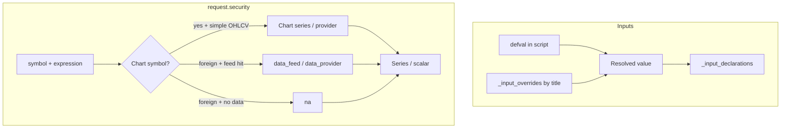

# Copyright (C) 2024-2026 jango_blockchained
#
# This file is part of pynescript.
#
# pynescript is free software: you can redistribute it and/or modify
# it under the terms of the GNU Affero General Public License as published by
# the Free Software Foundation, either version 3 of the License, or
# (at your option) any later version.
#
# pynescript is distributed in the hope that it will be useful,
# but WITHOUT ANY WARRANTY; without even the implied warranty of
# MERCHANTABILITY or FITNESS FOR A PARTICULAR PURPOSE.  See the
# GNU Affero General Public License for more details.
#
# You should have received a copy of the GNU Affero General Public License
# along with pynescript.  If not, see <https://www.gnu.org/licenses/>.
#
# SPDX-License-Identifier: AGPL-3.0-or-later

---
title: "request.* and input.*"
description: "Multi-symbol/timeframe requests, fundamental na semantics, host series bind, and input parameter resolution."
---

# `request.*` and `input.*`

## Abstract

Two namespaces couple scripts to the **host environment**: `input.*` declares parameters (with defaults and UI metadata), and `request.*` pulls data from other symbols, timeframes, or fundamental/economic sources. PYNE implements both as builtins with explicit extension points—`data_feed`, `data_provider`, and `_input_overrides`—so the same script can run offline or online with real market data.

**Design rule:** missing multi-symbol or fundamental data yields **`na`**, never silent substitution of chart OHLCV (no close-as-dividend, no chart volume as UPVOL).

## Conceptual model



## Interface surface

### `input.*` (`InputBuiltinsMixin`)

| Builtin | Purpose |
| --- | --- |
| `input` | Generic defval + title/tooltip/inline/group/confirm/active |
| `input.bool` / `int` / `float` / `string` / `color` | Typed scalars |
| `input.price` / `source` / `time` / `timeframe` / `session` / `symbol` | Domain inputs |
| `input.enum` / `input.text_area` | Enumerations and multiline text |

**Runtime value:** each call returns the resolved value (override if title matches, else default). Metadata is appended to `_input_declarations` for settings panels and LSP-adjacent hosts.

Overrides live on the evaluator as `_input_overrides: dict[title, value]`.

### `request.*` (`RequestBuiltinsMixin`)

| Builtin | Role |
| --- | --- |
| `request.security` | Other symbol / timeframe expression |
| `request.security_lower_tf` | Lower-TF array expansion |
| `request.dividends` / `earnings` / `splits` | Corporate actions |
| `request.financial` / `economic` / `quandl` | Fundamentals / external series |
| `request.currency_rate` | FX conversion helper |
| `request.seed` | Deterministic pseudo-series |
| `request.footprint` | Volume footprint object (v6 surface) |

#### `request.security` — interpret path

Resolution order (simplified):

1. Normalize symbol (series → last element; `ticker.*` → symbol string) and timeframe.
2. Classify **chart vs foreign** (`_is_chart_symbol` vs host `syminfo` / provider symbol).
3. Try `data_feed.fetch_latest_ohlcv` / ticker, then `data_provider.fetch`.
4. **Same-symbol coarser timeframe (HTF resample, 0.3.4+):** bucket chart OHLCV to the requested TF; allowlisted simple TA on HTF series — `ta.sma` / `ta.ema` / `ta.rsi` / `ta.atr` — evaluates on the resampled series. Policy meta is exposed on the Runtime for host honesty.
5. **Foreign + pre-evaluated expression** (UDF result, list/tuple of chart values, non-string expr) without multi-symbol data → **`na`** (not chart close as “dividends”).
6. Fundamental / non-equity prefixes (`DIVIDEND`, `FACTSET`, `EARNINGS`, `ESD_`) with no feed hit → **`na`** (no mock OHLCV).
7. Bare equity-style string names may still use **legacy mock** prices for offline demos when no feed is wired.

`ChartOHLCVProvider` (wired by `Runtime` via `resolve_request_sources` when unset) **only serves the chart ticker**. Foreign tickers get empty series, so interpret returns `na` unless a real multi-symbol feed is configured.

#### `request.security` — compile path

Compile lowering is intentionally narrow ([compiler overview](/pyne/docs/runtime/compiler/overview)):

| Case | Emit |
| --- | --- |
| Same-symbol (`syminfo.ticker` / empty chart id) **and** simple OHLCV expr (`close`, `high[1]`, …) | Passthrough chart array sample |
| Foreign tickers (`UPVOL.NY`, `ESD_FACTSET`, …) | `np.nan` |
| Complex third arg (UDFs, `year_sum(close)`, non-allowlisted `ta.*`, arithmetic) | `np.nan` |
| Other `request.*` APIs | `np.nan` (object mode) |

No inventing chart-close-as-dividends or chart-volume-as-advance/decline series.

#### Footprint (`FootprintBuiltinsMixin`)

Types `Footprint` and `VolumeRow` expose buy/sell volume, delta, VAH/VAL/POC rows, and per-row imbalance helpers—aligned with the v6 footprint surface inventory.

## Mode selection (`mode=auto`)

Pro API `/run` defaults body `mode` to **`auto`**. `Runtime._compile_eligible` **rejects compile** when the source contains `request.` (or top-level `import`), so auto **prefers interpret** for any script that uses `request.*`:

```text
request.* present → compile_fallback_reason = "request.* not supported in compile path"
                 → auto_backend = interpret
```

Forced `mode=compile` still runs the narrow lowering above (simple same-symbol only; else `na`). Input overrides also force interpret under auto.

See [Compiler overview](/pyne/docs/runtime/compiler/overview) for warm compile, numeric vs object mode, and eligibility.

## Host series bind (interpret)

Assigning host OHLCV / time series into a **user name** never aliases the host buffer by reference. `_bind_series_name` copies the current scalar into a fresh series for the user name so patterns like:

```pine
last_t := na(close) ? last_t[1] : time
```

cannot corrupt `time[j]` history. That bug previously broke TTM / `year_sum`-style windows (e.g. dividend-yield scripts).

## Internals

| Path | Role |
| --- | --- |
| `src/pynescript/ast/evaluator/builtins/input.py` | Input handlers + declarations |
| `src/pynescript/ast/evaluator/builtins/request.py` | `request.*` + chart/foreign / na policy |
| `src/pynescript/ast/evaluator/statements.py` | `_bind_series_name` (no OHLCV alias) |
| `src/pynescript/util/data.py` | `ChartOHLCVProvider`, `resolve_request_sources` |
| `src/pynescript/compiler/compiler.py` | Same-symbol OHLCV-only `security` lower |
| `src/pynescript/runtime/host.py` | Package Runtime SoT; feed wiring; `_compile_eligible` / `_run_auto` |
| `backend/runtime.py` | Compat re-export of package Runtime |
| `tests/test_dividend_yield_parity.py`, `test_datafeed_wiring.py` | na parity + chart provider |

## Invariants & edge cases

1. **Inputs are pure values at runtime.** Titles matter only for override keys and UI metadata—not for Pine type identity.
2. **Foreign without data → `na`.** Prefer honest missing data over inventing chart series as multi-asset results.
3. **Chart provider is chart-only.** Multi-asset accuracy needs a real `data_feed` / `data_provider`.
4. **Mocks are limited.** Equity-style bare symbols may still mock offline; fundamental prefixes and foreign pre-evaluated exprs do not.
5. **Dynamic symbols.** List/series symbols resolve to the latest element—supports loops constructing ticker ids.
6. **Lower TF.** `request.security_lower_tf` returns array-like structures; length scales with simulated lower-TF density when mocking.
7. **`mode=auto` + `request.*` → interpret.** Compile path is not a full multi-asset substitute.

## Worked examples

### Parameterized length

```pine
//@version=6
indicator("len")
len = input.int(14, "Length", minval=1)
plot(ta.sma(close, len))
```

Host:

```python
ev._input_overrides = {"Length": 21}
```

### Multi-timeframe close / simple HTF TA (chart symbol)

```pine
//@version=6
indicator("HTF")
htf = request.security(syminfo.tickerid, "D", close)
htf_sma = request.security(syminfo.tickerid, "D", ta.sma(close, 20))
plot(htf)
plot(htf_sma)
```

Same-symbol coarser TF: interpret buckets chart OHLCV and evaluates allowlisted simple `ta.*` (`sma` / `ema` / `rsi` / `atr`) on the HTF series. Compile may passthrough simple same-symbol OHLCV; complex foreign/security still → `na`.

### Intentional `na` — dividend yield (fundamentals missing)

```pine
//@version=6
indicator("div")
year_sum(src) =>
    ta.cum(src)
div_ticker = ticker.new("ESD_FACTSET", "X;Y;DIVIDENDS")
div_ttm = request.security(div_ticker, "D", year_sum(close), barmerge.gaps_on, lookahead=barmerge.lookahead_on)
plot(div_ttm)
```

Without a fundamentals feed: **interpret and compile both plot `na`** for `div_ttm`—not chart close as fake TTM dividends. Covered by `tests/test_dividend_yield_parity.py`.

### Intentional `na` — CVI / UPVOL-style foreign OHLCV

```pine
//@version=6
indicator("cvi")
up = request.security("UPVOL.NY", "D", close)
plot(up)
```

Foreign ticker + no multi-symbol data → **`na`**. Compile never rewrites this as chart close; inventing advance/decline volume from the host series is forbidden.

## Failure modes

| Symptom | Cause |
| --- | --- |
| All-`na` multi-asset plots | Foreign symbol / fundamental expr; no feed (expected) |
| Always ~100 mock prices | Bare equity string + no feed; legacy mock path |
| Input override ignored | Title string mismatch (including empty title) |
| Footprint fields zero | `request.footprint` without configured footprint data |
| `time[1]` / history wrong after assign | Should be fixed: host bind no longer aliases OHLCV |
| Lookahead surprises | Host data alignment / gaps—not automatic TV replay guarantees |
| `auto_backend=interpret` with `request.*` | Eligibility prefilter; use interpret or wire multi-symbol feed |

## See also

- [Compiler overview](/pyne/docs/runtime/compiler/overview) — auto eligibility, same-symbol security lower
- [Builtins hub](/pyne/docs/runtime/builtins)
- [Series & history](/pyne/docs/runtime/series-and-history)
- [Pro API run endpoint](/pyne/docs/api/endpoints/run)
- [Runtime hub](/pyne/docs/runtime)
