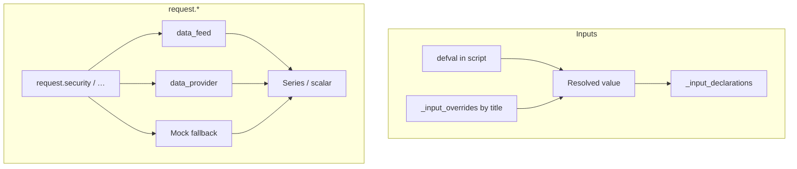

# `request.*` and `input.*`

## Abstract

Two namespaces couple scripts to the **host environment**: `input.*` declares parameters (with defaults and UI metadata), and `request.*` pulls data from other symbols, timeframes, or fundamental/economic sources. PYNE implements both as builtins with explicit extension points—`data_feed`, `data_provider`, and `_input_overrides`—so the same script can run offline with mocks or online with real market data.

## Conceptual model



## Interface surface

### `input.*` (`InputBuiltinsMixin`)

| Builtin | Purpose |
| --- | --- |
| `input` | Generic defval + title/tooltip/inline/group/confirm/active |
| `input.bool` / `int` / `float` / `string` / `color` | Typed scalars |
| `input.price` / `source` / `time` / `timeframe` / `session` / `symbol` | Domain inputs |
| `input.enum` / `input.text_area` | Enumerations and multiline text |

**Runtime value:** each call returns the resolved value (override if title matches, else default). Metadata is appended to `_input_declarations` for settings panels and LSP-adjacent hosts.

Overrides live on the evaluator as `_input_overrides: dict[title, value]`.

### `request.*` (`RequestBuiltinsMixin`)

| Builtin | Role |
| --- | --- |
| `request.security` | Other symbol / timeframe expression |
| `request.security_lower_tf` | Lower-TF array expansion |
| `request.dividends` / `earnings` / `splits` | Corporate actions |
| `request.financial` / `economic` / `quandl` | Fundamentals / external series |
| `request.currency_rate` | FX conversion helper |
| `request.seed` | Deterministic pseudo-series |
| `request.footprint` | Volume footprint object (v6 surface) |

#### `request.security(symbol, timeframe, expression, …)`

Resolution order (simplified):

1. Normalize symbol (series → last element) and timeframe.
2. Try `data_feed.fetch_latest_ohlcv` / ticker.
3. Try `data_provider.fetch`.
4. Fall back to **mock** synthetic prices so evaluation continues offline.

Expression may be a simple series name (`close`) or more complex forms depending on handler paths; production hosts should supply real data for multi-asset accuracy.

#### Footprint (`FootprintBuiltinsMixin`)

Types `Footprint` and `VolumeRow` expose buy/sell volume, delta, VAH/VAL/POC rows, and per-row imbalance helpers—aligned with the v6 footprint surface inventory.

## Internals

| Path | Role |
| --- | --- |
| `src/pynescript/ast/evaluator/builtins/input.py` | Input handlers + declarations |
| `src/pynescript/ast/evaluator/builtins/request.py` | request.* + footprint types |
| `src/pynescript/ast/evaluator/base.py` | Injects `data_feed` / `data_provider` into context |
| `backend/runtime.py` | `resolve_request_sources` wiring from chart bars |
| `tests/test_request_data_feed.py`, `test_datafeed*.py` | Feed contracts |

## Invariants & edge cases

1. **Inputs are pure values at runtime.** Titles matter only for override keys and UI metadata—not for Pine type identity.
2. **Mocks are intentional.** Silent mock fallback is not a hard error; production must validate feed wiring.
3. **Dynamic symbols.** List/series symbols resolve to the latest element—supports loops constructing ticker ids.
4. **Lower TF.** `request.security_lower_tf` returns array-like structures; length scales with simulated lower-TF density when mocking.
5. **Compile mode.** `input.*` defaults lower into numeric compile; live `request.security` is interpret-centric—do not assume multi-asset compile coverage.

## Worked examples

### Parameterized length

```pine
//@version=5
indicator("len")
len = input.int(14, "Length", minval=1)
plot(ta.sma(close, len))
```

Host:

```python
ev._input_overrides = {"Length": 21}
```

### Multi-timeframe close

```pine
htf = request.security(syminfo.tickerid, "D", close)
plot(htf)
```

With `Runtime.run(..., data_provider=...)`, daily closes come from the provider; without it, mocks apply.

## Failure modes

| Symptom | Cause |
| --- | --- |
| Always ~100 mock prices | No feed/provider; or fetch exceptions swallowed |
| Input override ignored | Title string mismatch (including empty title) |
| Footprint fields zero | `request.footprint` without configured footprint data |
| Lookahead surprises | Host data alignment / gaps—not automatic TV replay guarantees |

## See also

- [Builtins hub](/pyne/docs/runtime/builtins)
- [Pro API run endpoint](/pyne/docs/api/endpoints/run)
- [Runtime hub](/pyne/docs/runtime)
