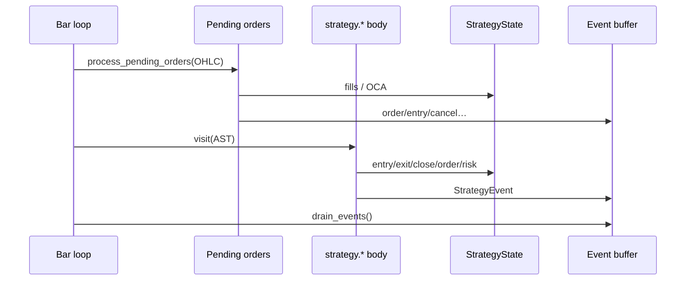

# Copyright (C) 2024-2026 jango_blockchained
#
# This file is part of pynescript.
#
# pynescript is free software: you can redistribute it and/or modify
# it under the terms of the GNU Affero General Public License as published by
# the Free Software Foundation, either version 3 of the License, or
# (at your option) any later version.
#
# pynescript is distributed in the hope that it will be useful,
# but WITHOUT ANY WARRANTY; without even the implied warranty of
# MERCHANTABILITY or FITNESS FOR A PARTICULAR PURPOSE.  See the
# GNU Affero General Public License for more details.
#
# You should have received a copy of the GNU Affero General Public License
# along with pynescript.  If not, see <https://www.gnu.org/licenses/>.
#
# SPDX-License-Identifier: AGPL-3.0-or-later

---
title: "Strategy builtins"
description: "Orders, fills, OCA, commission, risk gates, position metrics, and StrategyState."
---

# Strategy builtins

## Abstract

PYNE’s strategy layer is a **per-run broker simulation** driven by `strategy.*` calls during the bar loop. It is not a live exchange adapter: orders become fills against bar OHLC (market immediately; limit/stop via pending book), commissions and slippage adjust PnL, and risk helpers can block entries. Structured [StrategyEvent](/pyne/docs/runtime/events) records form the parity contract with [pyne-worker](/pyne/docs/pyne-worker) and the HOOX trade mesh.

## Conceptual model



**Fill-before-script** matches the interpreter `Runtime` and the compile-path [strategy broker](/pyne/docs/runtime/compiler/strategy-broker).

## Interface surface

### Order placement

| Builtin | Role |
| --- | --- |
| `strategy.entry` | Open/add (or reverse) by direction; market or pending limit/stop |
| `strategy.exit` | Bracket-style exit (pending limit/stop + OCA); market exit when no levels |
| `strategy.close` / `strategy.close_all` | Flatten by id or all (`qty_percent` supported) |
| `strategy.order` | Lower-level order with OCA name/type, partial fill cap |
| `strategy.cancel` / `strategy.cancel_all` | Remove pending orders |

Directions accept Pine constants (`strategy.long` / `strategy.short`) and common string aliases.

### `strategy.exit` surface (0.3.4+)

| Feature | Status |
| --- | --- |
| Pending stop/limit brackets + OCA | Interpret + compile — fills via `process_pending_orders` OHLC path |
| `from_entry` multi-leg filter | Interpret + compile — unknown id is soft no-op |
| `qty_percent` | Interpret + compile `close` — `%` of target (whole pos or `from_entry`); wins over `qty`; `≤0`/na → no-op; `>100` capped |
| Trail (`trail_offset` / `trail_points` / optional `trail_price`) | Interpret + compile — distances are **ticks** (`× mintick`). Pending stop ratchets from bar high/low (OHLC approx). `trail_points=0` / `na` is ignored so a valid `trail_offset` still applies (0.3.8). |
| `profit` / `loss` | **Ticks** from the exit’s entry average (`ticks * mintick`). Long: `entry ± offset`; short flips the sign. `na` / `≤0` ignore that leg. Absolute `limit` / `stop` win when both are set. |

```pine
//@version=6
strategy("Exit demo", overlay=true, initial_capital=100000)
if bar_index == 5
    strategy.entry("L", strategy.long, qty=10)
if bar_index == 6
    strategy.exit("X", from_entry="L", stop=low * 0.98, limit=high * 1.02, qty_percent=50)
// Tick form (same surface): profit/loss are offsets from entry avg, not prices.
// strategy.exit("X", from_entry="L", profit=200, loss=100)
```

### Position and performance series

Zero-arg builtins include `strategy.position_size` (signed: +long / −short), `position_avg_price`, `position_entry_name`, `opentrades` / `closedtrades` counts, `netprofit`, `openprofit`, `equity`, `cash`, gross win/loss stats, averages, max drawdown/runup, and max contracts held.

### Trade queries

Indexed accessors:

- `strategy.closedtrades.entry_*` / `exit_*` / `profit` / `size` / `commission`
- `strategy.opentrades.entry_*` / `size` / `profit` / `commission`
- Open/closed trade fields include bar/time/id/comment plus approximate MAE/MFE (`max_drawdown` / `max_runup` from bar high/low)

### Risk (interpret + compile halt cascade)

| Builtin | Effect |
| --- | --- |
| `strategy.risk.max_position_size` | Cap size as % of equity |
| `strategy.risk.max_intraday_loss` | Intraday loss gate |
| `strategy.risk.max_intraday_filled_orders` | Order count cap (day-scoped on compile) |
| `strategy.risk.max_drawdown` | Absolute / percent drawdown halt |
| `strategy.risk.max_cons_loss_days` | Consecutive losing calendar days → `entries_blocked` |
| `strategy.risk.allow_entry_in` | `"all"` \| `"long"` \| `"short"` |

Blocked entries still emit a diagnostic-style event with comment `risk_blocked` where implemented. Compile broker shares the common halt cascade above (not a full TradingView® risk engine).

### Declaration

`strategy(title, …)` applies broker settings onto `StrategyState`: `initial_capital`, commission type/value, slippage ticks, pyramiding, `avg_price_model`, etc.

### Average price model (pynescript extension)

Not part of official TradingView Pine. Controls how `strategy.position_avg_price` evolves when size changes:

| `avg_price_model` | On same-direction **adds** | On **partial reduce** |
| --- | --- | --- |
| `"stock"` (default) | Arithmetic VWAP of fills | Re-average remaining open legs (FIFO multi-trade style) |
| `"futures"` | Same arithmetic VWAP | **Sticky** net AEP until flat (linear USDT-M / BTCUSDT-like) |
| `"inverse"` | Arithmetic today; harmonic add planned | Sticky until flat (same reduce rule as futures) |

```pine
strategy("Perp style", avg_price_model="futures")
// or tokens:
// strategy(..., avg_price_model=strategy.avg_price_futures)
```

Linear add formula (stock and futures):

\[
avg' = \frac{avg \cdot |size| + p \cdot q}{|size| + q}
\]

Under `"futures"`, partial closes realize PnL against the sticky average (not per-leg FIFO entry prices), and closed-trade `entry_price` records that same average. Commission is never folded into the average numerator.

There is no `strategy.order.avg_future_price` series—use `strategy.position_avg_price` with the mode switch.

### Leverage (pynescript extension — simpler futures UI)

Exchanges expose **leverage** (e.g. 5× / 10× / 20×). Prefer that over TV-style `margin_long` / `margin_short` percentages:

```pine
//@version=6
// TV-safe: strategy() kwargs need *const* (literals / const vars).
// Host UI can still inject runtime input overrides into PYNE.
strategy(
     "BTCUSDT style",
     avg_price_model="futures",
     leverage=10,
     default_qty_type=strategy.percent_of_equity,
     default_qty_value=100,  // use full equity as *margin*
     initial_capital=10_000)

// Optional Inputs-tab control for *trade logic* (not TV strategy Properties):
// lev = input.float(10, "Leverage", minval=1, maxval=125)
```

| Setting | Effect |
| --- | --- |
| `leverage=N` (default `1`) | Buying power multiplier |
| `percent_of_equity` / `cash` default qty | `qty = margin × leverage / price` |
| `fixed` default qty | Unchanged (contracts as written) |
| `strategy.cash` / capital held | Margin locked = notional / leverage |
| `strategy.margin_liquidation_price` | Simple isolated estimate when `leverage > 1` |
| `strategy.leverage` | Read-back of configured multiplier |

`leverage=10` also sets internal margin % to `100/10 = 10` (TV `margin_long`/`margin_short` equivalent). If only `margin_long` is set, leverage is derived as `100 / margin_long`.

#### `input` before `strategy()` — TV vs PYNE

| | TradingView | PYNE |
| --- | --- | --- |
| Statements before `strategy()` | Allowed for **const** vars (and types/enums/imports) | Allowed |
| `input.*()` return qualifier | **`input`** (not `const`) | Plain Python value (no qualifier system) |
| `strategy(leverage=input.float(...))` | **Compile error** — most `strategy()` params require **`const`** | **Interpret:** works. **Compile:** folds **const-like defval** into the broker ctor (`input.float(10)` → `leverage=10`) |
| User-adjustable leverage on TV | **Settings → Properties** (“Long/Short leverage”, mapped from `margin_long`/`margin_short`) | Declaration `leverage=` or host-injected inputs |

Qualifier hierarchy on TV: `const < input < simple < series`. A parameter that needs `const` **cannot** accept an `input` value. So even if `lev = input.float(10)` appears *before* `strategy()`, you still cannot pass `lev` into `strategy(...)` on TV.

PYNE does **not** enforce qualifiers; for compile-path parity with TV’s const rule, non-const strategy kwargs are skipped unless their series folds to a constant defval.

## Internals

### `StrategyState` (`strategy.py`)

Per-evaluator instance fields include:

- Position: direction (`flat`/`long`/`short`), size (non-negative internal), entry metadata
- Books: `pending_orders`, `open_trades`, `closed_trades`
- Economics: capital, commission model, slippage, mintick
- Risk: max position %, drawdown, consecutive loss days, `entries_blocked`
- Equity curve peak/trough for max DD / runup
- `_events: list[StrategyEvent]` drained each bar

`signed_position_size()` implements Pine’s signed `strategy.position_size`.

### `Order` and fills

```text
Order: market | limit | stop | stop-limit
  + oca_name / oca_type ∈ {none, cancel, reduce}
  + max_fill_per_bar (0 = fill remaining)
```

`process_pending_orders(open, high, low, close)` walks the book, computes trigger prices from OHLC (gap-aware open logic for limits/stops), applies commission/slippage, updates trades, runs OCA side effects, and emits events.

### OCA

| `oca_type` | On fill of a group member |
| --- | --- |
| `cancel` | Cancel other pending in group |
| `reduce` | Reduce sibling quantities by fill size |
| `none` | Independent |

Covered by `tests/test_oca_commission.py` and order-fill suites.

## Invariants & edge cases

1. **Isolation.** Never use class-level strategy state; concurrent runs must not share books.
2. **Pyramiding.** Additional entries respect `pyramiding` from the declaration.
3. **Partial fills.** `max_fill_per_bar` / defaults allow multi-bar completion of large orders.
4. **Calendar buckets for cons-loss.** Exit timestamps in ms vs seconds vs bar index are normalized in `note_closed_trade_day`.
5. **Compile path.** Object-mode uses `CompileStrategyBroker`—aligned fill rules, smaller surface than full interpreter metrics. Prefer interpret mode for full `strategy.closedtrades.*` analytics unless compile coverage is verified.

## Worked examples

### Market long / close

```pine
//@version=6
strategy("Demo", overlay=true, initial_capital=100000)
if bar_index == 5
    strategy.entry("L", strategy.long, qty=10)
if bar_index == 10
    strategy.close("L", qty_percent=100)
```

Parity fixtures under `tests/fixtures/parity/pine/` encode expected event sequences for such scripts.

### Pending stop entry

```pine
//@version=6
strategy("Breakout", overlay=true)
strategy.entry("Break", strategy.long, stop=high[1])
```

Creates a pending stop; subsequent bars’ `process_pending_orders` fill when `high` trades through the stop, using open-gap-aware fill prices.

### OCA bracket sketch

```pine
//@version=6
strategy("Bracket", overlay=true)
// after entry "L" is open:
strategy.order("TP", strategy.short, qty=1, limit=tp, oca_name="br", oca_type=strategy.oca.cancel)
strategy.order("SL", strategy.short, qty=1, stop=sl, oca_name="br", oca_type=strategy.oca.cancel)
```

First fill cancels the sibling.

## Failure modes

| Symptom | Cause |
| --- | --- |
| Entry never fills | Pending stop/limit; OHLC never trades through; or risk block |
| Double entries | Pyramiding > 0 or missing close |
| Events missing `script_id` | Host forgot to stamp after `drain_events` (Runtime does this) |
| PnL off vs TV | Commission type, slippage ticks, mintick, or fill price model |
| Interpret vs compile event drift | Broker subset / timing—diff with `tests/test_compiler_strategy.py` |

## See also

- [Events](/pyne/docs/runtime/events)
- [Strategy broker (compile)](/pyne/docs/runtime/compiler/strategy-broker)
- [pyne-worker](/pyne/docs/pyne-worker)
- [Pro API backtest](/pyne/docs/api/endpoints/backtest)
