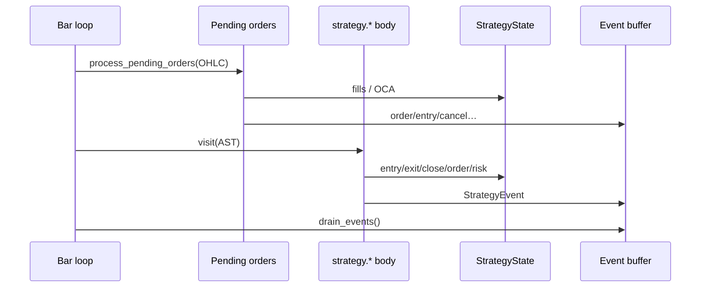

# Copyright (C) 2024-2026 jango_blockchained
#
# This file is part of pynescript.
#
# pynescript is free software: you can redistribute it and/or modify
# it under the terms of the GNU Affero General Public License as published by
# the Free Software Foundation, either version 3 of the License, or
# (at your option) any later version.
#
# pynescript is distributed in the hope that it will be useful,
# but WITHOUT ANY WARRANTY; without even the implied warranty of
# MERCHANTABILITY or FITNESS FOR A PARTICULAR PURPOSE.  See the
# GNU Affero General Public License for more details.
#
# You should have received a copy of the GNU Affero General Public License
# along with pynescript.  If not, see <https://www.gnu.org/licenses/>.
#
# SPDX-License-Identifier: AGPL-3.0-or-later

---
title: "Strategy builtins"
description: "Orders, fills, OCA, commission, risk gates, position metrics, and StrategyState."
---

# Strategy builtins

## Abstract

PYNE’s strategy layer is a **per-run broker simulation** driven by `strategy.*` calls during the bar loop. It is not a live exchange adapter: orders become fills against bar OHLC (market immediately; limit/stop via pending book), commissions and slippage adjust PnL, and risk helpers can block entries. Structured [StrategyEvent](/pyne/docs/runtime/events) records form the parity contract with `pine-worker` and the HOOX trade mesh.

## Conceptual model



**Fill-before-script** matches the interpreter `Runtime` and the compile-path [strategy broker](/pyne/docs/runtime/compiler/strategy-broker).

## Interface surface

### Order placement

| Builtin | Role |
| --- | --- |
| `strategy.entry` | Open/add (or reverse) by direction; market or pending limit/stop |
| `strategy.exit` | Bracket-style exit (limit/stop) against position |
| `strategy.close` / `strategy.close_all` | Flatten by id or all |
| `strategy.order` | Lower-level order with OCA name/type, partial fill cap |
| `strategy.cancel` / `strategy.cancel_all` | Remove pending orders |

Directions accept Pine constants (`strategy.long` / `strategy.short`) and common string aliases.

### Position and performance series

Zero-arg builtins include `strategy.position_size` (signed: +long / −short), `position_avg_price`, `position_entry_name`, `opentrades` / `closedtrades` counts, `netprofit`, `openprofit`, `equity`, `cash`, gross win/loss stats, averages, max drawdown/runup, and max contracts held.

### Trade queries

Indexed accessors:

- `strategy.closedtrades.entry_*` / `exit_*` / `profit` / `size` / `commission`
- `strategy.opentrades.entry_*` / `size` / `profit` / `commission`

### Risk

| Builtin | Effect |
| --- | --- |
| `strategy.risk.max_position_size` | Cap size as % of equity |
| `strategy.risk.max_intraday_loss` | Intraday loss gate |
| `strategy.risk.max_intraday_filled_orders` | Order count cap |
| `strategy.risk.max_drawdown` | Absolute / percent drawdown halt |
| `strategy.risk.max_cons_loss_days` | Consecutive losing calendar days → `entries_blocked` |
| `strategy.risk.allow_entry_in` | `"all"` \| `"long"` \| `"short"` |

Blocked entries still emit a diagnostic-style event with comment `risk_blocked` where implemented.

### Declaration

`strategy(title, …)` applies broker settings onto `StrategyState`: `initial_capital`, commission type/value, slippage ticks, pyramiding, etc.

## Internals

### `StrategyState` (`strategy.py`)

Per-evaluator instance fields include:

- Position: direction (`flat`/`long`/`short`), size (non-negative internal), entry metadata
- Books: `pending_orders`, `open_trades`, `closed_trades`
- Economics: capital, commission model, slippage, mintick
- Risk: max position %, drawdown, consecutive loss days, `entries_blocked`
- Equity curve peak/trough for max DD / runup
- `_events: list[StrategyEvent]` drained each bar

`signed_position_size()` implements Pine’s signed `strategy.position_size`.

### `Order` and fills

```text
Order: market | limit | stop | stop-limit
  + oca_name / oca_type ∈ {none, cancel, reduce}
  + max_fill_per_bar (0 = fill remaining)
```

`process_pending_orders(open, high, low, close)` walks the book, computes trigger prices from OHLC (gap-aware open logic for limits/stops), applies commission/slippage, updates trades, runs OCA side effects, and emits events.

### OCA

| `oca_type` | On fill of a group member |
| --- | --- |
| `cancel` | Cancel other pending in group |
| `reduce` | Reduce sibling quantities by fill size |
| `none` | Independent |

Covered by `tests/test_oca_commission.py` and order-fill suites.

## Invariants & edge cases

1. **Isolation.** Never use class-level strategy state; concurrent runs must not share books.
2. **Pyramiding.** Additional entries respect `pyramiding` from the declaration.
3. **Partial fills.** `max_fill_per_bar` / defaults allow multi-bar completion of large orders.
4. **Calendar buckets for cons-loss.** Exit timestamps in ms vs seconds vs bar index are normalized in `note_closed_trade_day`.
5. **Compile path.** Object-mode uses `CompileStrategyBroker`—aligned fill rules, smaller surface than full interpreter metrics. Prefer interpret mode for full `strategy.closedtrades.*` analytics unless compile coverage is verified.

## Worked examples

### Market long / close

```pine
//@version=5
strategy("Demo", overlay=true, initial_capital=100000)
if bar_index == 5
    strategy.entry("L", strategy.long, qty=10)
if bar_index == 10
    strategy.close("L")
```

Parity fixtures under `tests/fixtures/parity/pine/` encode expected event sequences for such scripts.

### Pending stop entry

```pine
strategy.entry("Break", strategy.long, stop=high[1])
```

Creates a pending stop; subsequent bars’ `process_pending_orders` fill when `high` trades through the stop, using open-gap-aware fill prices.

### OCA bracket sketch

```pine
strategy.order("TP", strategy.short, qty=1, limit=tp, oca_name="br", oca_type=strategy.oca.cancel)
strategy.order("SL", strategy.short, qty=1, stop=sl, oca_name="br", oca_type=strategy.oca.cancel)
```

First fill cancels the sibling.

## Failure modes

| Symptom | Cause |
| --- | --- |
| Entry never fills | Pending stop/limit; OHLC never trades through; or risk block |
| Double entries | Pyramiding > 0 or missing close |
| Events missing `script_id` | Host forgot to stamp after `drain_events` (Runtime does this) |
| PnL off vs TV | Commission type, slippage ticks, mintick, or fill price model |
| Interpret vs compile event drift | Broker subset / timing—diff with `tests/test_compiler_strategy.py` |

## See also

- [Events](/pyne/docs/runtime/events)
- [Strategy broker (compile)](/pyne/docs/runtime/compiler/strategy-broker)
- [Parity / pine-worker](/pyne/docs/pine-worker)
- [Pro API backtest](/pyne/docs/api/endpoints/backtest)
