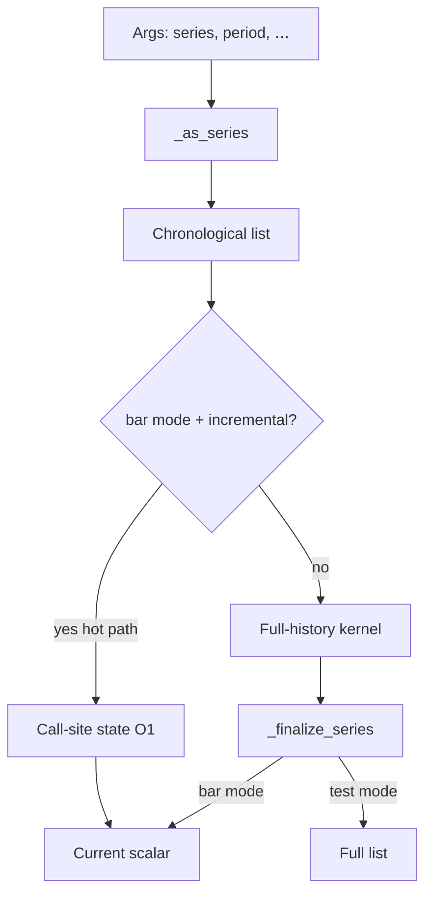

# Technical analysis (`ta.*`)

## Abstract

The `ta.*` namespace is the largest pure-compute surface in PYNE: moving averages, oscillators, volatility bands, volume studies, pattern helpers, and cross/rise/fall predicates. Implementations live under `technical_submodules/` and are composed into `TechnicalAnalysisMixin`. Numerical behavior is validated against TradingView reference series (see [numerical validation](/pyne/docs/reference/numerical-validation)); the design goal is IEEE-limit parity, not “approximate TA.”

## Conceptual model



Hosts in production set bar mode so indicator calls return **scalars for the active bar**, matching how Pine expressions compose (`ta.ema(a) - ta.ema(b)`).

### Incremental hot path (2026-07-28)

When `_pine_bar_mode` and `_pine_ta_incremental` are enabled (Runtime default; disable with **`PYNE_TA_INCREMENTAL=0`**), these builtins update **call-site state** once per bar instead of recomputing full history:

| Builtin | State model |
| --- | --- |
| `ta.sma` | Rolling window (deque) |
| `ta.ema` / `ta.rma` | Recursive seed + step |
| `ta.rsi` | Dual RMA of gains/losses |
| `ta.macd` | Fast/slow/signal EMAs in one slot |
| `ta.atr` | TR stream; mean warm-up then EMA-of-TR (matches current full oracle) |

Call sites are indexed like crossovers (`_ta_call_i` reset each bar). Nested forms such as `ta.ema(ta.sma(close, 14), 10)` stay correct because each call keeps its own slot. Golden suite: `tests/test_ta_incremental.py` (incremental last values ≡ full recompute).

## Interface surface

Dispatch keys (non-exhaustive; map is authoritative in `technical.py`):

| Family | Examples |
| --- | --- |
| Moving averages | `ta.sma`, `ta.ema`, `ta.wma`, `ta.rma`, `ta.hma`, `ta.vwma`, `ta.swma`, `ta.alma` |
| Oscillators | `ta.rsi`, `ta.stoch`, `ta.cci`, `ta.cmo`, `ta.mfi`, `ta.roc`, `ta.wpr`, `ta.tsi` |
| Trend / channels | `ta.macd`, `ta.adx`, `ta.dmi`, `ta.supertrend`, `ta.sar`, `ta.linreg` |
| Volatility | `ta.atr`, `ta.tr`, `ta.bb`, `ta.bbw`, `ta.kc`, `ta.kcw`, `ta.stdev`, `ta.variance` |
| Volume | `ta.obv`, `ta.vwap`, `ta.mfi` (shared), volume submodule helpers |
| Structure | `ta.highest` / `lowest` / `highestbars` / `lowestbars`, `ta.pivothigh` / `pivotlow` |
| Predicates | `ta.crossover`, `ta.crossunder`, `ta.cross`, `ta.rising`, `ta.falling` |
| Stats / other | `ta.change`, `ta.mom`, `ta.cum`, `ta.median`, `ta.mode`, percentiles, `ta.barssince`, `ta.valuewhen`, `ta.correlation` |

### Argument conventions

- Typical form: `ta.fn(series, length)`.
- Some functions allow **period-only** calls (e.g. `ta.highest(20)`) defaulting source to `high` / context series via `_expect_series(..., allow_period_only=True)`.
- Multi-value returns (e.g. MACD, BB, Supertrend) unpack as tuples/lists; assignment uses StatementEvaluator unpack rules.
- Fractional lengths floor to int (TradingView-compatible).

### Stateful crosses

`ta.crossover` / `ta.crossunder` need previous-bar pairs. In bar-mode runs the host resets a call-site index (`_cross_call_i`) each bar so multiple cross calls in one script keep independent state.

## Internals

| Path | Role |
| --- | --- |
| `src/pynescript/ast/evaluator/builtins/technical.py` | Dispatch map aggregation |
| `.../technical_submodules/core.py` | Series coerce, expect helpers, bar finalize, **incremental kernels** |
| `.../moving_averages.py`, `oscillators.py`, `volatility.py`, `volume.py`, … | Kernels + inc wiring |
| `.../common.py`, `basic.py`, `advanced.py`, `patterns.py`, `strategies.py`, `synthesizer.py`, `economics.py` | Additional families |
| `tests/test_ta_indicators_*.py`, `tests/test_indicators.py` | Regression |
| `tests/test_ta_incremental.py` | Inc ≡ full recompute golden |
| `docs/numerical_validation_report.md` | Published precision summary |

History for wrapper series is reversed to chronological order and may be truncated (`_SERIES_MAX`) before full kernels run. Incremental path only needs `series[-1]` per call, so truncation does not freeze state.

## Invariants & edge cases

1. **Warm-up → `na`.** Insufficient bars (e.g. SMA length \(N\) needs \(N\) samples) yield `None` / leading `na` in full-series mode.
2. **NA in window.** Many kernels propagate `na` if any window element is missing (mirrors Pine strictness for SMA-like sums).
3. **Default sources.** `ta.atr` pulls high/low/close from `current_series` / context when not passed explicitly.
4. **Compile path kernels differ.** Numba `numba_sma` / `numba_ema` / `numba_rsi` / highest/lowest are separate implementations—parity tests should cover both modes for scripts that compile.
5. **No chart look-ahead.** Kernels only see history available at the current bar index; `request.security` lookahead is a separate concern.
6. **Incremental ≡ full recompute (oracle).** Changing seed rules (e.g. ATR Wilder vs EMA-of-TR) is a correctness project, not a silent perf flag.

## Worked examples

### Classic overlay

```pine
//@version=5
indicator("SMA 14")
v = ta.sma(close, 14)
plot(v)
```

In bar mode each visit returns one float (or `na`); the host stacks them into a series for the response envelope.

### Cross entry signal

```pine
//@version=5
strategy("X")
fast = ta.ema(close, 12)
slow = ta.ema(close, 26)
if ta.crossover(fast, slow)
    strategy.entry("L", strategy.long)
```

Cross state is bar-local; ensure the runtime resets cross call indices when reusing an evaluator.

### Multi-value unpack

```pine
[macdLine, signal, hist] = ta.macd(close, 12, 26, 9)
plot(hist)
```

## Failure modes

| Symptom | Cause |
| --- | --- |
| Always `na` | Length longer than available history; or series not updated |
| Wrong vs TV by large margin | Wrong source series; mock OHLCV; or non-bar-mode list composition bug |
| Cross never fires | Call-index state not reset / shared incorrectly across bars |
| Compile diverges | Numba RSI/EMA seed conventions—check `numba_builtins.py` |

## See also

- [Series & history](/pyne/docs/runtime/series-and-history)
- [Strategy builtins](/pyne/docs/runtime/builtins/strategy)
- [Numba builtins](/pyne/docs/runtime/compiler/numba)
- [Numerical validation](/pyne/docs/reference/numerical-validation)
